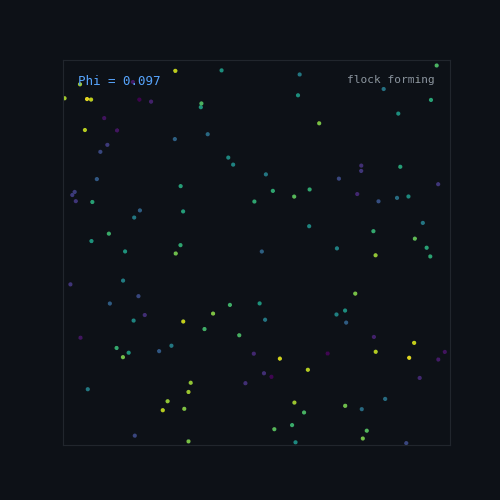
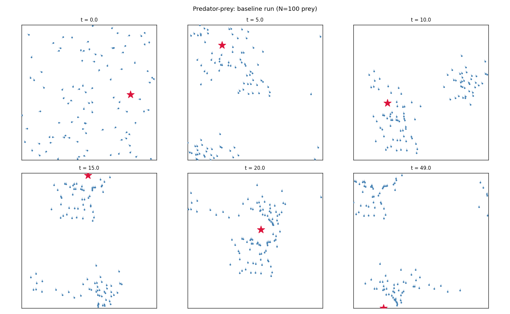

<div align="center">



# Emergent Flocking & Collective Evasion

[](https://python.org)
[](https://numpy.org)
[](https://matplotlib.org)
[](https://uncg.edu)
[](https://github.com/ninjahawk/Summer_Research)

**PHY 351 — Independent Summer Research &nbsp;|&nbsp; UNCG**

A computational study of force-based flocking agents on a periodic 2D domain, extended with predator-prey dynamics. Based on Charbonneau (2017), Ch. 10.

[**▶ Open Interactive Demo**](sim_demo.html) &nbsp;·&nbsp; [**📊 Raw Data**](data.html) &nbsp;·&nbsp; [**📋 Research Log**](logs.html)

</div>

---

## 🧠 Model

N agents move on a periodic unit square under four forces each timestep:

| Force | Description |
|-------|-------------|
| **Repulsion** | Short-range — keeps agents from overlapping (range 2r₀) |
| **Alignment** | Drives velocity toward mean of neighbors within r_f |
| **Self-propulsion** | Corrects speed toward target v₀ |
| **Noise** | Uniform random perturbation in [−η, η] |

**Key analytical result:** equilibrium cruise speed is `v_eq = v₀ + α/μ` — not `v₀`. Derived from force balance in an aligned flock; verified experimentally to within 0.002 across four α values.

**Default parameters:** N=350, r₀=0.005, ε=0.1, r_f=0.1, α=1.0, v₀=1.0, μ=10.0, η=0.5, dt=0.01

---

## 📊 Results

### Flock Formation & Coherence

<div align="center">

</div>

Flock forms reliably above α ≈ 0.1. With all forces active the order parameter Φ stays above 0.97 up to noise η ≈ 10, then collapses near η ≈ 20. The alignment force makes the system dramatically more noise-resistant than the repulsion-only case.

---

### Phase Transition Analysis

<div align="center">

</div>

Finite-size scaling across N = 25–200 (with compactness fixed via r₀ = √(C/πN)) shows KE/N curves are N-independent and susceptibility χ = N·Var(KE/N) increases monotonically — no peak at any tested compactness. The solid-to-fluid transition is a **smooth crossover**, not a true phase transition.

---

### Predator-Prey Dynamics

<div align="center">

</div>

<div align="center">

</div>

Flocking prey maintain Φ ≈ 1.0 under sustained predator pressure. Non-flocking prey scatter to Φ ≈ 0.1 almost immediately. A minimum evasion buffer distance (~0.10) persists regardless of predator aggression.

---

### Multi-Predator & Flock Geometry

<div align="center">

</div>

<div align="center">

</div>

With 1–4 predators, coherence stays near 0.975–0.991. Aspect ratio rises substantially (AR = 2.8 → 8.6). Counterintuitively, evasion distance *increases* with more predators — because all predators independently target the same center of mass, co-localizing at the same point (measured separation ~0.001) and producing combined repulsion that pushes the flock farther away.

---

## 🔬 Key Findings

| # | Finding |
|---|---------|
| 1 | Cruise speed is v_eq = v₀ + α/μ (exact analytical result) |
| 2 | Solid-to-fluid transition is a smooth crossover at all tested compactness values |
| 3 | Flock forms at very low alignment amplitude (α ≈ 0.05–0.10) |
| 4 | Full model robust to noise up to η ≈ 10 |
| 5 | Flocking prey maintain Φ ≈ 1.0 under predator pressure; non-flocking scatter to Φ ≈ 0.1 |
| 6 | Evasion distance saturates regardless of predator aggression |
| 7 | Larger flocks expose smaller fractions to predator threat (dilution effect) |
| 8 | Fixed-compactness scaling confirms crossover in both dense and dilute regimes |
| 9 | Flock elongates with stronger alignment and under predator pressure |
| 10 | Multiple predators maintain coherence while increasing flock elongation |
| 11 | Multiple predators co-localize at prey CoM — explains counterintuitive evasion result |
| 12 | Crossover behavior is general across compactness values, not regime-specific |

---

## 🗂️ Repository

| File | Description |
|------|-------------|
| `flocking.py` | Core model — buffer zone, vectorized forces, run loop, metrics |
| `analysis.py` | Validation limiting cases and parameter sweeps |
| `predator.py` | Single-predator extension — 4 experiments |
| `phase_transition.py` | Finite-size scaling of solid-to-fluid transition |
| `geometry.py` | Radius of gyration and aspect ratio analysis |
| `multi_predator.py` | Multi-predator experiments (1–4 predators) |
| `evasion_analysis.py` | Predator co-localization diagnostic |
| `compactness_phase.py` | Fixed-compactness finite-size scaling |
| `make_demo.py` | Generates `figures/demo.gif` for this README |
| `sim_demo.html` | Interactive browser simulation (open locally) |
| `data.html` | Raw numerical data — open in browser, copy to Google Sheets |
| `logs.html` | Time log and research log |
| `findings.md` | Running notes on all 12 findings |

---

## 🚀 Run

```bash
python analysis.py          # validation and parameter sweeps
python phase_transition.py  # finite-size scaling
python predator.py          # single-predator experiments
python geometry.py          # flock shape analysis
python multi_predator.py    # multi-predator experiments
python evasion_analysis.py  # evasion diagnostic
python compactness_phase.py # fixed-compactness phase scaling
```

Open `sim_demo.html` in a browser for a real-time interactive simulation with adjustable parameters.

---

## 🛠️ Tools

- **Language:** Python 3 — numpy, matplotlib, reportlab
- **AI assistance:** Claude (Anthropic) — code generation, debugging, research guidance. All AI use documented in research log.

---

*Charbonneau, P. (2017). Natural Complexity: A Modeling Handbook. Princeton University Press.*  
*Silverberg et al. (2013). Collective motion of humans in mosh and circle pits. Physical Review Letters, 110, 228701.*
