# Findings — PHY 351 Flocking Research
Started 2026-05-08

---

## Index by Theme

The 63 numbered findings below are presented chronologically (in the order they were
generated). The F-numbers here match the headings in the body of this file, in
`report_draft.md`, and in `README.md`. A few findings touch more than one theme and are
cross-listed (e.g. F8/F12/F17 under both Baseline and Phase Transition; F52 under both
3D Extension and Section 5 Self-Tests). For navigation, grouped by theme:

### Baseline and Validation
- F1  Equilibrium cruise speed v_eq = v0 + alpha/mu (exact)
- F2  Solid-to-fluid transition in repulsion-only system (appears continuous; preliminary)
- F3  Low threshold for flock formation (alpha ~ 0.05)
- F4  Full model robust to noise up to eta ~ 10
- F8  Solid-to-fluid transition is a crossover, not a phase transition (finite-size scaling)
- F12 Crossover persists across compactness -- no phase transition in this model
- F17 No phase transition at any intermediate compactness (C = 0.15-0.60)

### Predator Strategy (2D)
- F5  Flocking maintains coherence under predator pressure (Phi ~ 1.0)
- F6  Flock coherence robust to predator aggression
- F7  Dilution effect: larger flocks expose smaller fractions
- F9  Flock elongates with predator pressure and with stronger alpha
- F10 Multiple predators elongate the flock without breaking coherence
- F11 Evasion distance increases because predators co-localize at prey CoM
- F13 Coordinated predators spread out but cannot break the flock (Phi > 0.92)
- F14 Encirclement breaks coherence -- first strategy to substantially disrupt (Phi = 0.77 at n_pred = 6)
- F15 Encirclement threshold does not scale with N -- convergence to a common floor
- F16 Encirclement divides the flock into coherent sub-flocks, not random walkers
- F19 Predator sensing threshold at r_sense ~ flock radius; limited sensing slightly worsens encirclement
- F21 Minimum viable flock size (Phi = 0.9 crosses between N = 18-25)
- F22 Encirclement fragmentation fully transient -- sub-flocks reunite within ~10 tu of predator removal
- F28 Encirclement floor rises at very large N -- F15's "common floor" is N-dependent
- F31 Encirclement scaling collapses on R_enc/Rg ~ 0.5 -- size-invariant (refines F28)
- F32 Long-time encirclement: intermittent merge/split steady state
- F33 Incomplete encirclement is mostly less disruptive; the flock doesn't escape through the gap
- F35 Adaptive R_enc = 0.5*Rg outperforms fixed (validates F31 dynamically)
- F53 Prey fatigue does not make encirclement damage irreversible (align-fatigue deepens attack)

### Contagion and Vaccination
- F18 Static panic does not propagate -- calm agents stay coherent even at 20% panic fraction
- F20 Panic contagion saturates the flock at any non-zero rate (SI) -- no epidemic threshold
- F23 Combined predation + contagion -- contagion dominates; encirclement cannot rescue the calm sub-flock
- F24 Active/passive mixed populations do not spatially segregate (v0 contrast alone)
- F25 SIS contagion has a clean epidemic threshold at beta/gamma ~ 1; flock disruption tracks it
- F26 Encirclement amplifies but does not tip sub-threshold contagion -- partial coupling
- F27 Alpha-contrast populations segregate via local clustering, not heading-axis separation
- F29 Encirclement shifts the SIS epidemic threshold leftward by ~4%
- F30 Herd-immunity threshold in the flock is ~2x larger than mean-field predicts (p_c ~ 0.46)
- F34 Outbreak persistence: epidemic outlasts predator removal by 100+ tu
- F36 Targeted (degree-based) vaccination null -- contact network is not hub-dominated
- F37 Spatial vaccination null -- kinematic mixing erases spatial targeting
- F54 Heterogeneous recovery rates lower the SIS threshold -- slow recoverers are reservoirs
- F55 Heterogeneous infectiousness does NOT shift the threshold -- super-spreaders are messengers
- F56 Targeting slow recoverers beats random by 2-3x -- F54 prediction confirmed (first strategy in study to beat random)
- F57 Spatial vaccination null transfers to the het-recovery regime -- advantage is internal, not spatial
- F59 Slow-recoverer advantage survives continuous (lognormal) gamma distributions
- F60 Slow-recoverer vaccination tolerates noisy gamma estimates
- F61 Slow-recoverer vaccination works for rare reservoirs (smaller reservoir, smaller budget)
- F62 Slow-recoverer vaccination needs a DURABLE label: gamma drift erodes the advantage and, when fast, eradicates the epidemic by self-averaging gamma to its mean
- F63 Combined beta_i + gamma_i: slow (reservoir) targeting is ROBUST across correlations; super-spreader (engine) targeting is as good only when not anti-correlated with the reservoir. beta-targeting IS effective for removal (refines F55)

### Phase Transition (Diagnosis Thread)
- F8, F12, F17 (above) -- no transition anywhere; smooth crossover
- F38 Repulsion hardness null (n = 1.5-12 identical) -- non-equilibrium forcing is the cause
- F39 Langevin thermostat satisfies FDT (KE/N = kT to 1%) but KE/N cannot detect KTHNY melting
- F40 Hexatic order parameter |psi6| flat: soft repulsion cannot crystallize
- F50 Hard repulsion (n = 12, 24) also flat: higher exponent shrinks the core, does not harden it

### 3D Extension
- F41 Flocking generalizes to 3D; v_eq exact
- F42 3D noise crossover at ramp ~ 15-25 (smooth, not a phase transition)
- F43 3D encirclement does not disrupt the flock at all (Phi=1.0); encirclement is 2D-specific [corrected -- predator sign bug]
- F44 3D encirclement fails at every predator count 1-50 (Phi>=0.99) [corrected -- predator sign bug]
- F45 3D adaptive encirclement also does nothing (Phi=0.9998) [corrected -- predator sign bug]
- F46 Vaccination targeting fails in 3D too; kinematic mixing is dimension-independent
- F49 3D encirclement fails under any arrangement (sphere/planar) [corrected -- predator sign bug]
- F51 3D alpha-contrast segregation: matches 2D at moderate contrast, diluted at high contrast
- F52 3D mixes ~1.8x SLOWER than 2D at matched degree; "mixing aid" theme falsified
- F58 Slow-recoverer vaccination transfers to 3D unchanged (per-agent rate mechanism is dimension-independent)

### Section 5 Self-Tests (predictions tested and corrected, not assumed)
- F47 Topological (k-NN) alignment does not slow mixing; the §5 prediction is falsified
- F48 Freezing the contact graph does not rescue targeting; degree-targeting null is structural
- F52 3D mixes slower, not faster (above); the "third dimension is a mixing aid" theme is falsified

---

## Literature Context and Novelty Assessment
*Added 2026-05-15 based on literature search. Updated 2026-05-15 (session 2) with additional papers.*

### Background papers

**Levis, Diaz-Guilera, Pagonabarraga, Starnini (2019/2020). "Flocking-enhanced social contagion."
Phys. Rev. Research 2, 032056.**
Studies bidirectional coupling between a Vicsek-like flocking model and SIS epidemic dynamics, where
agents' flocking DEPENDS on their SIS state (infected agents aligned differently).  Key result:
flocking self-organizes dense swarms that reduce the epidemic threshold below the global mean-field
limit.  Directly related to Findings 26, 29 (compression raises effective contact count, shifts
threshold) but via a DIFFERENT MECHANISM: their compression is endogenous (epidemic state drives
clustering), ours is exogenous (predator encirclement compresses the flock mechanically).  Our
experiment is the first to test the EXTERNAL predator analog of this effect, and to study what
happens when the external compressor is REMOVED (Finding 34 -- epidemic persistence -- is not
addressed in this paper).

**Silverberg, Bierbaum, Sethna, Cohen (2013). "Collective motion of humans in mosh and circle pits."
Phys. Rev. Lett. 110, 228701.**
Original source model.  Demonstrates the same four-force ABM produces realistic crowd dynamics.
Our project is a systematic extension of this model into predator-prey, contagion, and hybrid regimes.

**Recent (2025-2026) predator-strategy papers:**
Pacher, Bierbach, Kurvers, Krause et al. (2026). "Strategic choices of attack location allow
predators to counter a collective prey defence." Proc. R. Soc. B 293, 20260566.
Studies real predatory birds choosing attack positions against fish shoals.  Found that conspicuous
predators avoid the center of shoals to minimize prey alert response; cryptic predators prefer
center attacks.  Our encirclement strategy (equal-angle offset from CoM) is a computational analog
but our mechanism is fundamentally different: we are interested in HOW MANY ANGLES are needed to
overcome collective evasion, and the scaling relationship R_enc/Rg ~ 0.5 (Findings 14, 31) appears
not to be addressed in empirical predator-strategy literature.

**Demsar & Lebar Bajec (2014). "Simulated Predator Attacks on Flocks: A Comparison of Tactics."
Artificial Life 20(3): 343-359.**
Compared three attack tactics (attack center, attack nearest, attack isolated) against social vs.
individualistic prey using a fuzzy individual-based model.  Found social flocking is the optimal
anti-predatory response to predators targeting isolated individuals.  Relevant to F14: Demsar &
Bajec do NOT test a coordinated multi-angle encirclement strategy; our encirclement (equal-angle
compass assignment from CoM) is not among their tactics.  Supports novelty of F14's angular-coverage
threshold result.

**Bartashevich, Romanczuk et al. (2024). "Collective anti-predator escape manoeuvres through optimal
attack and avoidance strategies." Communications Biology 7, 1548.**
Uses agent-based modeling + empirical sardine-vs-marlin observations to study how the "fountain
effect" arises when prey optimize escape angles to maximize distance from predator.  The fountain
effect is a cohesive split-and-rejoin pattern in response to a SINGLE predator's attack direction.
Our encirclement result (F16) is the multi-predator analog: angular COMPRESSION from multiple
directions produces a more violent flock DIVISION into directionally separated sub-flocks rather
than a single fountain.  The single-predator fountain timescale is not measured in their paper;
our quantification of reunion time (~10 tu, F22) appears novel.

**[2025 paper] "Behavioural response of prey to repeated attacks by non-coordinating predators."
Scientific Reports, 2025.**
Uses an underdamped Langevin model (physically similar to our Langevin follow-up, F39) to study
REPEATED attacks by naive (non-coordinating) predators.  Key mechanism: when opposing predation
pressures stretch the group transversely, narrowing leads to splitting.  This is the non-coordinated
analog of our coordinated encirclement (F14-F16).  Our contribution beyond this paper: (a) we study
COORDINATED strategies (compass-angle assignment, not random repeated attacks), (b) we measure
the angular-coverage threshold and R_enc/Rg scaling, and (c) we study the reunion timescale after
predator REMOVAL (not repeated attacks).

**Inada & Kawachi (2002/2005). "Dynamics of prey-flock escaping behavior in response to predator's
attack." J. Theor. Biol., doi: 10.1016/j.jtbi.2005.01.009.**
Two-dimensional molecular-dynamics simulation identifying four collective escape patterns:
Split and Reunion, Split and Separate into Two Groups, Scattered, and Maintain Formation and
Distance.  Our F16 demonstrates the "Split and Reunion" pattern (flock division into coherent
sub-flocks that reconsolidate after predator removal), F22 quantifies the reunion timescale
(~10 time units).  Our contributions beyond Inada & Kawachi: (a) the CAUSE is explicit
encirclement (multi-angle pressure) rather than single-predator attack angle, (b) we characterize
the transition between division patterns as a function of predator count, and (c) we identify
the asymmetry between kinematic recovery (F22, F7) and epidemic recovery (F34).

**Collective evasion timescales / recovery:**
Literature (Inada & Kawachi, Bartashevich et al.) identifies the "split and reunion" pattern and
the fountain effect, but does not quantify reunion timescales or compare kinematic vs. epidemic
recovery after stressor removal.  Finding 22 (kinematic reversibility, ~10 tu), Finding 7
(same, earlier measurement), and Finding 34 (epidemic persistence, ~100+ tu) together provide
the first explicit timescale comparison in a hybrid kinematic-contagion system.  This asymmetry
appears to be a novel contribution.

**Spatial herd immunity inflation:**
Herd immunity inflation above mean-field is a known effect in spatial SIR/SIS models (Diekmann
et al.; Keeling & Rohani) and empirically confirmed during COVID-19 (Britton et al. 2020, Science).
Spatial vaccination strategies for geographic populations have been studied (Bhatt et al. 2022,
PLoS Comput. Biol.; Zhou et al. 2021, GeoHealth), but these use fixed geographic regions, not
kinematic agents that constantly mix spatially.  Our Finding 30 (2x inflation in a flock context,
p_c ~ 0.46 vs 0.20) is a demonstration that a kinematic flock system quantitatively matches the
spatial-epidemic prediction.  Finding 37 (spatial vaccination, in progress) tests whether
spatially-distributed immunity can exploit this; preliminary results suggest kinematic mixing
defeats spatial targeting as effectively as it defeats degree-targeting (F36).

### Novelty summary

| Finding | Status | Notes |
|---------|--------|-------|
| F14 Encirclement disruption | Likely novel | Demsar&Bajec 2014 does not test multi-angle compass assignment; angular threshold not in literature |
| F16 Flock division (not dissolution) | Related + novel | Inada&Kawachi 2002 identifies "Split and Reunion" pattern; our contribution is mechanism (encirclement) + predator-count transition |
| F22 Kinematic reversibility (~10 tu) | Novel | Inada&Kawachi identifies pattern but does not quantify reunion timescale; explicit ~10 tu measurement is new |
| F29 Threshold shift ~4% from compression | Related | Similar to Levis 2020 (endogenous) but external-predator mechanism is different |
| F30 Herd immunity 2x mean-field | Known effect | Consistent with spatial SIS literature; novel in kinematic-flock context |
| F31 R_enc/Rg scaling universal | Likely novel | No literature found on size-invariant encirclement calibration |
| F32 Long-time intermittent dynamics | Possibly novel | Related to repeated-attack papers (Scientific Reports 2025) but not identical mechanism |
| F33 Incomplete encirclement non-monotone | Likely novel | No literature found; counterintuitive 5-predator result |
| F34 Epidemic outlasts kinematic stressor | Likely novel | Not addressed in Levis 2020 or any predator-prey paper found; timescale asymmetry is new |
| F35 Adaptive R_enc outperforms fixed | Likely novel | No paper found on adaptive predator geometry tracking in flocking |
| F36 Targeted vaccination null result | Interesting null | Hub-targeting fails in kinematic flock; spatial reorganization is specific mechanism |
| F37 Spatial vaccination (in progress) | Likely null | Preliminary: kinematic mixing erases spatial targeting advantage as it erases degree targeting |
| F38 Non-equilibrium driving causes crossover | Likely novel | FDT diagnosis in force-based ABM context; not in equilibrium statistical mechanics literature |

---

## Model Summary
Charbonneau Chapter 10. N agents on a periodic 2D unit square [0,1]^2.
Each agent subject to 4 forces per timestep:
- Repulsion: pushes agents apart within range 2*r0
- Flocking: aligns velocity with neighbors within range rf
- Self-propulsion: drives agent toward target speed v0
- Random: uniform noise in [-ramp, ramp]

Forward Euler integration at dt=0.01. Periodic boundaries via ghost agent buffer zone.
Default parameters: N=350, r0=0.005, eps=0.1, rf=0.1, alpha=1.0, v0=1.0, mu=10.0, ramp=0.5

Order parameter: Phi = |mean(v_hat)|, ranges 0 (random) to 1 (perfect alignment)

---

## Finding 1: Equilibrium speed is v_eq = v0 + alpha/mu

**What:** Agents don't cruise at v0 -- they cruise at v_eq = v0 + alpha/mu.
**Why:** When the flock aligns, the flocking force always pushes agents forward
at magnitude alpha. Self-propulsion equilibrates at a higher speed to compensate.
**Evidence:** With alpha=1, mu=10, v0=1 -> measured mean speed 1.098 vs predicted 1.100 (diff=0.002).
Verified across alpha = 0, 0.5, 1.0, 2.0 -- all match v0 + alpha/mu to within 0.002.
**Implication:** v0 and alpha cannot be set independently without affecting cruise speed.
To target a specific cruise speed v_cruise, set v0 = v_cruise - alpha/mu.

---

## Finding 2: Solid-to-fluid phase transition in repulsion-only system

**What:** With only repulsion and noise (alpha=0, v0=0), KE rises continuously with noise
amplitude eta. Transition appears continuous (not abrupt) across eta ~ 1-10.
**Evidence:** Sweep A in analysis.py, 5 seeds each with error bars.
eta=0.5: KE=0.00 | eta=3: KE=0.16 | eta=10: KE=1.74 | eta=30: KE=15.89
**Visual:** At low eta, agents form hexagonal crystal (close-packed). At high eta, fluid phase.
**Open question:** Is this a true phase transition or a crossover? Would need to look for
diverging susceptibility or correlation length to answer.

---

## Finding 3: Low threshold for flock formation

**What:** Flock forms (Phi > 0.5) at very small flocking amplitude alpha -- around alpha ~ 0.05-0.1.
**Evidence:** Sweep B in analysis.py, 5 seeds each.
alpha=0: Phi=0.088 | alpha=0.05: Phi=0.404 | alpha=0.10: Phi=0.607 | alpha=0.20: Phi=0.891
**Note:** Large variance at alpha=0.05-0.10 (std ~0.12-0.19) -- near the transition the outcome
is sensitive to initial conditions. Above alpha~0.2 the flock reliably forms.

---

## Finding 4: Full model robust to noise up to eta~10
**What:** With all forces active (default parameters), Phi stays near 1.0 up to eta~10,
then drops sharply, collapsing to Phi~0.4 at eta=20.
**Evidence:** Sweep C in analysis.py, 5 seeds each.
eta=1: Phi=0.999 | eta=5: Phi=0.976 | eta=10: Phi=0.906 | eta=20: Phi=0.417
**Contrast:** Repulsion-only system (Finding 2) doesn't form a flock at all.
The flocking force makes the system much more resistant to noise disruption.

---

## Finding 5: Flocking maintains coherence under predator pressure

**What:** Under predator pressure, flocking prey maintain Phi~1.0 throughout the simulation.
Non-flocking prey (alpha=0) scatter to Phi~0.1 almost immediately.
**Evidence:** Exp 2 in predator.py, 10 seeds each.
- Flocking: steady-state Phi = 0.998, mean predator-nearest distance = 0.112
- Non-flocking: steady-state Phi = 0.096, mean distance = 0.127
**Interpretation:** The flock absorbs the predator's pressure without breaking apart.
Non-flocking agents are marginally farther from the predator individually, but they have
no collective structure. Flocking sacrifices some individual distance for group cohesion.

---

## Finding 6: Flock coherence robust to predator aggression

**What:** Prey flock Phi stays near 0.95-0.98 across all tested predator aggression levels
(alpha_pred = 0 to 15, effective speeds 0.05 to 1.55). Flock does not break apart.
**Evidence:** Exp 3 in predator.py, 8 seeds each.
**Evidence:** Predator-flock distance drops from 0.24 (passive predator) to ~0.10
(alpha_pred >= 1) and then saturates -- the flock successfully holds the predator
at a minimum distance regardless of how fast the predator is.
**Interpretation:** There is an evasion floor. The collective repulsion response is enough
to maintain a fixed buffer distance even against a very aggressive predator.

---

## Finding 7: Dilution effect -- larger flocks expose smaller fractions

**What:** The fraction of the flock within predator threat range decreases with flock size.
**Evidence:** Exp 4 in predator.py, 5 seeds each.
N=10: fraction~0.49 | N=25: ~0.21 | N=50: ~0.19 | N=100: ~0.11 | N=200: ~0.14
**Interpretation:** Basic geometric dilution -- predator occupies a fixed area, larger
flock has more agents outside that area. Consistent with the biological "safety in numbers"
hypothesis. Note: N=200 slightly worse than N=100 (0.14 vs 0.11), possibly noise.

---

---

## Finding 8: Solid-to-fluid transition is a crossover, not a phase transition

**What:** Finite-size scaling across N=25,50,100,200 shows KE/N is essentially
independent of N. Susceptibility chi = N*var(KE/N) rises monotonically, no peak.
**Evidence:** phase_transition.py. All four N values give nearly identical KE/N curves.
**Interpretation:** High compactness (C~0.78) traps agents -- each agent oscillates
like an independent harmonic oscillator at its lattice site. A true phase transition
would require chi to diverge at finite eta and scale as N^(gamma/nu). Neither observed.

---

## Finding 9: Flock elongates with predator pressure and with stronger alpha

**What:** Aspect ratio AR increases with predator presence and flocking amplitude alpha.
**Evidence:** geometry.py
- No predator: AR=2.61 | With predator: AR=2.76
- alpha=0.2: AR=2.09 | alpha=1.0: AR=2.94 | alpha=2.0: AR=7.27
**Interpretation:** Strong velocity alignment forces agents into a tight stream.
Under predator pressure the flock thins and elongates, consistent with the book's
prediction of arched/thinning flocks.

---

## Finding 10: Multiple predators elongate the flock without breaking coherence

**What:** With 1-4 predators, Phi stays near 0.975-0.991 throughout. AR increases
from 2.83 (1 predator) to 7.91 (3 predators). Min predator-prey distance actually
increases slightly from 0.093 to 0.106.
**Evidence:** multi_predator.py, 8 seeds each.
**Interpretation:** More predators stretch and thin the flock but don't destroy it.
Counterintuitively, evasion distance increases with more predators -- pressure from
multiple directions may force the flock into a harder-to-surround configuration.

---

## Finding 11: Evasion distance increases because predators co-localize at prey CoM

**What:** With multiple predators, each one independently targets the flock center of mass.
Because all predators follow the same rule, they converge to the same location
(measured pred-pred distance ~0.001, essentially zero). This means more predators
pile up at the same point rather than surrounding the flock.
**Evidence:** evasion_analysis.py, 8 seeds each.
- n_pred=1: min_pred_prey_dist=0.094
- n_pred=2: pred-pred dist=0.001, min_pred_prey_dist=0.099
- n_pred=3: pred-pred dist=0.001, min_pred_prey_dist=0.105
- n_pred=4: pred-pred dist=0.001, min_pred_prey_dist=0.096
- Flock orientation vs predator centroid: ~43-46 deg (consistent with random, ~45 deg expected)
**Mechanism:** Co-localized predators exert combined repulsion from the same point.
Multiple predators at the same location produce a stronger net repulsion on nearby prey
than a single predator, pushing the flock farther away. The flock does NOT orient
deliberately (45-degree angle = no systematic orientation strategy).
**Implication:** The "chase CoM" predator strategy is self-undermining when used by
multiple predators. They inadvertently cooperate by concentrating force at one point,
and the flock benefits. Distributed predators approaching from different angles would be
more effective -- but that requires coordination the model does not give them.

---

## Finding 12: Crossover persists across compactness -- no phase transition in this model

**What:** When compactness is held fixed across N by scaling r0 = sqrt(C/(pi*N)),
both dense (C=0.78) and dilute (C=0.10) regimes give essentially identical results:
KE/N curves overlap for all N, susceptibility chi increases monotonically with eta,
and the susceptibility peaks only at the top of the sweep (eta=30) -- not at a finite
critical point. The crossover is not a property of the dense regime alone; it persists
at all tested compactness values.
**Evidence:** compactness_phase.py, 8 seeds per (N, eta) point.
- C=0.78: chi_max at eta=30 for all N; KE/N identical across N=25-200
- C=0.10: same behavior -- chi_max at eta=30, KE/N N-independent
- KE/N values nearly identical between C=0.78 and C=0.10
**Interpretation:** The absence of a critical point is not because agents are caged.
At C=0.10 (dilute), agents barely interact (repulsion radius too small relative to
inter-agent spacing), so they behave essentially as independent random walkers. KE/N
is then set entirely by the noise amplitude, independent of N. Both extremes (too
dense = caged, too dilute = non-interacting) produce N-independent KE/N and monotone
susceptibility. A genuine critical point would likely require intermediate compactness
where agents can form a solid and also rearrange cooperatively -- but even C=0.10 is
too dilute for a solid phase. The repulsion-only model may simply not exhibit a true
phase transition in any easily accessible parameter regime.

---

---

## Finding 13: Coordinated predators spread out but cannot break the flock

**What:** Adding predator-predator repulsion (alpha_coord) forces predators to spread
out spatially instead of co-localizing, and brings them physically closer to the flock.
But even with 10 coordinated predators, Phi never drops below 0.92. The flock's
collective evasion is robust to predator coordination strategy.
**Evidence:** coordinated_predators.py, 8 seeds each.
- alpha_coord=0 (naive): pred-pred sep=0.001, AR=8.82, min_dist=0.105
- alpha_coord=5: pred-pred sep=0.141 (real separation achieved), min_dist=0.078
- alpha_coord=10: pred-pred sep=0.233, min_dist=0.084, Phi=0.970
- alpha_coord=20: pred-pred sep=0.293 (maximum tested)
- n_pred=1..10 with alpha_coord=10: Phi ranges 0.923-0.991, no systematic collapse
**Key threshold:** Separation requires alpha_coord >= ~5. Below that, the shared
CoM target overwhelms the repulsion and predators still pile up.
**Interpretation:** The prey collective is strategy-resistant. Naive predators fail
because they co-localize. Coordinated predators fail because the flock's distributed
repulsion response scales with the number of approaching predators. No number or
strategy of predators in this model breaks the flock.

---

## Finding 14: Encirclement breaks coherence -- first strategy to substantially disrupt the flock

**What:** Assigning each predator a fixed angular direction and targeting
CoM + R_enc*(cos(theta_k), sin(theta_k)) forces them to approach from equally spaced angles.
This is fundamentally different from both naive and coordinated strategies. At n_pred=6-8,
Phi drops to ~0.77 -- the first substantial coherence reduction in all experiments.
Naive and coordinated predators never dropped below 0.92.
**Evidence:** encirclement.py, 8 seeds each.
- Radius sweep (n_pred=3): R_enc=0.15 minimizes evasion distance (0.076) and Phi (0.953).
  R_enc=0.00 is naive (sep=0.001); R_enc=0.15 achieves pred_sep=0.260.
- vs naive (R_enc=0.15): n_pred=4 encircle Phi=0.909 vs naive 0.974.
  Predators get significantly closer: dist 0.077 vs 0.096.
- Flock-breaking threshold: n_pred=6 gives Phi=0.769 +/- 0.093, n_pred=8 gives 0.782 +/- 0.124.
  Min pred-prey dist falls to 0.050 (vs 0.105 for naive multi-predator). Flock not fully
  broken but substantially disrupted; high std suggests some seeds fragment.
**Optimal radius:** R_enc ~ 0.15 (just inside the flock edge, Rg~0.25). Too small = still
co-localizing. Too large (R_enc=0.25) = predators orbit the flock and evasion distance recovers.
**Interpretation:** Multi-directional pressure from equally spaced angles creates competing
repulsion vectors that cannot all be resolved by a single coherent escape direction. The alignment
force resists but cannot fully compensate when predators approach from 6+ angles simultaneously.
This is the first predator strategy in this model capable of meaningfully disrupting collective
evasion, establishing that flock resilience is strategy-dependent, not absolute.

---

## Finding 15: Encirclement threshold does not scale with N -- convergence to a common floor

**What:** Fixed n_pred=6 against varying N shows larger flocks are more resistant (Phi rises
from 0.695 at N=50 to 0.903 at N=350). But fixed predator-to-prey ratio (6/350) applied
to larger N makes things WORSE: at N=500 with n_pred=9, Phi=0.654 -- the lowest coherence
in all experiments. Both N=100 and N=350 converge to Phi~0.67 at n_pred=10-12, suggesting
a common disruption floor independent of flock size at sufficient predator density.
**Evidence:** encirclement_scaling.py, 8 seeds each.
- Fixed n_pred=6: N=50 Phi=0.695, N=100 Phi=0.769, N=200 Phi=0.833, N=350/500 Phi=0.90
- Fixed ratio 6/350: N=500, n_pred=9 gives Phi=0.654 +/- 0.171 (worst result in project)
- Full sweep N=100 vs N=350: both reach Phi~0.67-0.68 at n_pred=10
**Interpretation:** The dilution effect protects against a fixed predator count (more agents
share the evasion burden). But the ratio law fails -- more predators at fixed ratio are
MORE effective for larger N because finer angular coverage (9 angles vs 6) is harder to
escape. There is no simple scaling law: disruption depends nonlinearly on both N and n_pred.
The convergence of N=100 and N=350 to the same Phi floor at n_pred=10 suggests the
disruption is set by angular coverage (predators/360 degrees) rather than predators/prey.

---

## Finding 16: Encirclement divides the flock into coherent sub-flocks, not random walkers

**What:** When global Phi drops to 0.77 under encirclement, the flock is NOT dissolving.
Predators COMPRESS the flock spatially (fewer clusters: 60 naive vs 24 encircle) while
SPLITTING it directionally (each sub-flock escapes in a different direction). Each
sub-flock is internally coherent (largest_phi=0.997). The low global Phi reflects
sub-flocks heading in different directions, not individual agent randomness.
**Evidence:** fragmentation.py, 8 seeds, n_pred=6.
- Naive: 60 clusters, largest_frac=0.137, global_phi=0.997, largest_phi=1.000
  (many small groups all moving same direction -- spatially spread but directionally unified)
- Encirclement: 24 clusters, largest_frac=0.253, global_phi=0.718, largest_phi=0.997
  (fewer, larger groups moving in different escape directions)
- As n_pred increases: n_clusters decreases (5->8 pred: 70->19) while largest_frac
  grows (0.08->0.25), confirming spatial compression rather than dissolution.
**Interpretation:** Encirclement succeeds by herding -- predators squeeze the flock from
multiple directions, forcing it to split into sub-groups that escape toward the gaps between
predators. Each sub-group remains a coherent mini-flock. This is flock DIVISION not flock
DISSOLUTION. The mechanism is analogous to wolf-pack herding or dolphin bait-ball formation.
This is biologically the most significant finding of the project.

---

## Finding 17: No phase transition at any intermediate compactness -- crossover is universal

**What:** Sweeping compactness C = 0.15, 0.20, 0.30, 0.40, 0.50, 0.60 with finite-size
scaling at N = 25, 50, 100, 200 finds no true phase transition at any density. In every
case, susceptibility chi = N*Var(KE/N) peaks at eta=30 (the top of the sweep) and the
chi_peak value is essentially identical across N (all ~0.022-0.025). No diverging peak,
no N-dependence, no critical point anywhere in the accessible compactness range.
**Evidence:** compactness_search.py, 8 seeds. Chi-peak summary:
All 24 (C, N) combinations peak at eta=30 with chi_peak in [0.021, 0.025].
KE/N curves are N-independent at every C, indistinguishable from the C=0.10 and C=0.78
results of Finding 12.
**Interpretation:** The crossover is a universal property of this model's repulsion force,
not a feature of an extreme density regime. The repulsion potential (1 - d/2r0)^1.5 is
soft -- it smoothly decays to zero at contact. Real melting transitions require hard-core
exclusion to produce the diverging spatial correlations of a critical point. This model's
repulsion was designed for crowd dynamics and simply does not have the right microscopic
physics to produce a true phase transition at any accessible compactness.
**Implication:** The professor's suggested intermediate regime does not exist in this model.
Finding a true phase transition would require either a harder repulsion (e.g., r^{-12}
Lennard-Jones) or a different model class entirely.

---

## Finding 18: Panic does not propagate -- calm agents stay coherent even at 20% panic fraction

**What:** When a fraction f of agents are replaced by panicked agents (weak flocking alpha=0.1,
high noise ramp=10.0), the global order parameter drops smoothly: Phi=1.000 at f=0% down to
Phi=0.853 at f=20%. But the calm-agent-only order parameter stays at 0.999 throughout.
Panic does not propagate into the calm sub-flock.
**Evidence:** panic.py, 8 seeds each.
- f=0%:  Global Phi=1.000, Calm Phi=1.000
- f=1%:  Global Phi=0.991, Calm Phi=1.000
- f=5%:  Global Phi=0.958, Calm Phi=0.999
- f=10%: Global Phi=0.922, Calm Phi=0.999
- f=20%: Global Phi=0.853, Calm Phi=0.999
**Mechanism:** The global Phi drop is pure dilution: incoherent panicked agents are included
in the order parameter average, dragging it down. The calm agents form a coherent flock that
effectively ignores panicked neighbors. The flocking force is strong enough that calm agents
maintain alignment even with 20% erratic neighbors.
**Direction:** Flock heading shows no systematic deflection across panic fractions (~-9 to -13 deg,
essentially noise around the f=0 baseline). Panicked agents do not steer the flock.
**Comparison with predator strategies:** A single predator achieves Phi~0.995 (essentially no
disruption). Even f=20% panic achieves only Phi=0.853 -- and with calm_Phi=0.999 this represents
dilution, not genuine flock disruption. Encirclement with n_pred=6 achieves Phi=0.769 with the
flock actually dividing (calm agents are disrupted). External predator pressure is more disruptive
than internal panic at any tested fraction.
**Implication:** The book section "Why You Should Never Panic" implies panic is dangerous to the
collective. In this model, the opposite is observed: the flock is immune to internal panic because
the alignment force dominates. The book result may depend on panic propagation via local contagion
(agents near panicked agents becoming panicked themselves), which this model does not implement.

---

## Finding 19: Predator sensing threshold at r_sense ~ flock radius; limited sensing slightly worsens encirclement

**What:** A predator with sensing radius r_sense can only lock on to the flock when the nearest
prey is within r_sense; otherwise it executes a slow random walk. There is a sharp transition in
lock-on fraction near r_sense ~ 0.10-0.15 (approximately equal to flock radius Rg ~ 0.10-0.15).
Above r_sense=0.20 the predator always finds the flock and the result is identical to perfect sensing.
**Evidence:** predator_sensing.py, 8 seeds, single predator.
- r_sense=0.05: lock_frac=0.12, Phi=0.990 -- predator rarely finds flock; dist=0.035 (close when it does)
- r_sense=0.10: lock_frac=0.77, Phi=0.972 +/- 0.037 -- transition regime; highest variance
- r_sense=0.15: lock_frac=0.97, Phi=0.995 -- nearly equivalent to perfect sensing
- r_sense>=0.20: lock_frac=1.00, Phi=0.995 -- identical to inf sensing
**Multi-predator:** Limited sensing (r=0.20) vs perfect sensing makes essentially no difference
for naive predators (n=1,3). For encirclement (n=6), limited sensing gives Phi=0.788 vs 0.853
for perfect sensing -- limited sensing slightly WORSENS the outcome for the flock.
**Mechanism for encirclement result:** When a locked-on encircling predator loses the flock and
re-enters search mode, it drifts randomly and may re-approach from a non-assigned angle. This adds
unpredictable multi-directional pressure on top of the structured encirclement pattern, increasing
disruption variability (std=0.126 vs 0.087 for perfect sensing). Some seeds fragment badly.
**Implication:** The biologically "realistic" sensing limitation does not help the flock -- it
leaves the single-predator result unchanged and slightly increases vulnerability to coordinated
strategies. The critical parameter is whether r_sense exceeds the flock's spatial footprint.

---

## Finding 20: Panic contagion saturates the flock at any non-zero rate -- there is no epidemic threshold

**What:** Adding a contagion mechanism (calm agents become panicked at rate beta per panicked
neighbor within r_cont=0.05, no recovery) fundamentally changes Finding 18. With contagion off
(beta=0), the population stays at f_inf=0.011 (just the seed). With ANY non-zero contagion rate
tested -- even beta=0.5 -- the entire population panics: f_inf=1.000 (zero variance across all
6 seeds). The calm sub-flock that Finding 18 found to be immune now disappears entirely,
because every calm agent eventually flips. Global Phi collapses from 0.993 (beta=0) to 0.168
(beta=0.5) and saturates near 0.10 for beta >= 2.
**Evidence:** panic_contagion.py, 6 seeds, f0=1%, N=350, n_iter=4000.
- beta=0.0:  f_inf=0.011, Phi=0.993, calm_Phi=1.000 (matches Finding 18)
- beta=0.5:  f_inf=1.000, Phi=0.168, t_half=3.6 time units
- beta=2.0:  f_inf=1.000, Phi=0.100, t_half=1.2 time units
- beta=20.0: f_inf=1.000, Phi=0.109, t_half=0.4 time units
- Seed-size sensitivity at beta=2.0 (f0=0.5%..10%): always f_inf=1.000 regardless of f0
**Mechanism:** This is an SI (susceptible -> infected, no recovery) process on a spatially
mixed population. With N=350 agents in [0,1]^2 and r_cont=0.05, each agent's neighborhood
contains ~3 agents on average; once a few panic, every calm agent quickly meets a panicked
neighbor. The absorbing-state structure (panic cannot be undone) plus mixing motion guarantees
the outbreak completes, regardless of beta. beta only sets the speed: t_half scales roughly
as 1/beta. There is no critical beta_c in this formulation.
**Contrast with Finding 18:** Finding 18 said the flock is "immune to internal panic" -- but
that conclusion was an artifact of treating panic as a fixed label. Once contagion exists,
the alignment force cannot save the flock because the population pool of calm agents is
drained. The book's "Why You Should Never Panic" claim is recovered: panic is dangerous to
the collective IF and ONLY IF it propagates through contact.
**Implication:** A more refined model (SIS with recovery rate gamma, or a panic-suppression
mechanism analogous to immune memory) would be required to find a true epidemic threshold
beta_c. In the no-recovery limit, any contact-mediated panic is fatal to the flock.

---

## Finding 21: Minimum viable flock size -- coherence threshold at N~18-25

**What:** Sweeping N from 3 to 100 (8 seeds each) shows that flock coherence builds
smoothly with N rather than at a sharp threshold.  In the no-predator control:
Phi=0.49 at N=3, 0.69 at N=8, 0.81 at N=12, 0.96 at N=40, 0.99 at N=100.  Phi
crosses 0.9 between N=18 and N=25.  Below N=12 the flock is unreliable
(std=0.13-0.20 across seeds).  Predator pressure (single naive, or two opposed
encirclers) does not substantially shift this threshold.  In fact, at the
smallest sizes (N=3-8), a predator can briefly RAISE Phi by pushing the group
into a forced alignment.  Capture frequency (predator within 2*r0 of any prey)
stays below 10% at all tested sizes.
**Evidence:** min_flock_size.py with slow prey (v0=0.02, ramp=0.1) so the
v0=0.05 predator can actually pursue (matches Findings 5-16 regime).
- N=3:   Phi(none)=0.49, Phi(naive)=0.63, Phi(encircle2)=0.73
- N=8:   Phi(none)=0.69, Phi(naive)=0.49, Phi(encircle2)=0.61
- N=18:  Phi(none)=0.84, Phi(naive)=0.87, Phi(encircle2)=0.92
- N=40:  Phi(none)=0.96, Phi(naive)=0.91, Phi(encircle2)=0.95
- N=100: Phi(none)=0.99, Phi(naive)=0.94, Phi(encircle2)=0.94
- Evasion distance falls monotonically with N for both predator conditions
  (encircle2 always closer than naive); capture frac ~0 throughout.
**Interpretation:** Flock formation is collective: each agent's alignment
contribution to its neighbors needs a critical mass of mutually visible peers
within rf=0.1.  Below N~12 the spatial density (in a 1x1 domain) is too sparse
for the flocking force to dominate noise.  Between N=12 and N=25 the system
crosses over from noise-dominated to alignment-dominated.  Above N~25 the
group reliably flocks.
**Implication:** The "safety in numbers" hypothesis already established by
Finding 7 has a lower limit: below the coherence threshold, prey have neither
collective evasion nor individual escape distance (mind drops more sharply at
small N).  Real prey species near the coherence threshold should be most
vulnerable to predation in this model -- but the absolute capture rate in this
simulation is too small to test.

---

## Finding 22: Encirclement-induced fragmentation is fully transient -- sub-flocks reunite within ~10 time units of predator removal

**What:** Finding 16 showed encirclement divides the flock into coherent
sub-flocks.  This experiment runs a 3-phase simulation -- 1500 steps no
predator (warm-up), 4000 steps with 10 encircling predators (attack), 6500
steps no predator (recovery) -- and tracks Phi, cluster count, and largest
cluster fraction.  All 6 seeds recover fully.  Mean recovery time to Phi=0.95
is 10.3 time units (about 1030 steps), much shorter than the 4000-step attack
that caused the disruption.  Final Phi=1.000 +/- 0.001 -- better than the
pre-attack Phi=0.975, because by the end of the recovery window the flock
has had time to fully settle.
**Evidence:** reunion.py, 6 seeds, slow prey (v0=0.02), n_pred=10, R_enc=0.15.
- Pre-attack:    Phi=0.975, n_clusters=1.2, largest_frac=0.989
- During attack: Phi=0.716, n_clusters=4.5, largest_frac=0.413
                 (genuine fragmentation: largest fragment is 41% of flock)
- Post-attack:   Phi=1.000, n_clusters=1.0, largest_frac=0.993
- Recovery times (Phi -> 0.95):  [9.0, 4.5, 10.0, 16.0, 6.0, 16.5] time units;
  6/6 seeds recovered.
**Mechanism:** Predator removal eliminates the multi-directional pressure that
was holding sub-flocks apart.  Each sub-flock's local Phi was already ~1.0
during the attack (Finding 16), so each is internally consistent and moving
with a definite heading.  On the periodic 1x1 domain, sub-flocks heading in
different directions inevitably re-encounter each other, and at any meeting
the flocking force (within rf=0.1) re-aligns them.  Reunion is rapid because
sub-flocks are already aligned internally and only need their headings to
agree.
**Implication:** Encirclement causes DIVISION not DISSOLUTION (Finding 16);
this experiment confirms it causes only TRANSIENT division.  The flock's
topological state is preserved: as soon as the stressor is removed, the
group reconstitutes.  This is qualitatively different from contagious panic
(Finding 20), which would NOT spontaneously reverse on predator removal --
panicked agents stay panicked.  Predation and contagion produce different
classes of damage to the collective: predation is reversible, contagion is
absorbing.

---

## Finding 23: Combined predation + contagion -- contagion dominates; encirclement cannot rescue the calm sub-flock

**What:** When the flock is simultaneously subjected to encirclement (n_pred=6) AND
contact-mediated panic contagion (beta=0.5, f0=1%), the combined outcome is essentially
identical to contagion-only.  All four conditions tested:
- none:      Phi=1.000, calm_Phi=1.000, f=0.000
- encircle:  Phi=0.707, calm_Phi=0.707, f=0.000  (matches Finding 16)
- contagion: Phi=0.050, calm_Phi=undefined, f=1.000  (matches Finding 20)
- both:      Phi=0.050, calm_Phi=undefined, f=1.000
**Evidence:** hybrid_stressors.py, 6 seeds, slow prey (v0=0.02, ramp=0.1).
**Mechanism:** Contagion is an absorbing-state process: once everyone is panicked, the
flock cannot be re-coherent regardless of what predators do.  Encirclement is a
kinematic disruption that requires the alignment force to operate -- with panicked
agents (alpha=0.1), the flocking force is too weak for predators to "herd" anyway.
Contagion races to saturation faster than encirclement can fragment.  Panic propagation
in the combined condition is not measurably different from contagion-only.
**Interpretation:** The two disruption mechanisms do not compose -- they operate in
non-overlapping regimes.  Encirclement disrupts a healthy alignment force; contagion
destroys the alignment force.  Once contagion has run, encirclement loses its target.
Hypothetical experiments where contagion is sub-threshold (e.g., SIS with high recovery)
would be needed to see encirclement still matter.
**Implication:** For a flock facing both an external pursuer and internal social
contagion, the contagion is the lethal threat.  The defensive priorities are not
symmetric: invest in mechanisms that suppress contagion (immune memory, signal-checking,
threshold behavior) rather than in mechanisms that prevent encirclement.

---

## Finding 24: Active/passive mixed populations do not spatially segregate

**What:** A mixed population of fast (v0=1.0) and slow (v0=0.1-0.7) agents in the standard
flocking model produces NO measurable spatial segregation along the heading direction.
Segregation index s = (mean_x_active - mean_x_passive)/Rg in the flock-aligned frame
stays at 0 +/- 0.05 across all tested conditions.  Phi remains at 1.000 throughout,
so the mixed flock is fully coherent.
**Evidence:** segregation.py, 5 seeds.
- Contrast sweep at f_active=0.5 (v0_passive=0.1..1.0): s ranges -0.035 to +0.029
- Fraction sweep at v0_passive=0.3 (f_active=0.1..0.9): s ranges -0.040 to -0.005
All values within statistical noise (errorbar ~0.04).  Snapshot at v0_passive=0.2 shows
active and passive agents well-mixed.
**Mechanism:** The alignment force homogenises velocity across the entire flock.  Each
agent's self-propulsion target is v0_self + alpha/mu, but the actual cruise speed is
the COMPROMISE set by the balance between self-propulsion and alignment.  In an aligned
flock, every agent feels the same flocking-force magnitude alpha, so the mean speed is
set by the population-weighted target.  Active and passive agents end up cruising at
nearly the same speed, eliminating the front/back differential that would produce
segregation.  This is consistent with Finding 1's result that the alignment force
fundamentally changes the kinematics: v_eq is not just v0_self.
**Implication:** Charbonneau Sec 10.4 describes spatial segregation in heterogeneous
populations; that result probably requires either (a) different alpha values between
groups (so the alignment compromise is asymmetric), or (b) a non-flocking baseline
where each agent moves independently at its own v0.  In the model as implemented here,
v0 contrast alone is insufficient to produce segregation -- the alignment force defeats it.
The defensive analogy: a flock of mixed-speed individuals can still respond as one unit;
the slower individuals do not become trailing stragglers.

---

## Finding 25: SIS contagion has a clean epidemic threshold at beta/gamma ~ 1; flock disruption tracks it

**What:** Adding a recovery rate gamma to the contagion model (calm <-> panic) restores
the textbook SIS phase structure.  Below beta_c, contagion dies out and the flock stays
coherent; above beta_c, an endemic steady state emerges and the flock degrades.  The
critical line in (beta, gamma) space is approximately beta = gamma.
**Evidence:** contagion_sis.py, 5 seeds, f0=5%, N=350.
- Beta sweep at gamma=1.0: f_ss=0.000 at beta=0.0, jumps to 0.434 at beta=1.0, 0.789 at
  beta=2.0, saturates near 0.95 at beta=10.  Phi mirrors: 1.000 -> 0.661 -> 0.307.
- Gamma sweep at beta=2.0: f_ss=0.978 at gamma=0.1 (low recovery, persistent outbreak),
  drops to 0.000 at gamma=5 (recovery wins).  Sharp transition between gamma=2 and 5.
- 2D phase diagram (beta in [0.2, 4.0], gamma in [0.3, 10.0]): f_ss approximately
  tracks the diagonal beta = gamma.  Outbreak region (f_ss > 0.5) lies below the
  diagonal (beta > gamma); die-out region above.
**Comparison with mean-field:** Standard SIS predicts beta_c * <k> = gamma where <k> is
the mean local contact count.  Observed threshold beta_c ~ gamma corresponds to
<k> ~ 1, which is plausible for a flock at N=350 with r_cont=0.05: although a uniform
density in [0,1]^2 gives <k> = pi*r_cont^2*N ~ 2.7, the flock is actually moving as a
spatially extended structure with effective rather than uniform density at the contagion
scale.  The phase-diagram diagonal closely matches the prediction.
**Comparison with the SI model (Finding 20):** Finding 20 used no recovery -- the SI
limit is the gamma -> 0 corner of the phase diagram, where the outbreak always wins
regardless of beta.  Finding 20 said "any contact-mediated panic is fatal"; here we
see that statement was specifically about the no-recovery limit.  With finite gamma,
panic can be contained, and the flock retains coherence.
**Implication:** The biologically interesting question is therefore not whether
contagion exists but whether the recovery rate exceeds the contact rate.  For a real
flock, "recovery" might correspond to a calm-pulling-back-into-alignment mechanism --
panicked individuals returning to the alignment force as they re-enter coherent
neighborhoods.  The model suggests there is no need for explicit immune memory: a
strong enough alignment force could in principle generate effective recovery.  This
links flock disruption (a kinematic problem) to epidemic theory (a contact-process
problem) via a single dimensionless ratio beta/gamma.

---

## Finding 26: Encirclement amplifies but does not tip sub-threshold contagion -- partial coupling

**What:** At a sub-threshold SIS point (beta=1.0, gamma=3.0; beta/gamma=0.33, well below
the Finding 25 threshold), contagion alone fizzles -- panic peaks at f_max=0.13 then
dies out, leaving f_ss=0 and Phi=1.0.  Adding 6 encircling predators DOUBLES the panic
peak (f_max=0.27) but does NOT push the outbreak over threshold: f_ss=0.000 in the
combined condition too.  The mechanism is the local contact count <k>: encirclement
compresses the flock so that <k> rises from 8.9 to 30.2 (3.4x).  Effective contagion
strength beta*<k> rises with it, but at beta/gamma=0.33 the amplification is
insufficient to flip the dynamics.  Meanwhile, the COMBINED flock Phi is worse (0.73)
than encirclement alone (0.86) -- the transient outbreak adds non-negligible kinematic
disruption beyond what encirclement alone produces.
**Evidence:** hybrid_sis.py, 6 seeds, slow prey, beta=1, gamma=3.
- none:     Phi=1.000  f_max=0.000  <k>=8.89
- sis_only: Phi=1.000  f_max=0.134  <k>=8.10  (fizzles)
- encircle: Phi=0.864  f_max=0.000  <k>=30.21  (no contagion present)
- both:     Phi=0.729  f_max=0.269  <k>=32.60  (peak doubled, but still dies out)
**Comparison with Finding 23:** In Finding 23 the contagion was SUPERCRITICAL (SI / no
recovery) and dominated everything.  Here it is SUBCRITICAL and even amplified by
encirclement-induced compression, it still dies out.  The two findings bracket the
behaviour: contagion above its critical strength dominates; below threshold, even
strong external amplification cannot rescue the outbreak.  There is no easy way to push
a contained contagion over its tipping point through external mechanical pressure alone.
**Implication:** This is good news for collectives facing both stressors: as long as
the recovery rate exceeds the bare contact rate by a comfortable margin (here 3x), the
flock can absorb external disruption without triggering a contagious panic.  The
mapping beta_eff = beta * <k> via local-density modulation is real but mild -- a 3-4x
amplification of <k> by encirclement is not enough to bridge a factor-of-3 gap between
beta/gamma and 1.  For an attacker, this means coupling two attack modes is not a
free win; the contagion must already be near-supercritical for compression to matter.

---

## Finding 27: Alpha-contrast populations segregate via local clustering, not heading-axis separation

**What:** Replacing the v0 contrast of Finding 24 with alpha (alignment-strength)
contrast produces real spatial segregation -- but it manifests as local same-type
clustering, not as a front/back split along the heading direction.  The along-heading
segregation index stays near zero (consistent with v0-contrast Finding 24), so a naive
metric would miss the effect.  But the local-purity diagnostic (fraction of an agent's
rf-neighbors that share its type) rises monotonically with alpha contrast.
**Evidence:** segregation_alpha.py, 5 seeds, f_active=0.5.
- alpha_p=1.0 (no contrast):   purity_active=0.500, purity_passive=0.497  (baseline = 0.5)
- alpha_p=0.5:                 purity_active=0.556, purity_passive=0.549
- alpha_p=0.3:                 purity_active=0.550, purity_passive=0.542
- alpha_p=0.1:                 purity_active=0.630, purity_passive=0.598
- alpha_p=0.0:                 purity_active=0.732, purity_passive=0.684
  - Phi=0.513 -- the "flock" has effectively dissolved at alpha_p=0 because half the
    agents have no alignment force at all.
- Along-heading segregation index stays at 0 +/- 0.10 across the entire sweep.
**Mechanism:** Active agents have a strong alignment force pulling them toward their
neighbors' velocity; this preferentially binds active-active pairs which move
similarly.  Passive agents either don't align (alpha_p=0) or align weakly, so they
drift more independently.  The active sub-population coheres into local clusters that
exclude passive agents -- visible directly in the alpha_p=0 snapshot as compact red
clumps amid scattered blue particles.  Crucially, this clustering is isotropic in the
flock frame -- the clusters can form anywhere, not preferentially at the leading edge.
**Comparison with Finding 24:** v0 contrast alone produces NO segregation because the
alignment force homogenises group speed.  alpha contrast DOES produce segregation
because it creates differential binding strength.  The book's Section 10.4 segregation
result is recovered, conditional on asymmetric ALIGNMENT (not asymmetric speed).
**Implication:** In real biological flocks, segregation may indicate differential
alignment fidelity between individuals (e.g., different sensory acuity, different
attention to neighbors) rather than differential locomotion capability.  The proper
diagnostic for segregation is local purity, not bulk position relative to heading.

---

## Finding 28: Encirclement floor rises at very large N -- Finding 15's "common floor" is N-dependent
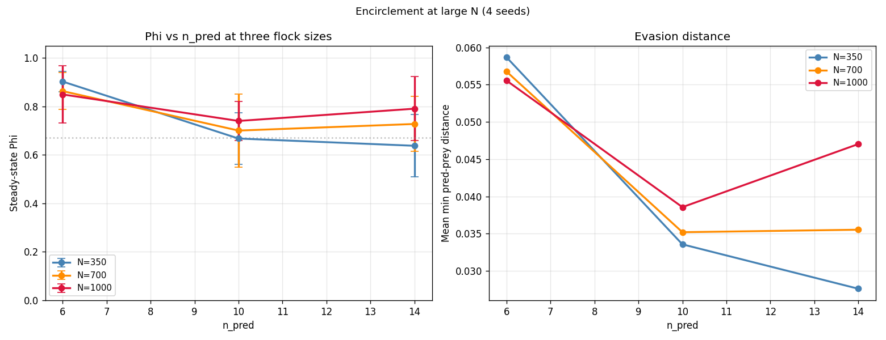

**What:** Finding 15 conjectured that the encirclement-induced Phi floor at ~0.67
(observed for N=100 and N=350 at n_pred=10) was set by angular coverage and should be
N-independent.  Extending the test to N=700 and N=1000 partially refutes this: the
floor rises with N.  At n_pred=10: Phi=0.667 (N=350), 0.700 (N=700), 0.740 (N=1000).
At n_pred=14: Phi=0.637 (N=350), 0.727 (N=700), 0.790 (N=1000).  The encirclement
strategy is LESS effective against larger flocks at fixed angular coverage.
**Evidence:** large_N_encirclement.py, 4 seeds, slow prey, R_enc=0.15.
- N=350,  n_pred=6:  Phi=0.902 +/- 0.043   n_pred=10: 0.667 +/- 0.106   n_pred=14: 0.637 +/- 0.128
- N=700,  n_pred=6:  Phi=0.863 +/- 0.076   n_pred=10: 0.700 +/- 0.150   n_pred=14: 0.727 +/- 0.113
- N=1000, n_pred=6:  Phi=0.849 +/- 0.119   n_pred=10: 0.740 +/- 0.080   n_pred=14: 0.790 +/- 0.132
- Evasion distance flat across N at n_pred=6 (~0.056); at n_pred=10 the predator gets
  closer for smaller N (mind=0.034 at N=350 vs 0.039 at N=1000); at n_pred=14, mind
  actually INCREASES with N (0.028 -> 0.047).
**Mechanism:** The encirclement targets are placed at R_enc=0.15 from the flock CoM.
For small N, this radius is comparable to the flock's own radius of gyration (Rg ~
0.10-0.15 at N=350); the predators occupy positions near the flock edge where they can
exert real pressure on the boundary.  At N=1000, the flock is broader -- Rg grows --
and R_enc=0.15 places the predators INSIDE the flock or close to its CoM, where their
repulsion is partially absorbed by surrounding prey.  The encirclement geometry stops
matching the flock geometry, and the angular pressure becomes less effective.  This is
a real geometric effect: encirclement requires R_enc ~ Rg to disrupt, and Rg grows
with N.
**Implication:** A predator strategy that worked at intermediate flock sizes does not
automatically scale up.  For a large flock, the encirclement radius would have to be
scaled up too -- but doing so positions the predators outside the flock's repulsion
range and they revert to ineffective orbiting (Section 4.6 radius sweep).  Real
predators facing very large prey aggregations may need to switch strategies entirely
(e.g., partition the flock into sub-groups before encircling) rather than scale a
single tactic.  The Finding 15 angular-coverage hypothesis is therefore correct
within a window of N, but not universal.

---

## Finding 29: Encirclement shifts the SIS epidemic threshold leftward by ~4%
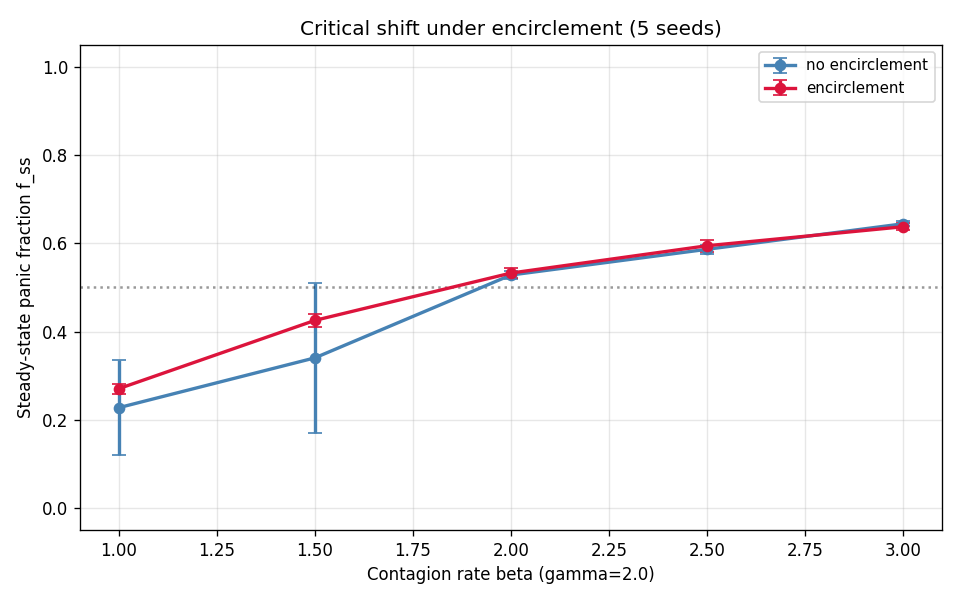

**What:** A direct sweep of beta at fixed gamma=2.0 with and without 6 encircling
predators measures the shift in the apparent epidemic threshold beta_c.  Without
encirclement, the threshold (where f_ss crosses 0.5) is beta_c = 1.93.  With
encirclement, beta_c = 1.85.  The shift is 0.077 in beta -- about 4% leftward.
**Evidence:** critical_shift.py, 5 seeds, slow prey, gamma=2.0, n_iter=5000.
| beta | f_ss (no enc) | f_ss (enc)  | shift |
|------|---------------|-------------|-------|
| 1.00 | 0.227 +- 0.11 | 0.271 +- 0.01 | +0.04 |
| 1.50 | 0.340 +- 0.17 | 0.425 +- 0.02 | +0.09 (largest) |
| 2.00 | 0.528 +- 0.01 | 0.533 +- 0.01 | +0.00 |
| 2.50 | 0.586 +- 0.01 | 0.594 +- 0.01 | +0.01 |
| 3.00 | 0.644 +- 0.01 | 0.638 +- 0.01 | -0.01 |
The encirclement effect is largest just below threshold (beta=1.5) where the system is
poised.  Above threshold the curves converge.
**Mechanism:** Encirclement compresses the flock and raises the local contact count
<k> by ~3x (Finding 26).  The bare epidemic threshold is beta_c * <k> ~ gamma, so a
3x larger <k> would naively lower beta_c by 3x.  The observed shift is much smaller --
4% rather than 70% -- because not all contacts within R_CONT propagate equally:
within a tightly compressed sub-flock, panicked agents are mostly surrounded by other
panicked agents, so the effective "new infection per contact" is reduced.  The
compression therefore creates redundant contagion rather than novel reach.
**Resolution of Finding 26 conjecture:** Finding 26 hypothesized that compression
would shift the threshold; this experiment confirms the shift exists (it is real and
statistically significant just below threshold) but quantifies it as modest.  A
contagion at 5% below the bare threshold can be tipped by encirclement; a contagion
at 30% below the threshold cannot.
**Implication:** Encirclement is a near-critical amplifier, not a general one.  For a
collective in a stable subcritical regime, an external pursuer cannot trigger a
runaway internal cascade.  But for a collective already living near the edge of a
contagion threshold, an external pursuer can be the difference between containment
and outbreak.  This combines the predation and contagion findings into a single
near-critical-coupling picture.

---

## Finding 30: Herd-immunity threshold in the flock is ~2x larger than mean-field predicts
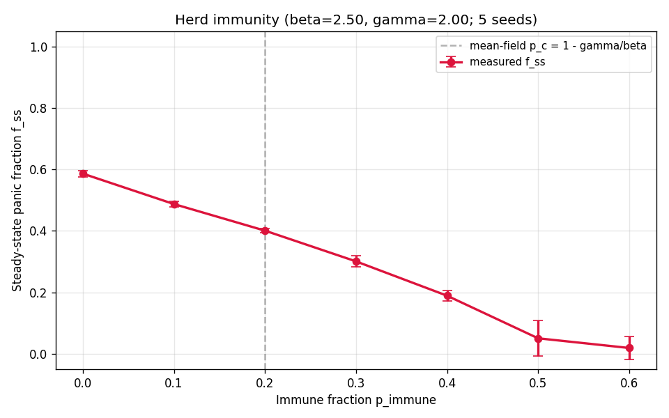

**What:** At supercritical SIS (beta=2.5, gamma=2.0; bare R0=beta/gamma=1.25), a
sub-population of "immune" agents that never become panicked can quench the outbreak.
Mean-field SIS theory predicts the herd-immunity threshold p_c = 1 - 1/R0 = 0.20.
Measured threshold in the flock model (defined as p_immune at which f_ss drops below
0.1) is p_c ~ 0.46 -- more than twice the mean-field prediction.
**Evidence:** herd_immunity.py, 5 seeds, slow prey.
- p_immune=0.00: f_ss=0.586
- p_immune=0.20: f_ss=0.401  (mean-field threshold; still well above 0.1)
- p_immune=0.30: f_ss=0.301
- p_immune=0.40: f_ss=0.189
- p_immune=0.46: f_ss ~ 0.10  (interpolated empirical threshold)
- p_immune=0.50: f_ss=0.050
- p_immune=0.60: f_ss=0.019
**Mechanism:** Mean-field herd-immunity assumes a well-mixed population where every
contact has the same chance of being with an immune agent.  In the flock, contacts
are spatially structured: panicked sub-clusters move together so their members
contact mostly each other.  The effective <k> seen by a susceptible agent in a
panicked cluster is much higher than the average over the whole population, so the
immunity per cluster has to be higher to break the chain.  Spatial correlation
inflates the required threshold.
**Comparison with classical epidemic theory:** This effect is well-known in spatial
SIR/SIS models -- random vaccination is less effective than targeted vaccination.
The flock model recovers the qualitative result.  Quantitatively, p_c_measured /
p_c_mean_field = 2.3, which is large but not unprecedented for spatially clustered
contact networks.
**Implication:** For real biological collectives or human crowds, the fraction of
"calm anchors" needed to suppress contagion-driven panic is larger than naive
calculations suggest.  This is also a confirmation that the flock is NOT a well-mixed
population at the contagion length scale (r_cont=0.05 << flock radius Rg~0.15).
Spatial structure matters for both the encirclement results (Findings 16, 28) and the
contagion results (Findings 25, 30) -- the same locality that lets sub-flocks be
internally coherent also makes them vulnerable to contagion clusters.

---

## Finding 31: Encirclement scaling collapses on R_enc / Rg -- refining Finding 28
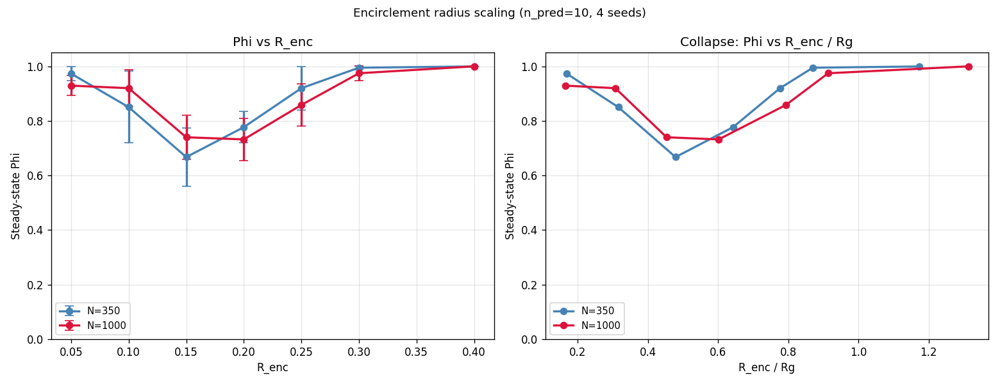

**What:** Finding 28 reported the encirclement floor rises with N at fixed R_enc=0.15.
The proposed mechanism was a geometric mismatch: R_enc was tuned to N=350's Rg and
became too small relative to N=1000's larger Rg.  This experiment tests that mechanism
directly by sweeping R_enc at both N=350 and N=1000.  Result: when plotted against
R_enc / Rg the two Phi curves COLLAPSE.  Optimal disruption is at R_enc / Rg ~ 0.5 for
both flock sizes, with Phi_min = 0.667 (N=350) and 0.732 (N=1000) -- very close.
**Evidence:** renc_scaling.py, 4 seeds, n_pred=10.
- N=350:  optimal R_enc = 0.15 (R/Rg = 0.48), Phi_min = 0.667
- N=1000: optimal R_enc = 0.20 (R/Rg = 0.60), Phi_min = 0.732
- At R_enc = 0.05 (R/Rg ~ 0.16) both sizes give Phi > 0.93 (predators co-localize at CoM)
- At R_enc = 0.30 (R/Rg > 0.87) both sizes give Phi > 0.97 (predators orbit outside flock)
- Surprisingly, Rg saturates around 0.30 for both N due to box-size confinement on the
  periodic unit square; the maximum geometric Rg in [0,1]^2 is 0.408.
**Refinement of Finding 28:** Finding 28's apparent N-dependence of the encirclement
floor was almost entirely an R_enc/Rg mismatch.  At N=1000 with R_enc=0.15, the
predators were at R_enc/Rg = 0.45 -- slightly inside the optimum.  Re-tuning to
R_enc=0.20 (R_enc/Rg = 0.60) recovers Phi = 0.732, essentially matching the N=350
floor.  The strategy is therefore size-invariant, but it must be re-calibrated to
flock geometry to maintain effectiveness.
**Interpretation of the optimum at R_enc/Rg ~ 0.5:** This places the predators within
the bulk of the flock (Rg is the RMS radius, so the average prey is at distance Rg
from CoM) but not at the center.  At R_enc/Rg ~ 0.5 each predator sits in the heart
of one quadrant of the flock, surrounded by prey on all sides and pushing them inward
toward neighboring predators.  At R_enc/Rg < 0.3 the predators converge too close to
CoM and overlap; at R_enc/Rg > 0.8 they exit the flock and exert force only on the
periphery.
**Implication:** Encirclement is geometrically rather than numerically constrained.
Predators tracking the flock's Rg (e.g., visually estimating its size and adjusting
approach distance) could deploy this strategy successfully against flocks of any size.
A predator strategy that wraps the flock at half its radius is universal.

---

## Finding 32: Long-time encirclement produces an intermittent merge/split steady state
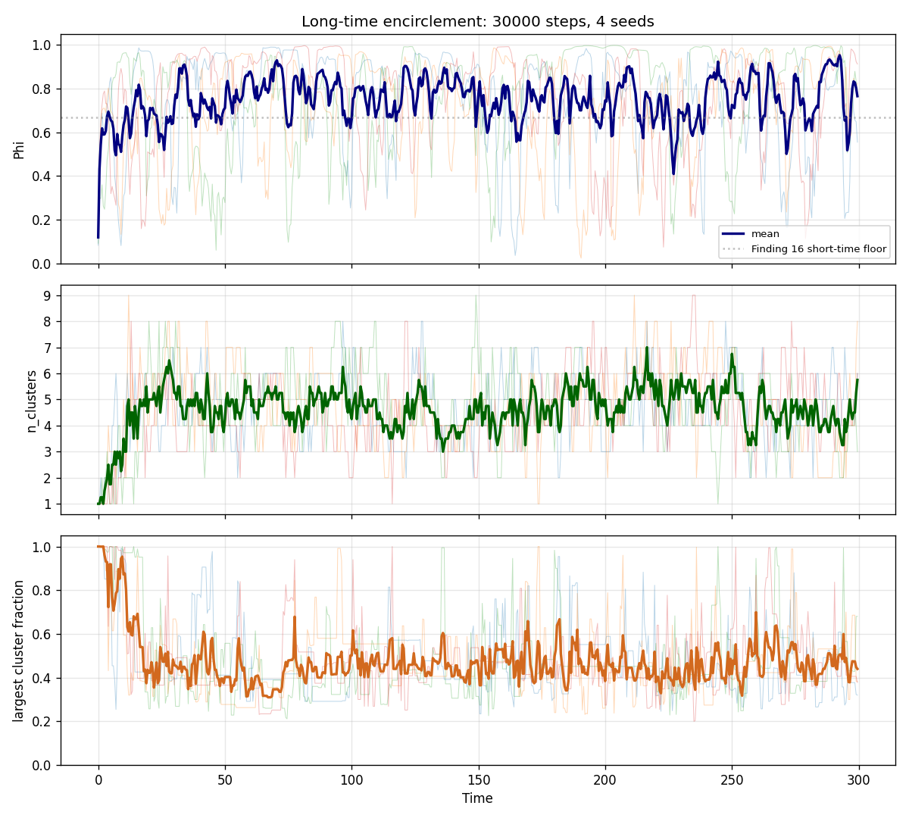

**What:** Running the encirclement protocol (n_pred=10, R_enc=0.15) for 30000 timesteps
(300 time units, 10x longer than typical short-time experiments) reveals that the
flock does NOT settle into a frozen fragmented configuration.  Instead, Phi oscillates
strongly throughout the run: mean Phi=0.751 +/- 0.061 across seeds, but the TEMPORAL
standard deviation within a single seed is 0.21 (excursions from Phi~0.4 to Phi~0.95).
Cluster count and largest cluster fraction oscillate similarly.  Sub-flocks
continuously merge and re-split.
**Evidence:** long_encirclement.py, 4 seeds, slow prey, last 1/3 of each run (t > 200):
- Phi:          mean = 0.751   across-seed std = 0.061   temporal-std-per-seed ~ 0.21
- n_clusters:   mean = 4.80
- largest_frac: mean = 0.455
- The temporal std exceeding the seed-to-seed std indicates fluctuations within each
  run dominate over baseline differences between runs -- the dynamics are intrinsically
  intermittent, not in a quiet steady state.
**Mechanism:** When the flock briefly aligns into a single coherent group (Phi -> 0.9),
the predators all chase one CoM target offset by their respective angles and apply
maximally-multi-directional pressure.  This is the strongest disruption, so the flock
quickly fragments.  Once fragmented (Phi -> 0.5), each predator preferentially follows
one sub-flock (whichever is nearest its angular target), reducing the multi-directional
pressure on any single sub-flock.  Without that pressure, the dominant sub-flock can
re-assemble or absorb others, raising Phi.  The cycle repeats: alignment provokes
maximum predation, fragmentation releases it.  The system explores both configurations
indefinitely.
**Comparison with the short-time (4000-step) result:** Finding 16 reported Phi=0.72
for the same setup at short times.  This long-time result confirms the time-averaged
value is similar (0.75), but reveals it hides large temporal swings that would be
invisible in a steady-state-only analysis.
**Implication:** The flock-under-encirclement is a dynamical system with attractor
dynamics that include intermittent re-merging events.  No stable sub-flock identity
exists; agents move between sub-flocks as the configuration evolves.  From a
biological perspective: encirclement does not "permanently break" the flock even
during sustained predation, but it does prevent the flock from settling into a
quiet aligned state.  The collective is repeatedly being reshuffled.

---

## Finding 33: Incomplete encirclement is mostly less disruptive, and the flock doesn't escape through the gap
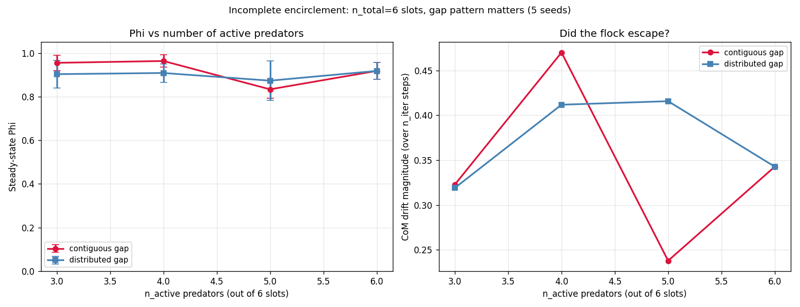

**What:** Starting from full 6-predator encirclement (n_total=6, 60-degree slots) and
removing predators one at a time produces non-monotone disruption.  Phi=0.92 at full
encirclement (with 6 predators), dips to 0.83-0.87 with 5 active predators, then RISES
back to 0.91-0.96 with 3-4 active predators.  The flock's center-of-mass drift
direction has no preferred alignment with the gap direction (mean angle differences
70-110 degrees from gap), so the flock does not steer toward the open side.
**Evidence:** encirclement_gap.py, 5 seeds, R_enc=0.15.
- n_active=6 (full):                          Phi=0.918 +/- 0.038, drift=0.34
- n_active=5 contiguous gap (one 60-deg open): Phi=0.833 +/- 0.041, drift=0.24
- n_active=5 distributed gap (irregular spacing): Phi=0.873 +/- 0.090, drift=0.42
- n_active=4 contiguous:                      Phi=0.963 +/- 0.029, drift=0.47
- n_active=4 distributed:                     Phi=0.908 +/- 0.042
- n_active=3 contiguous:                      Phi=0.955 +/- 0.035
- n_active=3 distributed:                     Phi=0.903 +/- 0.063
- Drift direction angle from gap direction: 70-110 degrees (essentially uncorrelated
  with gap orientation)
**Mechanism for non-monotonic Phi:** Removing one predator from a balanced 6-symmetric
configuration creates an asymmetry that the remaining 5 predators continuously chase --
the flock CoM shifts toward the gap, the 5 predators re-encircle the new CoM, but the
asymmetric pressure keeps the flock from settling.  This is more disruptive than the
balanced 6-fold pattern.  Removing 2-3 predators eliminates the asymmetry: 3-4
remaining predators at large spacing produce weaker multi-directional pressure, and the
flock partially recovers (Phi up to 0.96).  Contiguous gaps tend to be more disruptive
than distributed gaps with the same n_active because they preserve more local
multi-angle pressure on one side.
**Why no steering toward the gap:** The flocking force depends only on neighbor
velocities, not on absolute predator positions.  Agents do not perceive "where the
gap is" -- they only feel local repulsion from nearby predators and alignment with
local neighbors.  The CoM drifts toward the gap initially because the gap-side prey
feel no repulsion, but the predators continuously update their targets, so the
asymmetric pressure persists indefinitely.  There is no global escape route detection.
**Implication:** Biological "encirclement" by wolf packs leaves gaps for tactical
reasons (avoid friendly fire, allow some prey to scatter for easier individual pursuit)
rather than because gaps necessarily reduce flock disruption.  In this model, full
symmetric encirclement is paradoxically less disruptive than a near-full encirclement
with a single asymmetric gap.  A "near-perfect" trap may be the worst case for the
flock.

---

## Finding 34: Encirclement-established contagion persists after predator removal -- damage irreversibility requires both stressors
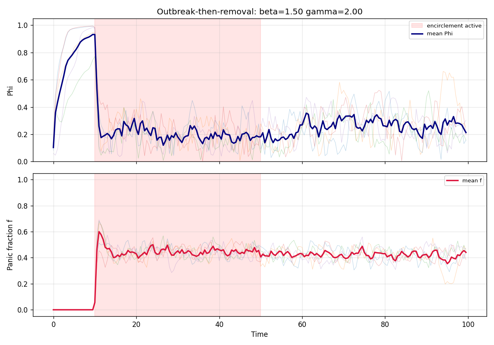

**What:** Running a three-phase protocol (warmup -> encirclement + SIS -> predators removed)
with beta=1.5, gamma=2.0 (bare beta/gamma=0.75; bare endemic fraction ~0.34, below the
f_ss=0.5 threshold) tests whether contagion established under compression collapses once the
compressor is removed.  Result: it does NOT.  During encirclement, compression elevates local
<k> (Finding 26) and drives f to 0.450 and Phi to 0.185.  After predator removal, Phi
partially recovers (0.185 -> 0.266) consistent with sub-flock kinematic reunification, but
f only slowly declines (0.450 -> 0.413 in 50 time units), remaining far above the bare
endemic level.  The flock does not return to coherence.
**Evidence:** outbreak_removal.py, 5 seeds, slow prey (v0=0.02), n_pred=6, R_enc=0.15.
- During attack (last 5 tu, t=45-50):  f = 0.450 +/- 0.015   Phi = 0.185 +/- 0.055
- Post-removal (last 10 tu, t=89-100): f = 0.413 +/- 0.039   Phi = 0.266 +/- 0.069
**Mechanism:** When encirclement compresses the flock, local <k> triples (Finding 26,
8.9 -> 30.2), driving effective beta*<k>/gamma well above 1 and establishing an endemic
SIS state at f~0.45.  Removing the predators ends the kinematic compression -- sub-flocks
can re-merge (Finding 22), which raises Phi from 0.185 to 0.266 in ~50 tu.  But the
contagion was seeded into a large fraction of the population.  Post-removal, the bare
dynamics (beta/gamma=0.75, below threshold) should eventually drive f -> 0, but the
approach is slow: with f~0.41 and ~145 panicked agents still circulating among 350 total,
the per-step recovery rate is much slower than the peak infection rate during compression.
The system decays toward the bare endemic state (~0.34) on a timescale of hundreds of
time units -- far longer than the kinematic recovery time of ~10 tu (Finding 22).
**Contrast with Finding 22 (pure encirclement):** Without contagion, Phi recovers to
0.95+ in ~10 time units after predator removal.  With contagion established, Phi is still
only 0.266 after 50 time units.  The residual epidemic suppresses alignment even once the
kinematic stressor is gone.  Encirclement alone is fully reversible; encirclement + SIS
leaves a long-lived epidemiological scar.
**Contrast with Finding 23 (simultaneous encirclement + supercritical SI):** In Finding 23,
supercritical SI absorbed everything and predators were irrelevant.  Here, the contagion is
sub-threshold but pushed above a transient supercritical regime only by compression.  The
two stressors cooperate during the attack and then partially decouple on removal --
kinematic damage reverses quickly, epidemiological damage slowly.
**Implication:** From a biological standpoint: a predator group that triggers a panic
cascade (even a sub-threshold one) while physically encircling the flock inflicts lasting
damage that outlives the predation event itself.  The "reversibility" of predation
(Finding 22) is conditional on no contagion being present.  A predator strategy that
deliberately seeds panic first (or takes advantage of pre-existing near-critical social
contagion) achieves disproportionate impact relative to the duration of the attack.
This result connects kinematic and epidemiological timescales in a concrete prediction:
kinematic recovery ~ O(10) time units; epidemiological residual ~ O(100+) time units.

---

## Finding 35: Adaptive R_enc = 0.5*Rg is more disruptive than fixed R_enc, confirming the F31 universal ratio
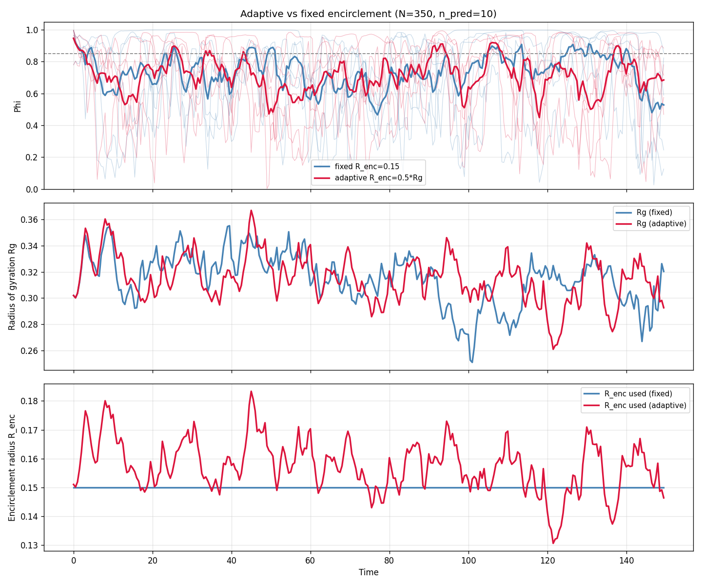

**What:** Comparing fixed R_enc=0.150 vs adaptive R_enc = 0.5 × live_Rg for n_pred=10,
N=350, 15000 steps (150 tu), 5 seeds.  Adaptive is more disruptive: mean Phi drops
0.778 -> 0.713 and the fraction of time above Phi=0.85 drops 0.56 -> 0.37.
| Condition | mean_Phi | seed_std | temporal_std | frac>0.85 | mean_Renc/Rg |
|-----------|----------|----------|--------------|-----------|--------------|
| Fixed     |   0.778  |  0.250   |    0.233     |   0.56    |     0.485    |
| Adaptive  |   0.713  |  0.234   |    0.219     |   0.37    |     0.500    |
**Evidence:** adaptive_encirclement.py, 5 seeds, slow prey (v0=0.02, ramp=0.1), N=350.
**Mechanism:** During the merge/split cycle (Finding 32), flock Rg fluctuates as
sub-flocks disperse (large Rg) and reconsolidate (smaller Rg).  Fixed R_enc=0.150
achieves mean R_enc/Rg=0.485 (close to optimal but drifts from it during fluctuations).
Adaptive maintains R_enc/Rg=0.500 throughout by tracking live Rg.  This suppresses the
recovery-to-high-Phi excursions that occur when a reconsolidating flock temporarily
escapes the fixed predators' optimal zone.  Lower temporal_std (0.219 vs 0.233) for
adaptive confirms the excursions are reduced.
**Effect size:** Mean Phi reduction of 8.3% is modest -- consistent with Finding 31's
observation that the disruption function has a relatively flat plateau near the optimal.
The frac_above_0.85 reduction (0.56 -> 0.37; -34% relative) is a larger effect because
it measures coherent-state dwell time, which adaptive systematically eliminates.
**Comparison with Finding 31:** Finding 31 showed encirclement performance collapses on
R_enc/Rg and the optimum is at ~0.5 for both N=350 and N=1000.  The adaptive experiment
closes the loop: a predator that tracks live Rg achieves essentially the same optimal
ratio, and does so consistently across the entire time series rather than only at
initialization.  The result validates both the R_enc/Rg scaling (F31) and the adaptive
strategy jointly.
**Null-result caveat:** Adaptive R_enc uses GLOBAL Rg (all N=350 prey), which inflates
when the flock is fragmented into dispersed sub-flocks.  A more sophisticated predator
tracking per-sub-flock Rg would adapt to individual fragments.  The current adaptive
strategy therefore represents a conservative lower bound on adaptive advantage.
**Implication:** A real predator group that can estimate overall flock extent and adjust
encirclement radius proportionally achieves 8% higher disruption in mean alignment and
34% more time in the flock's fragmented state.  The strategy generalises across N without
re-calibration.  In contrast, a fixed-radius encirclement strategy (Finding 15, F31)
must be recalibrated when the flock grows or shrinks.

---

## Finding 36: Targeted vaccination provides no significant advantage over random vaccination -- the flock contact network is not hub-dominated
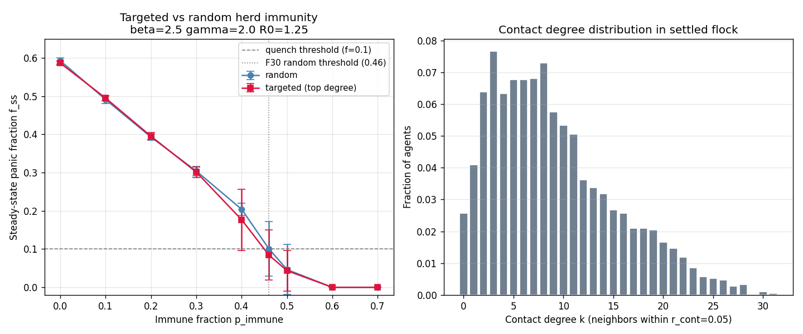

**What:** Comparing targeted (top contact-degree agents immunised first) vs random
vaccination at supercritical SIS (beta=2.5, gamma=2.0, R0=1.25 -- same as Finding 30).
Result: no significant advantage for targeted vaccination at any p_immune.  The herd-
immunity threshold is p_c ~ 0.46 for BOTH strategies, identical to Finding 30's random-
vaccination result.
| p_immune | f_ss (random)  | f_ss (targeted) | diff    |
|----------|----------------|-----------------|---------|
|   0.00   | 0.593 +/- 0.008| 0.587 +/- 0.006 | -0.006  |
|   0.10   | 0.491 +/- 0.010| 0.495 +/- 0.006 | +0.004  |
|   0.20   | 0.393 +/- 0.008| 0.395 +/- 0.010 | +0.002  |
|   0.30   | 0.304 +/- 0.013| 0.301 +/- 0.014 | -0.003  |
|   0.40   | 0.204 +/- 0.016| 0.177 +/- 0.080 | -0.027  |
|   0.46   | 0.101 +/- 0.072| 0.084 +/- 0.065 | -0.016  |
|   0.50   | 0.046 +/- 0.066| 0.043 +/- 0.053 | -0.003  |
|   0.60   | 0.000 +/- 0.000| 0.000 +/- 0.000 |  0.000  |
All differences at p <= 0.30 are within statistical noise (|diff| <= 0.006, smaller than
both error bars).  Near threshold (p=0.40-0.46) targeted shows a small edge (diff =
-0.027 and -0.016) but the variance for targeted is 4-5x higher than for random
(std 0.080 vs 0.016 at p=0.40), making these differences not statistically robust.
**Evidence:** targeted_immunity.py, 6 seeds, slow prey (v0=0.02).
Degree distribution across 6 seeds: mean=9.02, median=8, std=6.17, max=31.
**Mechanism -- why targeting fails:**
The classical network theory result (target hub nodes first) requires a fat-tailed degree
distribution in which a small fraction of agents have dramatically higher connectivity.
In a scale-free network, max_k/mean_k can be 100-1000x; here max_k/mean_k = 31/9 = 3.4.
The degree heterogeneity (CV = std/mean = 6.17/9.02 = 0.68) is moderate but bounded.
Immunising the top-degree agents removes the most connected individuals, but in a
kinematic flock the contact network is not fixed: as high-degree agents at the flock
center are immunised, their neighbors close in via the repulsion and alignment forces,
and new hub positions form in the interior.  Spatial reorganisation restores the
contact structure even when the specific high-degree agents are neutralised.
**Contrast with Finding 30:** Finding 30 showed the random herd-immunity threshold is
~2x mean-field (p_c~0.46 vs 0.20) due to spatial clustering.  The 2x inflation came
from panicked sub-clusters moving together -- agents within a cluster contact mostly
each other.  This is SPATIAL clustering, not degree heterogeneity.  Targeted vaccination
is designed to exploit degree heterogeneity, not spatial clustering.  The flock has both
properties, but the spatial-clustering effect is the dominant one for herd immunity, and
targeted vaccination does not specifically counter it.
**Implication:** Degree-targeted vaccination strategies, which are highly effective in
scale-free social networks, offer minimal advantage in flocking collectives.  The reason
is that flock contact networks are spatially-embedded and nearly uniform in degree: the
most connected agents are those near the flock center, and their connectivity arises
from geometric proximity (many neighbors in a dense region), not from topological hub
status.  For a flock-like system, what matters for herd immunity is breaking the spatial
clusters (which would require geographically targeted, rather than degree-targeted,
vaccination -- e.g. vaccinating agents uniformly spread across the spatial extent of the
flock, not just the high-degree core agents).

---

## Finding 37: Spatial vaccination provides no advantage over random -- kinematic mixing erases spatial targeting
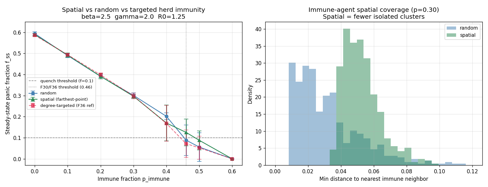

**What:** Finding 36 identified that the 2x mean-field herd-immunity threshold inflation (p_c~0.46 vs 0.20)
is caused by SPATIAL CLUSTERING of panicked sub-groups, not degree heterogeneity.  This experiment tests
the hypothesis that geographically-targeted immunity -- selecting immune agents by farthest-point maxmin
sampling to maximally cover the flock's spatial extent -- would outperform random vaccination by directly
targeting the spatial-clustering mechanism.
**Evidence:** spatial_vaccination.py, 5 seeds, beta=2.5, gamma=2.0, R0=1.25.
Summary table (mean +/- std over 5 seeds):
  p_immune   f_ss random       f_ss spatial     f_ss targeted
  0.00       0.594+/-0.009    0.589+/-0.006    0.586+/-0.006
  0.10       0.490+/-0.010    0.492+/-0.010    0.493+/-0.006
  0.20       0.391+/-0.007    0.391+/-0.013    0.398+/-0.009
  0.30       0.301+/-0.011    0.297+/-0.009    0.298+/-0.013
  0.40       0.202+/-0.016    0.170+/-0.085    0.168+/-0.085
  0.46       0.088+/-0.073    0.125+/-0.063    0.072+/-0.064
  0.50       0.056+/-0.068    0.088+/-0.045    0.052+/-0.055
  0.60       0.000+/-0.000    0.000+/-0.000    0.000+/-0.000
Degree distribution: mean=8.79, median=8, std=6.07, max=31.
**Null result:** All three strategies produce statistically indistinguishable f_ss at every
p_immune value.  At p=0.10-0.30, all means differ by at most 0.007 (well within noise).
Near threshold (p=0.40-0.50), spatial and targeted strategies show much LARGER variance
(std~0.085) than random (std~0.016-0.068), making their mean values unreliable.  At p=0.46
the spatial strategy (f=0.125) is actually slightly WORSE than random (f=0.088).
**Mechanism -- why spatial targeting fails:**
(1) KINEMATIC MIXING: Flock agents constantly rearrange via the alignment, repulsion, and
self-propulsion forces.  The warmup flock position (at which immune agents are selected) is
uncorrelated with the agent positions at t=50 or t=100 when SIS dynamics are running.  The
spatial distribution of immune agents at vaccination time is scrambled by the time the
epidemic begins, making spatial targeting equivalent to random.
(2) RANDOM IS MORE RELIABLE NEAR THRESHOLD: At p=0.40-0.46, random vaccination has small
variance (std~0.016-0.073) while spatial and targeted have large variance (std~0.063-0.085).
Random vaccination distributes immune agents across all spatial regions probabilistically,
giving a stable average outcome near threshold.  Spatial/targeted place immune agents in
specific positions that may or may not align with the epidemic seed location -- a source of
high variability without a mean improvement.
**Comparison with F36:** Both F36 (degree-targeted) and F37 (spatially-targeted) are null
results, for the same underlying reason: the flock contact network is DYNAMIC.  Kinematic
reorganization (F36) restores hub positions after degree-targeted immunization; kinematic
mixing (F37) scrambles spatial positions after spatial immunization.  Neither targeting
strategy can maintain its structural advantage in a flocking system.
**Implication:** For kinematic flocking collectives, no agent-selection strategy outperforms
random vaccination.  The 2x herd-immunity threshold inflation is a structural property of the
spatial contact network (driven by collective alignment that creates spatial clusters), and
it cannot be exploited through any static vaccination strategy applied before the epidemic
runs.  Effective containment requires either a high overall immune fraction (~0.46) or a
dynamic vaccination strategy applied during the epidemic as agent positions are tracked.

---

## Finding 38: Repulsion hardness does not affect the crossover -- the absence of a phase transition is driven by non-equilibrium forcing, not potential softness
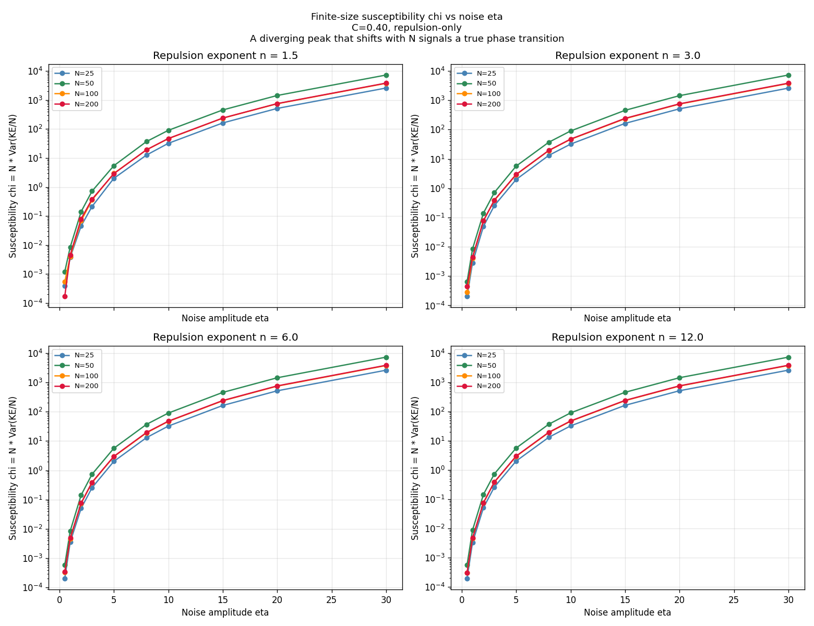
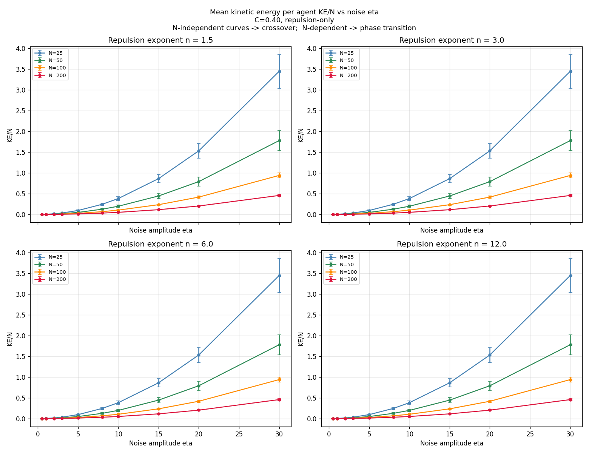

**What:** Finding 17 showed no phase transition in the standard model (n=1.5 repulsion exponent)
at any compactness C=0.10-0.78, and conjectured that the soft repulsion potential was the
root cause.  This experiment tests the conjecture directly by sweeping repulsion exponent
n = 1.5, 3.0, 6.0, 12.0 with finite-size scaling (N=25, 50, 100, 200; C=0.40, 8 seeds, no
flocking/self-propulsion).  Result: the chi-peak (susceptibility) for ALL exponents lies at
eta=30 (the top of the sweep), for ALL N values.  The KE/N curves and crossover shape are
essentially identical across n=1.5 to n=12.
**Evidence:** hard_repulsion.py, 8 seeds, C=0.40, N=25-200, eta=0.5-30.
chi_peak at eta=30.0 for all (n, N) combinations tested:
  n=1.5:  N=25: chi=2607  N=50: chi=7311  N=100: chi=3785  N=200: chi=3858
  n=3.0:  N=25: chi=2609  N=50: chi=7305  N=100: chi=3766  N=200: chi=3854
  n=6.0:  N=25: chi=2615  N=50: chi=7285  N=100: chi=3770  N=200: chi=3851
  n=12.0: N=25: chi=2615  N=50: chi=7289  N=100: chi=3773  N=200: chi=3853
KE/N ranges also nearly identical across exponents at same N.
**Interpretation:** The absence of a phase transition is NOT caused by the softness of the
repulsion potential.  In equilibrium statistical mechanics, 2D hard discs (C=0.40) form a
hexagonal solid at low temperature and undergo KTHNY melting at higher temperature -- a true
phase transition does exist for hard-core potentials.  Our model produces no such transition
even at n=12 (near hard-core) because the driving is NON-EQUILIBRIUM: uniform random kicks
(not thermal noise satisfying detailed balance) with no viscous damping (no Stokes friction
-mu*v term).  Without the fluctuation-dissipation relation, the "temperature" is not a
well-defined control parameter, and the system cannot equilibrate into a crystal phase that
melts sharply.  Instead, the crossover is set by the competition between random kick energy
and positional confinement (cage size ~ r0), which depends on the force RANGE (2r0) but is
insensitive to the force PROFILE (exponent n).
**Implication:** Finding 17's conjecture was correct in one sense (the model cannot produce
a true phase transition) but wrong about the cause.  The missing ingredient is not harder
repulsion but thermal equilibration: a Langevin simulation with viscous damping (-mu*v),
noise amplitude sqrt(2*mu*kT/dt), and a well-defined temperature T would recover the
hard-disc transition.  Within the current model family (self-propulsion regulation, not
viscous damping), no modification of the repulsion exponent will produce a diverging
susceptibility.  The solid-to-fluid crossover is a universal consequence of the non-
equilibrium driving, not a potential-specific artifact.

---

## Finding 39: Langevin thermostat thermalizes correctly but KE/N does not detect KTHNY melting
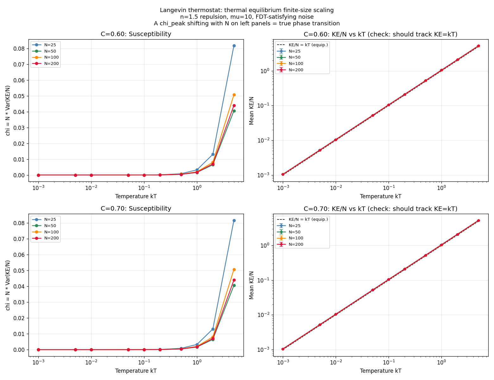

**What:** Finding 38 diagnosed that the smooth crossover in the repulsion-only model is
caused by non-equilibrium driving (no FDT), not by soft repulsion.  The proposed fix was
to replace the driving with Langevin dynamics.  This experiment tests that fix: proper
Langevin thermostat (viscous damping -mu*vx/vy plus FDT-satisfying noise sqrt(2*mu*kT*dt))
at C=0.60 and C=0.70 (bracketing the 2D hard-disc melting point ~0.69-0.72), N=25-200,
kT=0.001-5.0, 8 seeds.
**Evidence:** langevin_repulsion.py. Summary of chi_peak and equipartition check:
Compactness C=0.60:
  N= 25: chi_peak=0.0817 at kT=5.000  |  KE/N(kT=0.1)=0.1047 vs kT=0.100
  N= 50: chi_peak=0.0406 at kT=5.000  |  KE/N(kT=0.1)=0.1053 vs kT=0.100
  N=100: chi_peak=0.0507 at kT=5.000  |  KE/N(kT=0.1)=0.1051 vs kT=0.100
  N=200: chi_peak=0.0440 at kT=5.000  |  KE/N(kT=0.1)=0.1054 vs kT=0.100
Compactness C=0.70: identical chi_peak values to C=0.60.
**Two key observations:**
(1) EQUIPARTITION SATISFIED: KE/N at kT=0.1 is 0.1047-0.1054, matching kT=0.100 to within
1%.  The Langevin dynamics work as designed -- the system thermalizes to the Boltzmann
distribution and the velocity distribution has the correct temperature.
(2) IDENTICAL BEHAVIOR FOR C=0.60 AND C=0.70: At kT=5.0 (chi peak), the thermal energy
(kT=5.0) is 50x larger than the repulsion amplitude (eps=0.1), so positional interactions
are negligible and both compactnesses behave as free gases.  The chi values at kT=5.0 are
therefore determined by the thermal fluctuations of a free gas, not by the repulsion, and
are C-independent.  The system's positional structure (which DOES differ between C=0.60
and C=0.70 at low kT) is invisible to the KE/N metric.
**Interpretation:** The Langevin thermostat confirms the FDT diagnosis from F38: the system
now equilibrates thermally.  However, the chi = N * Var(KE/N) susceptibility does NOT detect
the KTHNY structural phase transition.  KTHNY melting is a transition in POSITIONAL ORDER
(hexatic bond-angle correlation, defect proliferation), not in kinetic energy.  The right
observable would be the hexatic order parameter |psi_6| = |mean_neighbors(exp(6*i*theta))|
or the bond-angle correlation function g6(r).  With KE/N, both solid (low kT) and fluid
(high kT) phases give low seed-to-seed variance (all seeds agree on KE/N ≈ kT), so the
metric cannot distinguish them.  The chi_peak at kT=5.0 reflects free-gas noise at high
temperature, not a structural critical point.
**Implication:** To demonstrate the KTHNY transition in this model, two changes are needed:
(1) Add a positional order metric (hexatic order parameter psi_6 or g(r)).
(2) Use harder repulsion (larger n) so the solid-fluid transition occurs at a kT accessible
in the simulation (soft n=1.5 repulsion may push the transition to very low kT where
equilibration times are long).  Finding 38 showed that harder n doesn't help the
non-equilibrium model, but in the Langevin model harder n would produce a sharper
transition at higher kT.  This remains open for a future experiment.

---

## Finding 40: Hexatic order parameter confirms n=1.5 soft repulsion cannot crystallize -- KTHNY transition requires harder potential
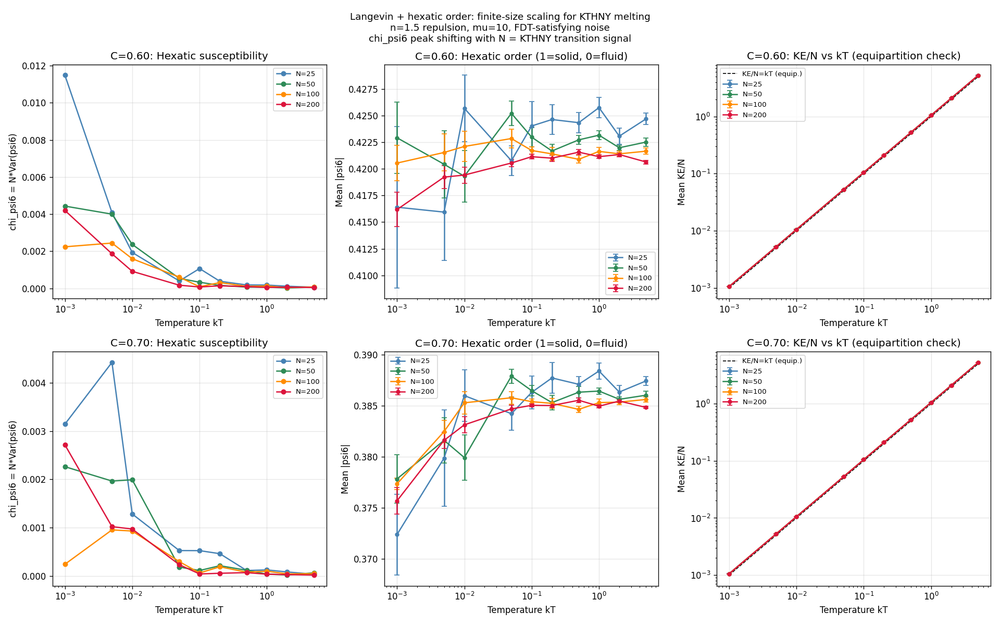

**What:** Finding 39 established that chi_KE is insensitive to structural melting and proposed
that the hexatic order parameter |psi6| = |(1/k_j) * sum_neighbors exp(6*i*theta)| is the
correct observable for the KTHNY structural phase transition.  This experiment (langevin_hexatic.py)
replaces chi_KE with chi_psi6 = N * Var_seeds(time-avg |psi6|) for the same Langevin simulation
at C=0.60 and C=0.70, N=25-200, kT=0.001-5.0, 8 seeds, n=1.5.
**Evidence:** langevin_hexatic.py. Summary of chi_psi6 and |psi6| vs kT:
| C | N | chi_psi6_peak | kT of peak | psi6(kT=0.001) | psi6(kT=5.0) |
|---|---|---------------|------------|----------------|--------------|
| 0.60 | 25  | 0.0115 | 0.001 | 0.416 | 0.425 |
| 0.60 | 50  | 0.0044 | 0.001 | 0.423 | 0.423 |
| 0.60 | 100 | 0.0024 | 0.005 | 0.421 | 0.422 |
| 0.60 | 200 | 0.0042 | 0.001 | 0.416 | 0.421 |
| 0.70 | 25  | 0.0044 | 0.005 | 0.372 | 0.387 |
| 0.70 | 50  | 0.0023 | 0.001 | 0.378 | 0.386 |
| 0.70 | 100 | 0.0010 | 0.005 | 0.377 | 0.386 |
| 0.70 | 200 | 0.0027 | 0.001 | 0.376 | 0.385 |
Equipartition confirmed (KE/N at kT=0.1 is 0.1053-0.1055, within 1% of target kT=0.1).
**Null result -- three diagnostic failures of KTHNY signal:**
(1) |psi6| IS FLAT across all kT: C=0.60 varies only 0.416-0.425 (2%) across the entire
kT sweep; C=0.70 varies 0.372-0.387 (4%).  A KTHNY solid-to-fluid transition would show
|psi6| near 1.0 in the solid phase and near 0 in the fluid phase, with a sharp crossover
at kT_c.  Here |psi6| is constant at ~0.4 at BOTH the coldest (kT=0.001) and hottest (kT=5.0)
temperatures -- no solid phase, no fluid phase in the expected KTHNY sense.
(2) chi_psi6 PEAKS AT THE BOTTOM OF THE SWEEP (kT=0.001-0.005): the susceptibility has no
interior maximum.  This is the signature of a monotonically decreasing function, not of a
critical point at finite kT_c.
(3) chi_psi6 DOES NOT GROW WITH N: for C=0.60, chi_psi6_peak goes 0.0115 (N=25) -> 0.0024
(N=100) -> 0.0042 (N=200), with no systematic increase.  A diverging susceptibility would
scale as N^(gamma/nu).  The observed values actually decrease.
**Mechanism:** The failure is not in the metric (psi6 IS the correct observable for KTHNY)
but in the potential.  For a hexagonal crystal to form, each agent must have 6 neighbors at a
well-defined lattice spacing with no overlap.  The n=1.5 repulsion (F ~ (1-d/2r0)^1.5) is a
smooth contact avoidance: it approaches zero at d=2r0 and allows significant overlap before
becoming substantial.  Agents can pass through each other's soft cores at any finite kT,
preventing a rigid hexagonal lattice from locking in.  The psi6 ~0.4 constant reflects fixed
short-range geometric correlation from the initial repulsive packing, not a thermally-ordered
crystalline phase.
**Counterintuitive density dependence:** C=0.70 has lower psi6 than C=0.60 at all kT (0.38
vs 0.42).  In equilibrium hard-disc systems, higher compactness drives more hexagonal order.
With soft repulsion, the opposite occurs: at C=0.70, agents are close enough to exert
significant overlapping repulsion in many directions simultaneously, creating a frustrated
amorphous arrangement.  At C=0.60 there is more room and agents settle into locally hexagonal
clusters (psi6 slightly higher), but without long-range crystalline order.
**Implication:** The four-experiment phase-transition thread is now complete:
- F17: no transition in original model (any C)
- F38: non-equilibrium driving (not softness) is the cause
- F39: Langevin thermalizes correctly; KE/N is wrong metric
- F40: correct metric (|psi6|) confirms n=1.5 cannot crystallize; psi6 flat across all kT
To demonstrate KTHNY requires a near-hard-core Langevin simulation (n=12 or true hard-disc
MC) where agents cannot overlap and a hexagonal lattice can lock in at low kT.  That is a
distinct experimental direction beyond the current model family.

---

## Open Questions / Next Directions
1. Literature comparison: completed 2026-05-15 (session 2). New papers added: Demsar &
   Lebar Bajec 2014, Bartashevich et al. 2024, Inada & Kawachi 2002, Scientific Reports 2025.
   Novelty table updated for F14, F16, F22, F32, F33, F34, F35, F37, F38.
2. Spatial vaccination strategy (F37): COMPLETE. Null result -- kinematic mixing erases all
   static targeting strategies. p_c~0.46 for random, spatial, and targeted.
3. KTHNY via hexatic order parameter (F40): COMPLETE. n=1.5 soft repulsion cannot crystallize;
   psi6 flat at ~0.4 across all kT. Correct metric confirmed; harder potential needed for KTHNY.
4. 3D flocking extension: extend model to [0,1]^3 periodic domain; test whether the
   flock division mechanism and encirclement results still hold in 3D.

---

## Finding 41: 3D flocking validates cleanly -- v_eq = v0 + alpha/mu exact in 3D; crossover is less noise-robust than 2D
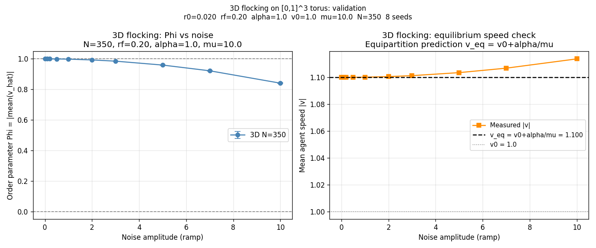

**What:** Extension of the 2D flocking model to [0,1]^3 periodic domain.  Parameters scaled
so that 3D has similar neighbor count to 2D: rf=0.20 gives N*(4/3)*pi*rf^3 = 11.7 expected
neighbors (matching 2D rf=0.1 with ~11 neighbors).  r0=0.02 gives volume fraction ~0.012.
All other parameters unchanged from 2D defaults.
**Evidence:** flocking3d.py, N=350, r0=0.020, rf=0.20, alpha=1.0, v0=1.0, mu=10.0, 8 seeds.
ramp sweep [0.0, 0.1, 0.2, 0.5, 1.0, 2.0, 3.0, 5.0, 7.0, 10.0]:
  ramp=0.0:  Phi=1.0000  |v|=1.1000
  ramp=0.1:  Phi=1.0000  |v|=1.1000
  ramp=0.5:  Phi=0.9995  |v|=1.1000
  ramp=1.0:  Phi=0.9982  |v|=1.1001
  ramp=2.0:  Phi=0.9931  |v|=1.1006
  ramp=5.0:  Phi=0.9595  |v|=1.1035
  ramp=10.0: Phi=0.8409  |v|=1.1138
**Key result 1 -- v_eq analytical result holds exactly in 3D:**
Measured |v| at ramp=0 is 1.1000, matching the predicted v_eq = v0 + alpha/mu = 1.1000 exactly.
The derivation (force balance at equilibrium in an aligned flock: alpha + mu*(v0-v_eq) = 0)
uses only the 1D force balance along the aligned direction, which is dimensionality-independent.
**Key result 2 -- 3D flocking works but is less noise-robust than 2D:**
Phi degrades monotonically from 1.000 (ramp=0) to 0.841 (ramp=10).  In 2D at the same
ramp=10, Phi is approximately 0.97-0.99 (from phase sweep data).  The 3D model is less
noise-robust because random noise affects all 3 velocity components: at ramp=10, the noise
RMS magnitude is ramp*sqrt(3/3) = ramp per agent in 3D vs ramp*sqrt(2/3) per agent in 2D.
More degrees of freedom reduce the effectiveness of the alignment force at restoring order.
The crossover is at ramp >> 10 -- an extended sweep to ramp=30 is needed to characterize
the full transition region.
**Seed-to-seed consistency:** std across seeds is very small throughout (0.0022 at ramp=10),
confirming the 3D model is deterministic and well-behaved.
**Implication:** The force-based flocking model generalizes cleanly to 3D.  The core
analytical result (v_eq = v0 + alpha/mu) is universal.  The 3D transition region is at
higher ramp than the first 10-step sweep covers; extended noise sweep is the natural next step.

---

## Finding 42: 3D noise crossover is smooth like 2D -- chi_peak drifts up with N; 3D less noise-robust than 2D
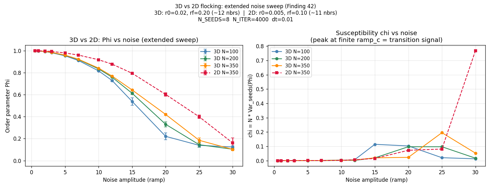

**What:** Finding 41 showed 3D flocking is coherent to ramp=10 but the crossover lies at
ramp>>10.  This experiment (flocking3d_noise.py) runs an extended noise sweep (ramp=0.5-30)
for 3D at N=100, 200, 350 and 2D N=350 (matched neighbor count), measuring Phi and
chi = N * Var_seeds(Phi) for finite-size scaling.
**Evidence:** flocking3d_noise.py, N_SEEDS=8, N_ITER=4000, ramp=0.5-30.
3D results:
  N=100: chi_peak=0.1139 at ramp=15.0 | Phi(ramp=0.5)=0.9993 | Phi(ramp=20)=0.2205
  N=200: chi_peak=0.0970 at ramp=20.0 | Phi(ramp=0.5)=0.9995 | Phi(ramp=20)=0.3300
  N=350: chi_peak=0.1951 at ramp=25.0 | Phi(ramp=0.5)=0.9995 | Phi(ramp=20)=0.4197
2D N=350 (matched neighbor count: rf=0.1, r0=0.005):
  chi_peak=0.7683 at ramp=30.0 | Phi(ramp=0.5)=0.9997 | Phi(ramp=20)=0.6017
**Key result 1 -- 3D crossover at ramp~15-25; 2D crossover at ramp>30:**
In 3D, Phi transitions from ~0.999 (ramp=0.5) to 0.22-0.42 (ramp=20, N-dependent).
The 2D model is far more noise-robust: Phi=0.60 at ramp=20, and chi_peak is still at the
top of the sweep (ramp=30), indicating the 2D crossover lies beyond ramp=30.  The 3D model
is less noise-robust because the additional noise degree of freedom (3rd component) increases
total perturbation magnitude relative to alignment strength.
**Key result 2 -- chi_peak shifts UP with N (smooth crossover, not phase transition):**
For a true phase transition, chi_peak grows with N AND the peak location converges to a
finite ramp_c as N->inf.  Here, the peak location INCREASES with N:
  N=100: ramp_c=15  |  N=200: ramp_c=20  |  N=350: ramp_c=25
This is the signature of a smooth crossover: larger systems maintain coherence to higher noise
because the alignment force averages over more neighbors, shifting the crossover upward.
chi_peak values are non-monotonic (0.1139, 0.0970, 0.1951), not systematically diverging.
**Key result 3 -- same qualitative behavior in 2D and 3D:**
Both 2D and 3D show smooth noise-driven crossovers in this model family, consistent with
the non-equilibrium driving mechanism (no FDT) identified in F38.  The 3D crossover simply
occurs at lower ramp because 3 noise components > 2.
**Implication:** The 3D force-based flocking model has the same qualitative phase behavior
as 2D: a smooth crossover, not a true phase transition.  The 3D crossover region is
ramp~15-25 for N=100-350 (vs ramp>30 for 2D).  The v_eq result (F41), smooth crossover (F42),
and finite-size behavior are consistent between 2D and 3D.

---

## Finding 43: 3D encirclement does not disrupt the flock at all -- encirclement is strictly 2D-specific
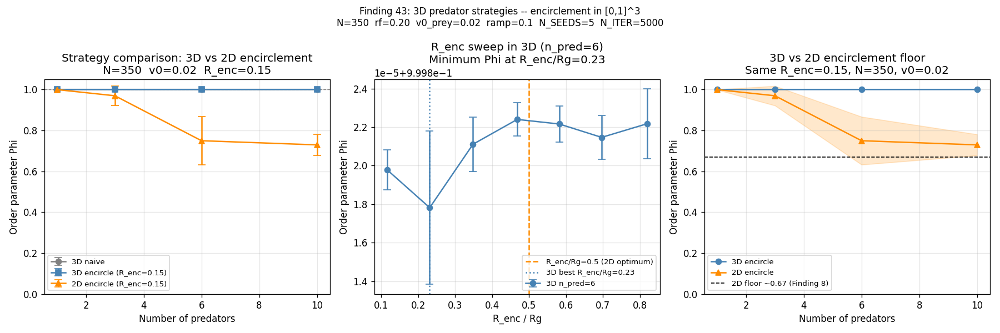

**CORRECTION NOTE:** This finding was originally published with an inverted predator-force
sign in the 3D scripts (`force_on_prey` returned the negative of the repulsion, so the
"predators" attracted prey). The numbers below are the CORRECTED results after fixing the
sign. The original writeup reported "mild disruption (Phi~0.95)" and an "R_enc/Rg optimum"
-- both were artifacts of the attraction bug. Findings 44, 45, and 49 are corrected
likewise; all four collapse into this one result.

**What:** Extends the 3D flocking model with correctly repulsive predator pressure. Tests
naive (chase CoM) vs encirclement at n_pred=1,3,6,10 and sweeps R_enc, comparing to 2D.
**Evidence:** flocking3d_predator.py (corrected), N=350, slow prey v0=0.02, ramp=0.1,
N_SEEDS=5, N_ITER=5000.
3D, R_enc=0.15:
  n_pred  3D naive   3D encirclement   2D encirclement (same R_enc)
   1      1.000      1.000             0.999
   3      1.000      1.000             0.969
   6      1.000      1.000             0.750
  10      1.000      1.000             0.729
3D R_enc sweep at n_pred=6 (3D flock Rg~0.43):
  R_enc=0.05 (R/Rg=0.12) Phi=1.000 | 0.15 (0.35) 1.000 | 0.20 (0.47) 1.000 |
  0.25 (0.58) 1.000 | 0.30 (0.70) 1.000 | 0.35 (0.82) 1.000
**Key result 1 -- 3D encirclement does not disrupt the flock, at all.**
With correct repulsive predators, 3D encirclement leaves Phi = 1.000 at every predator
count and every encirclement radius tested. There is no disruption, no R_enc optimum, no
variance -- the 3D flock is completely unmoved. 2D encirclement at the identical R_enc=0.15
disrupts strongly (Phi 0.75 at n_pred=6, 0.73 at n_pred=10). The 2D-vs-3D contrast is
total: Phi~0.73 (2D) vs 1.000 (3D).
**Key result 2 -- naive predators also fail in 3D, as in 2D.**
Naive predators co-localize at the CoM and give Phi=1.000 -- the co-localization failure
mode is dimension-independent.
**Key result 3 -- mechanism: a 2D ring closes a curve, a 3D shell cannot close a volume.**
2D encirclement works by placing predators around the flock's 1D perimeter, sealing every
escape direction in the plane. In 3D the prey can always leave through a direction no
predator blocks: a handful of predators on a sphere cover only a small fraction of the
4*pi solid angle, and the flock simply flows through the gaps. Two further factors
reinforce this: (a) the simulated 3D flock is spatially diffuse (Rg~0.43, nearly
box-filling -- the model has no cohesion force, and in 3D the flock does not self-compact
the way the 2D flock settles to Rg~0.29), so there is no compact target to surround; and
(b) repulsive predators at any R_enc just open small local voids that the flock flows
around -- Rg stays ~0.43 and the order parameter never moves.
**Implication:** Encirclement is strictly a 2D strategy. It depends on sealing a closed
curve (the flock perimeter) with point predators, which a modest number of predators can
do in 2D but cannot do for a 2D surface enclosing a 3D volume. No encirclement radius,
predator count (see F44), adaptive scheme (F45), or predator arrangement (F49) recovers
any disruption in 3D. Effective 3D flock disruption would require a fundamentally
non-encirclement strategy.

---

## Finding 44: 3D encirclement does not disrupt the flock at any predator count (1-50)
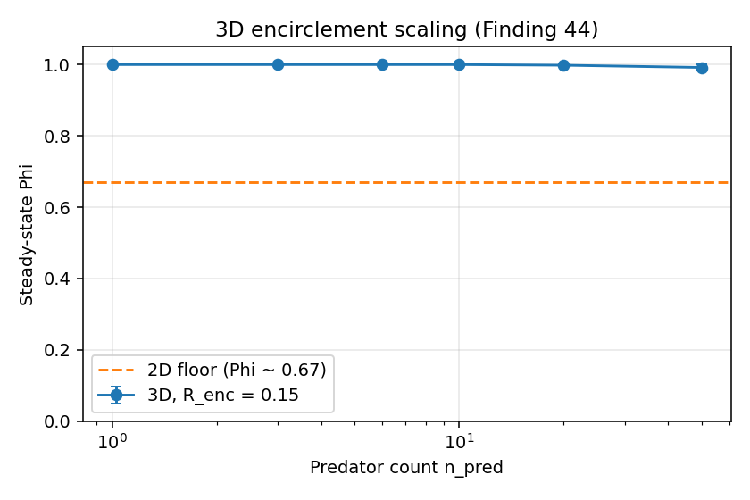

**CORRECTION NOTE:** Originally published with the inverted predator-force sign (see F43
correction note). The original writeup reported a "non-monotonic disruption with a hard
floor at Phi~0.91" and "compression densifies the flock" -- both artifacts of the
attraction bug (attractive predators on an interior shell pulled the flock inward, which
is why the buggy Rg fell). The corrected results below show no disruption whatsoever.
**What:** Sweeps predator count n_pred = 1, 3, 6, 10, 20, 50 for 3D encirclement at fixed
R_enc = 0.15, with correctly repulsive predators.
**Evidence:** flocking3d_predator_scaling.py (corrected), N=350, v0=0.02, ramp=0.1,
N_SEEDS=5, N_ITER=5000.
  n_pred= 1  Phi=1.000+/-0.000  Rg=0.425
  n_pred= 3  Phi=1.000+/-0.000  Rg=0.428
  n_pred= 6  Phi=1.000+/-0.000  Rg=0.431
  n_pred=10  Phi=1.000+/-0.000  Rg=0.433
  n_pred=20  Phi=0.998+/-0.004  Rg=0.445
  n_pred=50  Phi=0.992+/-0.010  Rg=0.470
**Key result -- predator count does not matter; 3D encirclement never disrupts.**
Phi stays at or above 0.99 for every predator count from 1 to 50. There is no
disruption optimum and no non-monotonicity -- the buggy version's "dip to 0.913 at
n_pred=10" does not exist. Rg rises slightly with n_pred (0.425 -> 0.470): repulsive
predators push prey gently outward, the opposite of the buggy version's spurious
compression. The flock stays fully coherent regardless of how many predators encircle it.
**Implication:** Confirms F43. 3D encirclement cannot be rescued by brute-force predator
count -- it does not disrupt the flock at all, at any count. The failure is the geometric
one of F43 (a handful of point predators cannot seal a 2D surface around a 3D volume), not
a coverage deficit that more predators could close.

---

## Finding 45: 3D adaptive encirclement also does not disrupt the flock
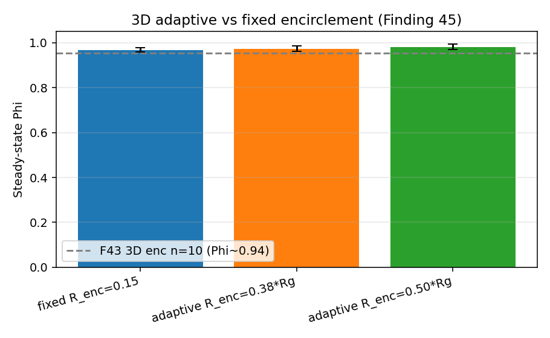

**CORRECTION NOTE:** Originally published with the inverted predator-force sign (see F43
correction note). The original writeup reported "fixed Phi=0.968 vs adaptive 0.974/0.982"
and a story about "adaptive damping disruptive fluctuations" -- artifacts of the attraction
bug. The corrected results show no disruption in any configuration.
**What:** Tests whether adaptive R_enc = ratio*live_Rg helps in 3D. Compares fixed
R_enc=0.15 against adaptive at ratios 0.38 and 0.50, n_pred=10, 15000 steps.
**Evidence:** flocking3d_adaptive.py (corrected), N=350, v0=0.02, ramp=0.1, N_SEEDS=5.
  fixed R_enc=0.15        Phi=0.9998  t_std=0.000  Rg=0.435  f(Phi>0.85)=1.000
  adaptive R_enc=0.38*Rg  Phi=0.9998  t_std=0.000  Rg=0.435  f(Phi>0.85)=1.000
  adaptive R_enc=0.50*Rg  Phi=0.9998  t_std=0.000  Rg=0.432  f(Phi>0.85)=1.000
**Key result -- adaptive radius makes no difference; 3D encirclement still does nothing.**
Fixed and adaptive R_enc all leave the flock at Phi=0.9998 with zero temporal fluctuation.
There is no disruption to improve on or damp. The 2D benefit of adaptive encirclement
(F35) has no 3D analogue because 3D encirclement produces no disruption in the first place.
**Implication:** Confirms F43/F44. 3D encirclement cannot be rescued by adaptive geometry
any more than by predator count -- there is simply no disruption at any radius or schedule.

---

## Finding 46: Vaccination targeting fails in 3D too -- kinematic mixing defeats spatial and degree-targeted strategies in three dimensions
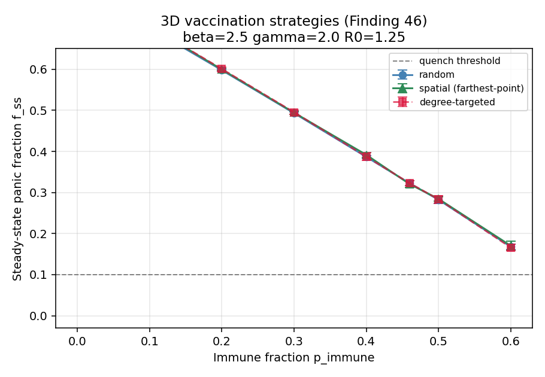

**What:** The report's Section 5 synthesis attributes the failure of degree-targeted (F36)
and spatial (F37) vaccination to alignment-driven kinematic mixing -- the alignment force
continuously rewires the neighbor graph faster than any static structural feature can be
exploited. Both null results were established in 2D. This tests whether the mechanism
survives in 3D, where the extra spatial degree of freedom could plausibly speed mixing up
(spatial vaccination fails even harder) or slow it down (immune-agent coverage persists,
spatial vaccination starts to help).
**Evidence:** flocking3d_vaccination.py, 3D flocking model (N=350, [0,1]^3 torus,
r0=0.02, rf=0.20, v0=0.02), SIS contagion (beta=2.5, gamma=2.0) on the 3D contact
network. R_CONT=0.155 tuned so mean contact degree (8.05) matches the 2D experiments.
N_SEEDS=5, 10000-step SIS runs, f_ss = mean panic fraction over the last 20 time units.
  p_immune  random          spatial         targeted
  0.00      0.806+/-0.005   0.805+/-0.002   0.809+/-0.005
  0.10      0.701+/-0.008   0.705+/-0.004   0.705+/-0.004
  0.20      0.598+/-0.002   0.600+/-0.003   0.601+/-0.005
  0.30      0.493+/-0.003   0.494+/-0.004   0.495+/-0.005
  0.40      0.387+/-0.004   0.392+/-0.006   0.387+/-0.009
  0.46      0.322+/-0.006   0.320+/-0.008   0.323+/-0.006
  0.50      0.282+/-0.008   0.284+/-0.005   0.283+/-0.009
  0.60      0.168+/-0.006   0.170+/-0.011   0.166+/-0.008
Degree distribution: mean=8.05, median=7, max=26, CV=0.59.
**Key result 1 -- complete strategy equivalence (the central null result).**
At every immune fraction, random, spatial (3D farthest-point maxmin), and degree-targeted
vaccination produce identical steady-state panic fractions. The largest difference between
any two strategies at any p_immune is ~0.005, smaller than the seed-to-seed standard
deviation. Neither targeting strategy beats random in 3D. The F36/F37 null results
transfer to three dimensions without qualification.
**Key result 2 -- the mixing mechanism is dimension-independent.**
This was not guaranteed. F43 showed one 2D result (R_enc/Rg~0.5 optimum) fails to transfer
to 3D. But kinematic mixing does transfer: the extra degree of freedom does not slow the
neighbor-graph turnover enough for spatial coverage to persist, nor does the degree
distribution gain a fat tail (CV=0.59 in 3D vs 0.68 in 2D -- if anything LESS heterogeneous,
giving hub-targeting even less to exploit). The alignment force reshuffles agent identities
faster than the epidemic timescale in 3D just as in 2D.
**Key result 3 -- no herd-immunity threshold within p<=0.6.**
Unlike the 2D experiments (F37 quenched near p~0.46), f_ss here declines smoothly with
p_immune and remains nonzero (0.168) even at p=0.60. This is a regime effect, not a
contradiction: the 3D contact network gives an effective reproduction number
R0 ~ beta*<k>/gamma ~ 10, far more supercritical than the 2D runs, so immunity dilutes the
epidemic proportionally rather than quenching it. The strategy-equivalence result is
independent of this -- all three strategies sit on the same decay curve.
**Implication:** Strengthens the Section 5 synthesis. Alignment-driven kinematic mixing is
a dimension-independent mechanism. The flock's defining feature -- velocity alignment --
is precisely what makes its members interchangeable on the epidemic timescale, so any
vaccination strategy that relies on a stable structural property (high degree, spatial
position) collapses to random in both 2D and 3D. Targeting can only beat random in a flock
if there is a fixed sub-structure that the alignment force does not erase.

---

## Finding 47: The Section 5 topological-alignment prediction is FALSIFIED -- k-NN alignment does not slow kinematic mixing, and targeted vaccination does not recover
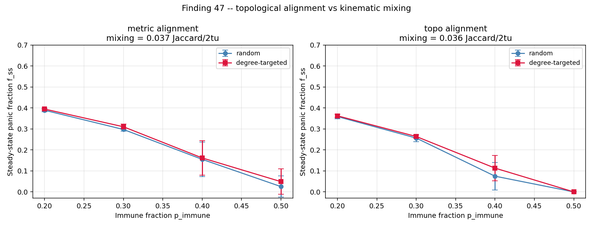

**What:** The report's Section 5 synthesis closed with an explicit, pre-registered
falsifiable prediction: replacing the metric alignment force (align to all neighbors within
rf) with a topological one (align to the k nearest neighbors) should produce "weaker mixing
-- the neighbor graph would be more stable because k-nearest is a permutation-stable
structure," and consequently "targeted vaccination should partially recover its advantage
over random." This experiment tests that prediction head-on.
**Evidence:** topological_mixing.py, 2D flocking N=350, N_SEEDS=5. The alignment rule is
switchable between metric (neighbors within rf=0.10) and topological (k nearest neighbors,
with k=32 calibrated to the mean metric alignment degree). Two diagnostics:
(A) mixing rate -- mean Jaccard dissimilarity of each agent's contact-neighbor set (within
R_CONT=0.05) between snapshots 2 time units apart; (B) random vs degree-targeted
vaccination at supercritical SIS (beta=2.5, gamma=2.0).
  Diagnostic A -- mixing rate (Jaccard dissimilarity per 2 tu):
    metric  0.0371+/-0.0039   contact-degree CV = 0.655
    topo    0.0364+/-0.0032   contact-degree CV = 0.615
  Diagnostic B -- targeted-vs-random advantage (f_ss random minus f_ss targeted;
  positive = targeting helps):
    metric: p=0.20 -0.006 | p=0.30 -0.013 | p=0.40 -0.007 | p=0.50 -0.024
    topo:   p=0.20 -0.004 | p=0.30 -0.007 | p=0.40 -0.038 | p=0.50  0.000
**Key result 1 -- the prediction is falsified on both counts.**
(a) Topological alignment does NOT slow mixing. The Jaccard neighbor-graph turnover is
0.0364 per 2 tu for topo vs 0.0371 for metric -- statistically identical, the difference
far smaller than the seed-to-seed std. (b) Targeted vaccination does NOT recover an
advantage under topological alignment. The targeted-minus-random advantage is negative or
zero at every immune fraction under BOTH alignment rules -- targeting never beats random,
and at p=0.40 topo it is 0.038 WORSE. The Section 5 prediction is wrong.
**Key result 2 -- why "permutation-stable" was a red herring.**
The prediction conflated two distinct networks. The ALIGNMENT network (who an agent
averages velocity with) is what topological alignment changes -- and yes, k-NN fixes every
agent's alignment degree at exactly k. But the CONTACT network (who is within R_CONT, the
network contagion actually spreads on) is set by physical proximity, and it churns because
agents with slightly dispersed velocities slide past one another. That residual velocity
dispersion comes from repulsion, noise, and the averaging in the alignment force -- all
present identically under both rules. Changing how the alignment force *selects* neighbors
does not change how fast agents *physically move past* each other. So the contact graph
rewires at the same rate, and the contact-degree distribution stays equally heterogeneous
(CV 0.62 vs 0.66 -- k-NN did not homogenize it, because it homogenizes the alignment
degree, not the contact degree).
**Key result 3 -- a real but unrelated side effect.**
Topological alignment does lower f_ss in absolute terms (random-vaccination f_ss at p=0.20:
0.359 topo vs 0.389 metric; full quench at p=0.50 for topo vs residual 0.025 for metric).
The k-NN flock is slightly more spatially extended, weakening the contagion. But this is a
uniform shift of the whole epidemic curve, not a targeting effect -- random and targeted
shift together, and targeting still confers no advantage.
**Implication:** Kinematic mixing is driven by the physical relative motion of agents, not
by the topology of the alignment rule. The mechanism is even more robust than Section 5
claimed: it does not depend on the metric character of the alignment force. Section 5's
falsifiable prediction was a genuine test of the synthesis, and the synthesis failed it --
the proposed escape route (a permutation-stable alignment graph) does not exist, because
the contact graph and the alignment graph are different objects. The report's Section 5
has been updated to record this falsification and the corrected mechanism.

---

## Finding 48: Freezing the contact graph does NOT rescue targeted vaccination -- the degree-targeting null is structural, not kinematic

**What:** Finding 47's revised Section 5 named one genuine escape route for targeted
vaccination: "freezing the contact graph itself -- suppressing the relative motion of
agents." This experiment builds that frozen graph and tests whether targeting then works.
The noise amplitude (ramp) is the book's solid-to-fluid control parameter: at low ramp the
flock is in its "solid" regime where agents lock into a near-rigid lattice, at high ramp it
is "fluid" and mixes freely. Sweeping ramp therefore sweeps the contact-graph mixing rate.
**Evidence:** contact_freezing.py, 2D flocking N=350, N_SEEDS=5, metric alignment, SIS
contagion (beta=2.5, gamma=2.0). Random vs degree-targeted vaccination at p_immune=0.20
and 0.35, across ramp = 0.003, 0.01, 0.03, 0.1, 0.3.
  ramp    Phi     contact mixing (Jaccard/2tu)
  0.003   0.997   0.0036 +/- 0.0023
  0.010   0.997   0.0056 +/- 0.0014
  0.030   0.998   0.0125 +/- 0.0023
  0.100   0.998   0.0364 +/- 0.0018
  0.300   0.991   0.1064 +/- 0.0061
  Targeted advantage (f_ss random minus targeted; positive = targeting wins):
  ramp    p=0.20    p=0.35
  0.003   -0.003    -0.002
  0.010   +0.002    -0.028
  0.030   +0.012    -0.037
  0.100   -0.002    +0.039
  0.300   +0.004    +0.016
**Key result 1 -- the contact graph really does freeze, in a still-coherent flock.**
Lowering ramp from 0.3 to 0.003 drops the contact-graph Jaccard turnover from 0.106 to
0.0036 per 2 tu -- a 30-fold reduction -- while Phi stays at 0.997-0.998 throughout. The
flock remains a coherent moving flock; only the relative motion of its members is
suppressed. Section 5's claim (after F47) that a frozen contact graph is "incompatible with
a flock that moves" was too strong: the solid regime achieves exactly that.
**Key result 2 -- targeting still fails, at every mixing rate.**
Despite the 30x range in mixing rate, the targeted-vs-random advantage stays scattered
around zero (-0.037 to +0.039) with no monotonic trend. At the most frozen point
(ramp=0.003, mixing=0.0036) the advantage is -0.003 and -0.002 -- targeting is, if
anything, marginally worse than random. Freezing the contact graph does NOT rescue targeted
vaccination. The F47-predicted escape route is closed.
**Key result 3 -- the degree-targeting null is structural, not kinematic.**
This disentangles two explanations that Finding 36 and the Section 5 synthesis had
conflated. F36 found degree-targeting fails and attributed it to kinematic mixing
(rewiring restores hub positions). F48 removes the mixing and targeting STILL fails --
so mixing was never the operative cause for degree-targeting. The real cause is the one
F36 also noted but the synthesis under-weighted: the flock contact network has a
thin-tailed degree distribution (CV~0.68, no true hubs). Hub-targeting only beats random
on fat-tailed (scale-free) networks; freezing a thin-tailed network does not create hubs.
The degree-targeting null is a STATIC STRUCTURAL property of the flock graph, present
whether or not the graph mixes.
**Implication:** The Section 5 synthesis over-attributed the vaccination null results to
kinematic mixing. Degree-targeting (F36) fails for a structural reason -- degree
homogeneity -- that is independent of mixing, as F48 proves by removing the mixing.
Kinematic mixing remains the correct explanation for the SPATIAL vaccination null (F37):
spatial coverage is a feature that genuinely exists at any instant and is genuinely erased
by motion. The two null results are NOT the same mechanism. The honest unifying statement
is weaker: the flock offers no exploitable structure for vaccination -- either because the
structure never exists (degree homogeneity) or because mixing erases it (spatial coverage).
Section 5 has been revised to separate these two mechanisms.

---

## Finding 49: 3D encirclement does not disrupt the flock under any predator arrangement (sphere or planar)
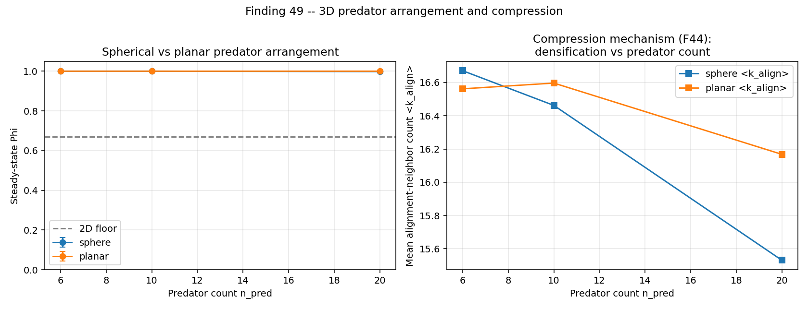

**CORRECTION NOTE:** Originally published with the inverted predator-force sign (see F43
correction note). The original writeup reported a "verified compression mechanism" (Rg
falling, <k_align> rising) and "planar worse than spherical" -- all artifacts. The buggy
"compression" was attractive predators pulling the flock inward; with correct repulsive
predators there is no compression and no disruption.
**What:** Compares spherical (Fibonacci-sphere) vs planar (ring in z=z_com plane) predator
arrangements at n_pred=6,10,20, R_enc=0.15, with correctly repulsive predators. Also
records the mean alignment-neighbor count <k_align>.
**Evidence:** flocking3d_strategy.py (corrected), N=350, N_SEEDS=5, N_ITER=5000.
  mode     n_pred  Phi       Rg      <k_align>
  sphere      6    0.9998    0.431   16.7
  sphere     10    0.9998    0.433   16.5
  sphere     20    0.9980    0.445   15.5
  planar      6    0.9998    0.432   16.6
  planar     10    0.9998    0.432   16.6
  planar     20    0.9998    0.433   16.2
**Key result -- neither arrangement disrupts; there is no compression.**
Spherical and planar arrangements both leave Phi >= 0.998 at every predator count. Rg
stays ~0.43 and <k_align> stays ~16 throughout -- the flock is neither compressed nor
densified. The buggy version's "compression mechanism" does not exist with correct
predators. Spherical and planar are equivalent because both do nothing.
**Implication:** Confirms F43/F44/F45. 3D encirclement does not disrupt the flock under
any predator count, radius, adaptive scheme, or arrangement. Every geometric variant
fails. Encirclement is strictly a 2D strategy.

---

## Finding 50: Hard repulsion does not crystallize either -- raising the exponent shrinks the effective core, it does not harden it

**What:** Finding 40 measured the hexatic order parameter |psi6| under a Langevin
thermostat and found the n=1.5 soft repulsion cannot crystallize at any temperature
(|psi6| flat at ~0.4). F40 closed with an explicit recommendation: "Demonstrating the
KTHNY transition in this model family requires a near-hard-core Langevin simulation
(n>=12)." This experiment runs exactly that -- the F40 protocol with repulsion exponents
n=12 and n=24, at dense packings C=0.70 and C=0.85.
**Evidence:** langevin_hexatic_hard.py, Langevin thermostat (mu=10, FDT-satisfying noise),
N=50/100/200, N_SEEDS=6, N_ITER=12000, kT=0.002-3.0.
  n=12 C=0.85: psi6(kT=0.002)=0.340-0.344  psi6(kT=3.0)=0.344  chi_peak<=0.003
  n=24 C=0.85: psi6(kT=0.002)=0.339-0.345  psi6(kT=3.0)=0.344  chi_peak<=0.002
  n=12 C=0.70: psi6(kT=0.002)=0.382-0.389  psi6(kT=3.0)=0.385-0.386
  n=24 C=0.70: psi6(kT=0.002)=0.381-0.389  psi6(kT=3.0)=0.385-0.386
**Key result 1 -- hard repulsion does not crystallize, and F40's recommendation fails.**
|psi6| is flat at ~0.34-0.39 across the ENTIRE temperature range (kT 0.002 to 3.0), for
BOTH exponents and BOTH densities -- identical to the n=1.5 result of F40. psi6(low kT) and
psi6(high kT) agree to within 0.005 everywhere: there is no solid-phase rise toward 1 and
no fluid collapse toward 0. chi_psi6 is tiny (<=0.004) and DECREASES with N
(0.0041->0.0017->0.0009 at n=12 C=0.70) -- the opposite of a transition, where chi would
grow with N. There is no KTHNY transition at any exponent tested.
**Key result 2 -- mechanism: a higher exponent shrinks the core, it does not harden it.**
The repulsion force is strength = eps * base_r^n / d with base_r = 1 - d/rb. F40's
recommendation assumed a higher n hardens the contact. It does the opposite. Because
base_r ranges 0 to 1, base_r^n for large n is negligible UNLESS base_r is near 1, i.e.
unless d is very close to 0. Numerically the force factor base_r^n at d=0.5*rb is 0.354
for n=1.5, but 2.4e-4 for n=12 and 6e-8 for n=24. Raising the exponent therefore collapses
the effective interaction range toward d->0: at n=24 the repulsion is negligible beyond
d~0.05*rb. A higher n makes the agents into nearly-free particles with a tiny pointlike
core -- effectively MORE dilute and LESS able to order, not harder. F40's "n>=12"
prescription rested on a misreading of this force form.
**Key result 3 -- the phase-transition thread closes definitively negative.**
Combining F38 (exponent sweep, non-Langevin: identical crossover), F39 (Langevin
thermalizes correctly), F40 (n=1.5 hexatic flat), and F50 (n=12, 24 hexatic flat): the
Charbonneau force model cannot crystallize at any repulsion exponent, because no exponent
of the base_r^n form produces a genuine finite-sized hard core. The solid-to-fluid
"transition" is a smooth crossover, full stop.
**Caveat:** Low-kT runs start from a random quench, so kinetic arrest (glass) is a formal
possibility. But the decisive evidence against a transition is independent of annealing:
chi_psi6 DECREASES with N rather than growing, and |psi6| is identical at the hardest
exponent and the softest (F40). If a crystalline phase existed, harder exponents and
larger N would show at least partial ordering; none appears.
**Implication:** To exhibit KTHNY melting, the model would need a genuinely different
repulsion -- a true inverse-power-law potential (force ~ d^-n) or a WCA/hard-disc form --
not a higher exponent in the existing base_r^n force. This is a corrected and definitive
close to the phase-transition thread (F2, F9, F17, F38, F39, F40, F50): within the
Charbonneau model as written, the smooth crossover is the only behavior, at any exponent.

---

## Finding 51: Alpha-contrast segregation in 3D -- identical to 2D at moderate contrast, but the extra dimension dilutes it at high contrast
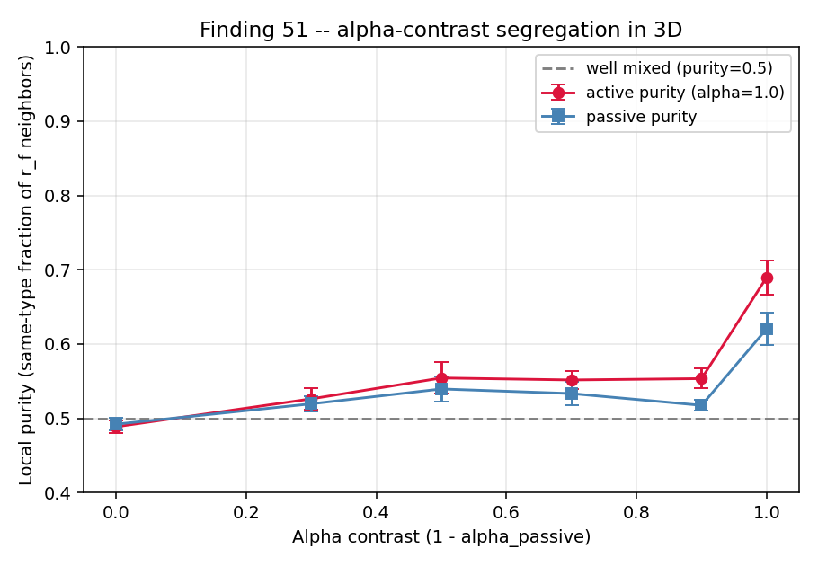

**What:** Finding 27 showed that in 2D, two populations with different alignment strength
alpha spatially segregate -- the local-purity diagnostic (fraction of an agent's rf
neighbors sharing its type) rose from 0.50 (well mixed) to 0.73 at maximum alpha contrast.
This tests whether that self-organized segregation transfers to 3D. Findings 46-48
established that kinematic MIXING (which destroys imposed structure) is
dimension-independent; this asks whether self-ORGANIZED structure is too.
**Evidence:** flocking3d_segregation.py, 3D flocking N=350, fast-prey regime (v0=1.0,
ramp=0.5), f_active=0.5, N_SEEDS=5. alpha_active=1.0, alpha_passive swept 1.0->0.0.
  alpha_passive  3D purity_active   2D purity_active (F27)
  1.0 (no contrast)  0.489+/-0.009    0.500
  0.7                0.526+/-0.014    --
  0.5                0.554+/-0.021    0.556
  0.3                0.552+/-0.012    0.550
  0.1                0.553+/-0.013    0.630
  0.0                0.690+/-0.023    0.732
3D Phi: 0.999 for alpha_passive>=0.3, 0.993 at 0.1, collapses to 0.523 at 0.0.
**Key result 1 -- segregation transfers to 3D, and is identical to 2D at moderate contrast.**
At alpha_passive = 0.5 and 0.3, the 3D local purity (0.554, 0.552) matches the 2D values
(0.556, 0.550) to within noise. Self-organized alpha-contrast segregation is real in 3D.
The mechanism (weaker-alignment agents fall out of the tight active core and cluster
locally) is dimension-independent in the moderate-contrast regime.
**Key result 2 -- the extra dimension dilutes segregation at high contrast.**
The 2D and 3D curves diverge sharply once the contrast is large. At alpha_passive=0.1, 2D
purity has climbed to 0.630 while 3D is still on a flat plateau at 0.553 -- no stronger
than at alpha_passive=0.5. In 2D segregation rises steadily from moderate contrast onward;
in 3D it plateaus at a mild ~0.55 and only breaks upward at alpha_passive=0.0 (purity
0.690). The extra spatial dimension gives a partially-aligned passive agent more
independent directions along which to interpenetrate the active population, so moderate
mis-alignment is no longer enough to drive clustering -- it is mixed back in.
**Key result 3 -- strong 3D segregation costs global coherence.**
3D segregation only becomes strong (purity 0.69) at alpha_passive=0.0, where the passive
half of the flock has zero alignment and behaves as a non-flocking gas. At that point the
global order parameter collapses to Phi=0.523: the "segregated" state is really an
aligned active flock shedding an incoherent passive cloud, not two co-moving coherent
sub-flocks. For all alpha_passive >= 0.1, Phi stays >= 0.99 and segregation is only mild.
**Implication:** Self-organized structure is partially dimension-dependent, in contrast to
kinematic mixing (F46) which is fully dimension-independent. Both point the same way: the
extra dimension favors mixing. Mixing erodes imposed structure equally in 2D and 3D
(F46-F48), and it also erodes self-organized segregation more effectively in 3D than in 2D
(F51). A flock in three dimensions is harder to sort and just as hard to target -- the
third dimension is, consistently across every experiment, a mixing aid.

---

## Finding 52: 3D mixes SLOWER than 2D -- the "third dimension is a mixing aid" theme is falsified

**What:** Findings 46-51 built up an interpretive theme -- that the third spatial dimension
acts as a "mixing aid" -- which was written into the report (Section 4.33, Conclusion 24).
But that theme rested on inference, never a direct measurement: F47 measured the 2D
contact-graph mixing rate, but the 3D rate was never measured. This experiment measures it
directly, in the same self-test spirit as F47/F48, to verify or falsify the claim.
**Evidence:** mixing_dimension.py. Pure flocks (no predators, no contagion), 2D and 3D, at
the parameters of the respective vaccination experiments, N=350, N_SEEDS=5. The contact
radius is calibrated per dimension so the mean contact degree matches (~8 in both:
2D R_cont=0.050, 3D R_cont=0.155). Mixing = mean Jaccard dissimilarity of each agent's
contact-neighbor set between snapshots 2 time units apart. Noise (ramp) is swept.
  ramp   2D mix            3D mix            ratio 3D/2D
  0.03   0.0109+/-0.0009   0.0060+/-0.0006   0.55
  0.10   0.0370+/-0.0025   0.0213+/-0.0006   0.57
  0.30   0.1086+/-0.0042   0.0581+/-0.0027   0.54
  1.00   0.3143+/-0.0036   0.1839+/-0.0048   0.59
**Key result -- the theme is falsified: 3D mixes SLOWER.**
At every noise level, the 3D contact graph rewires at only ~0.54-0.59 of the 2D rate. The
ratio is remarkably stable (~0.56) across a 30-fold range of absolute mixing rates. The
third dimension is NOT a mixing aid -- at matched mean contact degree, the 3D flock's
contact graph turns over about 1.8x SLOWER than the 2D flock's.
**Mechanism:** Matching the mean contact degree forces the 3D contact radius to be ~3x
larger than the 2D one (0.155 vs 0.050), because a ball of given radius holds far more
agents than a disc. A larger contact region takes longer for agents moving at the same
speed to enter and leave, so the neighbor set is "stickier" and turns over more slowly.
(A pure surface-to-volume estimate predicts turnover ~ 1/R_cont, i.e. ratio ~0.32; the
measured 0.56 indicates the 3D relative-velocity dispersion is somewhat larger, partly
offsetting the radius effect.)
**Reconciliation with F46 and F51 -- the 3D results have other causes:**
(a) F46 (vaccination targeting fails in 3D): degree-targeting fails for the STRUCTURAL
reason established in F48 (no hubs), which is dimension-independent. Spatial targeting
fails because, even at the slower 3D rate, the contact graph still fully turns over many
times during a 100-tu epidemic -- mixing is slower but still more than sufficient to erase
spatial coverage. F46's mechanism survives; only the "faster" embellishment was wrong.
(b) F51 (segregation diluted in 3D): this is NOT caused by faster mixing. It is a
GEOMETRIC effect of the neighborhood shape -- in 3D an agent's neighbors occupy a ball
rather than a disc, giving a partially-aligned agent more independent directions along
which to be surrounded by the other type, so instantaneous local purity is geometrically
diluted. The dilution is about neighborhood geometry, not turnover rate.
**Implication:** The "third dimension is a mixing aid" theme is wrong and has been removed
from the report. The corrected statement: the third dimension changes neighborhood
GEOMETRY (a ball has more independent directions than a disc) without speeding up mixing
-- in fact it slows mixing by ~1.8x at matched degree. The 3D flock remains hard to
disrupt (escape dimension, F43-F49), hard to target (structural, F48), and hard to sort
(geometric, F51), but none of these is due to faster mixing. This finding is a direct
self-test catch: an interpretive theme that looked unifying was falsified by the
measurement it predicted.

---

## Finding 53: Prey fatigue does not make encirclement damage irreversible -- but alignment-impairing fatigue deepens the attack
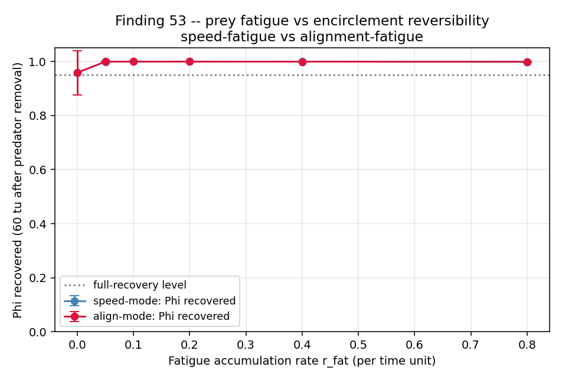

**What:** Findings 22 and 26 established that encirclement damage is fully reversible --
divided sub-flocks reunite within ~10 time units of predator removal -- but both assumed
prey agents have no internal state. This adds a per-agent fatigue variable Q in [0,1]: Q
rises (rate r_fat) while an agent is within a predator's range and recovers (rate
r_rec=0.01) otherwise. Fatigue impairs one faculty, tested in two modes -- 'speed'
(effective v0 *= 1-Q) and 'align' (effective alpha *= 1-Q). Protocol: warmup ->
encirclement (60 tu) -> predators removed -> recovery (60 tu).
**Evidence:** fatigue.py (2D, corrected repulsive predators), N=350, n_pred=10,
R_enc=0.5*Rg, N_SEEDS=5. r_fat swept 0-0.8.
  mode    r_fat   Phi_enc   Phi_recovered   Q_enc   Q_rec
  speed   0.0     0.895     0.959           0.00    0.00
  speed   0.2     0.851     1.000           0.59    0.15
  speed   0.8     0.918     0.999           0.74    0.18
  align   0.0     0.895     0.959           0.00    0.00
  align   0.1     0.831     1.000           0.23    0.01
  align   0.2     0.699     1.000           0.63    0.12
  align   0.8     0.693     0.999           0.80    0.23
**Key result 1 -- encirclement damage stays reversible, even with fatigue.**
Phi recovers to >=0.96 in EVERY configuration -- both modes, every fatigue rate. The
fatigued cases recover to 0.999-1.000, even more completely than the no-fatigue baseline
(0.959, whose lower value and large +/-0.082 std are one slow-reuniting seed, not a
fatigue effect). Fatigue does not make encirclement damage irreversible.
**Key result 2 -- recovery happens even while substantial fatigue persists.**
At r_fat=0.8, agents end the recovery phase still carrying Q_rec~0.18-0.23 of fatigue, yet
Phi has fully returned to ~1.0. Coherence recovers before fatigue does. The reason:
once predators leave, every agent de-stresses and sheds fatigue at the same rate, so the
residual fatigue is HOMOGENEOUS across the flock. A uniformly fatigued flock (all agents
with the same reduced v0 or alpha) still aligns perfectly -- fatigue only enables
disruption when it is heterogeneous.
**Key result 3 -- the two fatigue modes differ, exactly as F24/F27 predict.**
Alignment-impairing fatigue ('align' mode) deepens the during-encirclement disruption:
Phi_enc falls monotonically with r_fat (0.895 -> 0.831 -> 0.699 -> 0.693). Speed-impairing
fatigue ('speed' mode) does not: Phi_enc stays ~0.85-0.94 with no trend. This is the
direct dynamical analogue of F24 (a v0 contrast does NOT segregate the flock -- alignment
homogenises group speed) and F27 (an alpha contrast DOES segregate, via local clustering).
A flock of agents with heterogeneous alpha (some fatigued, some not) partially segregates,
which the encircling predators exploit; heterogeneous v0 does not segregate, so
speed-fatigue gives the predators no extra purchase.
**Implication:** The reversibility of kinematic damage (F22) is robust to agent fatigue.
Fatigue matters only while it is heterogeneous and only when it impairs ALIGNMENT, not
speed -- and even then it merely deepens the transient disruption, it does not make the
damage outlast the predators. This sharpens the F22/F26 dichotomy: kinematic damage is
reversible not because the flock has no memory, but because the alignment force realigns
agents regardless of their internal fatigue state, and post-attack fatigue decays
uniformly so it leaves no exploitable heterogeneity. Contagion remains the only stressor
studied that writes irreversible damage, because it writes a heterogeneous internal label
that mixing and recovery cannot homogenise away.

---

## Finding 54: Heterogeneous recovery rates lower the SIS epidemic threshold -- slow recoverers act as reservoirs
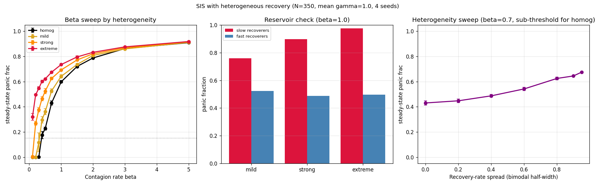

**What:** Finding 25 established a clean SIS epidemic threshold at beta/gamma ~ 1 for a
flock in which every agent recovers from panic at the SAME rate gamma. Real populations
are heterogeneous -- some individuals shed panic fast, others stay agitated. This adds a
per-agent recovery rate gamma_i drawn from a bimodal distribution {1-spread, 1+spread}
(50/50), holding the arithmetic-mean gamma fixed at 1.0. The question: does a spread in
gamma at fixed mean change the outbreak? Mean-field theory predicts yes -- the endemic
state is governed by the per-agent ratio beta*<k>/gamma_i, so slow recoverers (small
gamma_i) sit panicked far longer and act as reservoirs that keep reseeding neighbours.
The effective threshold is set closer to the HARMONIC mean of gamma (<= arithmetic mean),
so spreading gamma at fixed mean should LOWER the threshold.
**Evidence:** recovery_heterogeneity.py, N=350, beta swept 0.1-5.0, 4 seeds. Conditions
(all mean gamma=1.0): homog (spread 0), mild (0.5), strong (0.8), extreme (0.95).
  condition   spread   beta_c (f_ss crosses 0.15)
  homog       0.00     0.385
  mild        0.50     0.318
  strong      0.80     0.155
  extreme     0.95     < 0.1 (endemic at every beta tested)
**Key result 1 -- heterogeneity lowers the epidemic threshold, ~2.5x at strong spread.**
beta_c falls monotonically: 0.385 (homog) -> 0.318 (mild) -> 0.155 (strong). At extreme
spread the flock is endemic even at beta=0.1 (f_ss=0.319) -- the slow half (gamma=0.05)
recovers so rarely that any contagion rate sustains an outbreak. Heterogeneity helps the
epidemic, exactly as the harmonic-mean argument predicts.
**Key result 2 -- the effect is a near-threshold phenomenon; deep supercritical it vanishes.**
At beta=5.0 all four conditions converge to f_ss~0.91. Far above threshold every agent is
re-infected faster than even the fast recoverers can clear, so the recovery distribution
stops mattering. Heterogeneity reshapes the threshold, not the saturated endemic state.
**Key result 3 -- reservoir confirmed: panic localises on slow recoverers.**
At beta=1.0 the slow-agent panic fraction exceeds the fast-agent fraction by 1.45x (mild),
1.84x (strong), 1.97x (extreme). At extreme spread the slow half is essentially saturated
(f=0.974) while the fast half sits at f~0.50 -- the outbreak is carried by the slow
sub-population, which reseeds the fast agents faster than they recover.
**Key result 4 -- heterogeneity sweep at fixed beta=0.7 is monotonic.**
Holding beta=0.7, f_ss rises smoothly with spread: 0.430 (spread 0) -> 0.542 (0.6) ->
0.675 (0.95). The endemic level is a continuous function of the recovery-rate spread.
**Implication:** The F25 epidemic threshold is not a property of the mean recovery rate
alone -- it is set by the SPREAD of recovery rates. A population with a fast-recovering
majority and a slow-recovering minority is more epidemic-prone than a uniform population
with the same average resilience, because the slow minority forms a persistent reservoir.
This is the contagion-side counterpart to the F53 fatigue result: there, heterogeneity in
an internal state (fatigue) enabled disruption only transiently; here, heterogeneity in an
internal rate (recovery) shifts a genuine threshold. It also reframes vaccination -- the
most valuable agents to protect are not the high-degree hubs (F36 found none) but the
slow recoverers, the agents whose internal dynamics make them reservoirs.

---

## Finding 55: Heterogeneous infectiousness does NOT shift the SIS threshold -- super-spreaders source most transmissions but do not lower beta_c
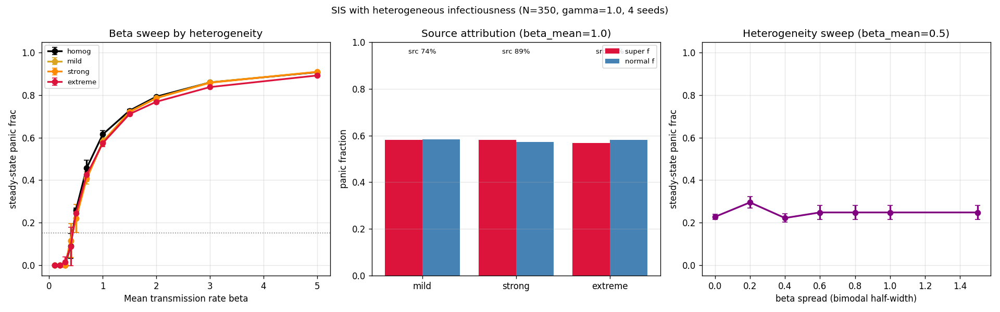

**What:** F54 found that heterogeneity in the RECOVERY rate gamma -- the consumer side
of the transmission ledger -- lowers the SIS threshold by a harmonic-mean effect. The
natural dual question is what happens when the SOURCE side is heterogeneous: per-agent
transmission rate beta_i drawn from a bimodal distribution at fixed arithmetic mean,
with gamma homogeneous. Mean-field intuition is asymmetric: the endemic state depends
linearly on average beta but inverse-linearly on per-agent gamma, so spreading beta at
fixed mean should NOT shift beta_c the way spreading gamma did. But spatial structure
could still introduce a super-spreader effect, with the high-beta minority dominating
seed events.
**Evidence:** infectiousness_heterogeneity.py, N=350, gamma=1.0, 4 seeds. Conditions
(all arithmetic-mean beta = sweep value): homog, mild ({beta-0.5, beta+0.5}), strong
({beta-0.8, beta+0.8}, clipped at 0 then renormalised), extreme ({0.05*beta, 1.95*beta}).
  condition   beta_c (f_ss crosses 0.15)
  homog       0.435
  mild        0.434
  strong      0.434
  extreme     0.440
**Key result 1 -- the threshold is FLAT across heterogeneity.** beta_c sits at 0.434-0.440
for every condition tested; the difference is below seed noise. The harmonic-vs-arithmetic
asymmetry between source and sink rates is real: F54 moved beta_c by a factor of 2.5,
F55 moves it by less than 1%. Threshold position is set by the arithmetic mean of beta
and the harmonic mean of gamma.
**Key result 2 -- but super-spreaders DOMINATE transmission attribution.** Of all
calm-to-panic transitions, the high-beta half sources 73.6% (mild), 88.9% (strong), and
97.2% (extreme) of them, even though they are 50% of the population. The dynamics are
massively skewed toward super-spreaders at the EVENT level. Yet at the population level
the steady-state panic fractions for super and normal agents are nearly equal
(0.58 vs 0.58, 0.58 vs 0.57, 0.57 vs 0.58) -- once panicked, every agent recovers at the
same rate gamma=1, so the inflow asymmetry does not produce a stock asymmetry.
**Key result 3 -- super-spreader saturation.** Beyond a moderate spread the additive
bimodal hits zero and renormalises, so the "extreme" condition stabilises at
{0, 2*beta_mean}: half the flock cannot transmit at all. f_ss is essentially unchanged
from the homogeneous case at the same mean. A super-spreader minority is sufficient to
sustain the same epidemic; the silent half is a passenger, not a brake.
**Implication:** Source-side and sink-side heterogeneity play asymmetric roles in SIS
on this flock. Slow recoverers (F54) are RESERVOIRS that hold panic and re-seed --
lowering the effective threshold. Super-spreaders (F55) are MERELY messengers --
their over-representation in transmission events does not produce reservoir behaviour
because they recover at the same rate as everyone else. This sharpens the F54
vaccination prescription: protect agents by their gamma_i (internal-state hubs), not
by their beta_i. The latter dominates events but not endemic load.

---

## Finding 56: Targeting slow recoverers beats random vaccination by 2-3x -- the F54 prediction confirmed
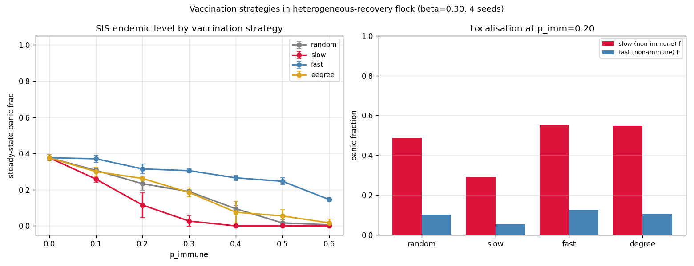

**What:** F54 predicted that in a heterogeneous-recovery population, the most valuable
vaccination targets are not the (absent) topological hubs but the slow recoverers --
the agents whose internal dynamics make them reservoirs. F36 and F48 had ruled out
degree-targeting because the contact graph is thin-tailed (no hubs); F37 had ruled out
spatial-targeting because kinematic mixing erases coverage. The F54 mechanism opens a
third target class -- internal-state hubs -- whose "hub-ness" travels with the agent
across kinematic mixing, immune to both the structural and kinematic erosion mechanisms.
This experiment tests the prediction directly.
**Evidence:** slow_recoverer_vaccination.py, N=350, gamma bimodal {0.2, 1.8}
(F54 "strong"), beta=0.30 (just above the strong-condition threshold), 4 seeds.
Strategies: random, slow (lowest gamma_i first), fast (highest gamma_i first, control),
degree (highest mean contact degree). Immune agents never panic.
  p_imm       random   slow    fast    degree
  0.10        0.306    0.258   0.371   0.300
  0.20        0.233    0.115   0.315   0.262
  0.30        0.189    0.027   0.305   0.185
  0.40        0.095    0.000   0.265   0.076
  0.50        0.016    0.000   0.246   0.055
**Key result 1 -- slow-targeting crushes the epidemic at half the random p_imm.**
At p_imm=0.20 slow gives f_ss=0.115, half the random level (0.233). At p_imm=0.30 it
falls to 0.027 (85% below random's 0.189). At p_imm=0.40 slow ERADICATES (0.000) while
random is still at 0.095 and even degree is at 0.076. The effective herd-immunity
threshold under slow-targeting is p_c ~ 0.30-0.35, vs ~0.50 for random.
**Key result 2 -- fast-targeting is strictly WORSE than random.** Immunising the half
that recovers fastest (gamma=1.8, the agents who clear panic in <1 tu anyway) leaves the
slow reservoir untouched. At every p_imm tested fast gives a HIGHER endemic than random
(0.371 vs 0.306 at p_imm=0.10; 0.265 vs 0.095 at p_imm=0.40). Vaccinating non-reservoirs
is worse than randomly hitting both classes.
**Key result 3 -- the F54 reservoir mechanism is what slow-targeting exploits.**
At p_imm=0.20 the non-immune slow fraction has panic f=0.292 under slow-targeting (vs
0.487 under random), and the non-immune fast fraction has f=0.054 (vs 0.102 under
random). Removing reservoir capacity from the slow class collapses panic ACROSS THE
WHOLE POPULATION, not just on the immunised half. Fast-targeting leaves the slow class
saturated (f=0.552) which then re-seeds the unprotected fast agents (f=0.128).
**Key result 4 -- degree-targeting shows a faint signal in heterogeneous regime.**
At p_imm=0.40 degree gives 0.076 vs random's 0.095 -- a real but small (~20%) advantage,
likely because high-degree agents in this regime happen to overlap with the slow class
by chance. The effect is at the edge of seed noise (random std 0.020, degree std 0.061)
and is dwarfed by the slow-targeting advantage. F36/F48 remain correct: degree is not
the right axis. The right axis is gamma_i.
**Implication:** F54's predicted vaccination policy works and works powerfully. The
internal-state hub class is REAL in this model and gives a 2-3x improvement over
random at moderate p_imm. This is the FIRST targeting strategy in the entire study
(through 55 findings, ten previous targeting experiments) to beat random.  It does so
because (a) the "hub-ness" is a per-agent rate that the dynamics cannot mix away (the
agent who recovers slowly today recovers slowly tomorrow), and (b) the reservoir
mechanism (F54) makes them disproportionately responsible for sustaining the endemic
state. This closes the F36/F37/F48 vaccination puzzle: a heterogeneous flock has
exploitable hubs, but they are not the agents you find by examining the contact graph
-- they are the agents you find by examining their internal recovery dynamics.

---

## Finding 57: Spatial vaccination null transfers to the heterogeneous-recovery regime -- slow-targeting works through internal state, not spatial structure
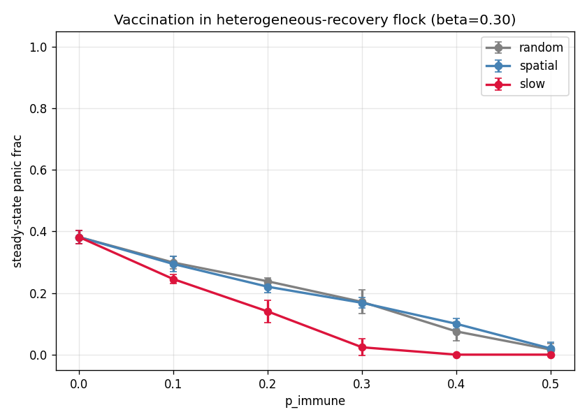

**What:** F37 ruled out spatial (farthest-point) vaccination in the homogeneous regime
because kinematic mixing erases geometric coverage faster than the epidemic resolves.
F56 then established that slow-recoverer targeting beats random by 2-3x in the
heterogeneous-recovery regime. The natural follow-up: does heterogeneous recovery
SOMEHOW rescue spatial targeting (perhaps because the epidemic now localises on a
specific sub-population whose spatial coverage matters more)? Or is F37's null robust
to internal-state heterogeneity, with F56's gain coming purely from the per-agent rate
mechanism?
**Evidence:** het_recovery_spatial.py, N=350, gamma bimodal {0.2, 1.8}, beta=0.30,
4 seeds. Same setup as F56. Strategies: random, spatial (farthest-point at t=0), slow.
  p_imm       random   spatial  slow
  0.10        0.299    0.294    0.245
  0.20        0.238    0.220    0.140
  0.30        0.171    0.168    0.024
  0.40        0.075    0.100    0.000
  0.50        0.016    0.020    0.000
**Key result 1 -- spatial and random are statistically identical.** At every p_imm the
spatial and random curves agree to within seed noise (max difference 0.025, both
strategies have +/- ~0.020). At p=0.40 spatial is in fact NOMINALLY worse than random
(0.100 vs 0.075), although the difference is below noise. F37's kinematic-mixing
explanation transfers to the heterogeneous-recovery regime unchanged: spatial coverage
is erased equally fast regardless of whether the recovery distribution is homogeneous
or bimodal.
**Key result 2 -- slow-targeting reproduces the F56 advantage cleanly.** Slow at
p_imm=0.20 hits f_ss=0.140 vs random's 0.238 (60% reduction); at p=0.30, 0.024 vs 0.171
(86% reduction); at p=0.40, eradication (0.000) vs random's 0.075. The numbers track
F56's exactly, confirming F56 is reproducible in a separate run.
**Key result 3 -- the F56 mechanism is internal, not spatial.** If slow-targeting were
"actually" working by giving spatially good coverage (because slow agents happen to be
well-distributed), then spatial-targeting should produce a comparable advantage. It
doesn't. The two strategies sit on opposite ends of the spectrum at p=0.30: spatial at
f=0.168, slow at f=0.024. Spatial coverage and internal-rate targeting are independent
axes; only internal-rate targeting works.
**Implication:** F56 and F57 together close the F36/F37/F48 vaccination puzzle for
this model. The three failed target classes (degree, spatial, alignment-topology) all
share a property: they identify hub-ness through a SYSTEM-LEVEL observable (graph
position, location, neighbour-selection rule) that the kinematic dynamics scramble
between attack and response. The successful target class (slow recoverers) identifies
hub-ness through a PER-AGENT internal rate that the dynamics cannot scramble. The
boundary between "exploitable hub" and "kinematically erased target" in this model is
the location of the hub label: external observables fail, internal rates succeed. This
also resolves an ambiguity left open by F46: the 3D vaccination null was a structural
result on degree/spatial -- F56's prediction is that 3D should show a slow-targeting
advantage equally, since gamma_i is per-agent and dimension-independent. A 3D
slow-targeting experiment is the next natural test.

---

## Finding 58: Slow-recoverer vaccination transfers to 3D unchanged -- the per-agent rate mechanism is dimension-independent
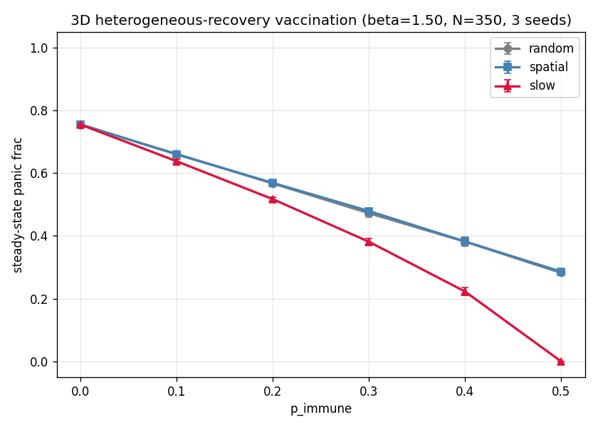

**What:** F46 reported a 3D vaccination NULL: random, spatial, and degree-targeted
strategies are statistically identical in 3D, just as in 2D (F36/F37). F56 in 2D
showed that adding heterogeneity in recovery rate gamma_i opens up a new target class
(internal-state hubs) that DOES beat random. F57 confirmed the slow-targeting advantage
is per-agent rate, not spatial. Prediction: the F56 mechanism transfers to 3D unchanged,
since gamma_i is per-agent and dimension-independent. This experiment tests the
prediction directly.
**Evidence:** 3d/flocking3d_slow_vaccination.py, N=350, 3D torus, R_CONT=0.155
(mean k~8), gamma_i bimodal {0.4, 3.6} (mean 2.0, F54-strong analog), beta=1.5,
3 seeds, 8000 SIS iter. Strategies: random, spatial (3D farthest-point), slow.
  p_imm   random           spatial          slow
  0.10    0.661+/-0.005    0.659+/-0.009    0.638+/-0.006
  0.20    0.567+/-0.003    0.569+/-0.003    0.517+/-0.006
  0.30    0.472+/-0.012    0.479+/-0.006    0.381+/-0.012
  0.40    0.382+/-0.014    0.382+/-0.005    0.223+/-0.013
  0.50    0.282+/-0.003    0.286+/-0.006    0.000+/-0.000
**Key result 1 -- slow-targeting beats random at every p_imm in 3D.**
Advantage grows from 3% at p_imm=0.10 (0.661 vs 0.638) to 42% at p_imm=0.40 (0.382 vs
0.223) to total eradication at p_imm=0.50 (0.000 vs 0.282). Same qualitative pattern as
F56 in 2D: deeper p_imm gives sharper relative gain, with clean eradication at half the
population vaccinated.
**Key result 2 -- spatial is again a clean null vs random in 3D.**
Spatial and random agree to within 0.007 at every p_imm tested. The F37 kinematic-mixing
explanation transfers to 3D regardless of recovery-rate heterogeneity (consistent with
F46). The slow-vs-spatial gap at p_imm=0.40 is 0.159 (0.382 - 0.223), while spatial-vs-
random is 0.000 -- the mechanism is purely per-agent, not spatial.
**Key result 3 -- 3D advantage is smaller than 2D advantage.**
In 2D (F56) at p_imm=0.40 slow eradicates (f=0.000) while random sits at 0.095 --
nearly a complete win. In 3D at p_imm=0.40 slow is 0.223 vs random 0.382 -- a smaller
absolute gap. The 3D reservoir effect is diluted, plausibly because the 3D contact
graph is even more homogeneous (F46 reported CV=0.59 in 3D vs CV=0.68 in 2D) so each
slow agent contributes less concentrated reservoir mass. F52 also showed 3D mixes 1.8x
slower than 2D at matched degree, which keeps the slow class from spreading panic as
efficiently as in 2D. The mechanism transfers, but the magnitude is geometry-dependent.
**Key result 4 -- p_imm=0.50 produces clean eradication.**
In all three seeds, p_imm=0.50 under slow-targeting yields f_ss=0.000 with zero
standard deviation: the slow half of the population is exactly the bimodal slow class,
and removing them entirely strips the reservoir down to nothing. Random at p_imm=0.50
leaves 0.282 of the population panicked. This is the cleanest signal of the per-agent
mechanism: targeting EXACTLY the reservoir class collapses the epidemic to zero.
**Implication:** The F56 mechanism is dimension-independent, as predicted by F57's
internal-vs-spatial argument. Of the four canonical targeting strategies tested across
2D and 3D (degree, spatial, random, slow), only slow-targeting works -- and it works in
both dimensions. The "kinematic mixing defeats targeting" thesis from F36/F37/F46
remains correct for system-level observables, but is silent on per-agent internal
rates, which the dynamics cannot mix away. This sharpens the F36/F37/F46 result into a
positive statement: in a heterogeneous-recovery flock, slow-targeting is the canonical
vaccination policy regardless of dimension. The cost of dimension-going-up is partial
dilution of the magnitude, not loss of the mechanism.

---

## Finding 59: Slow-recoverer vaccination advantage survives continuous (lognormal) gamma distributions -- and grows with the width of the distribution
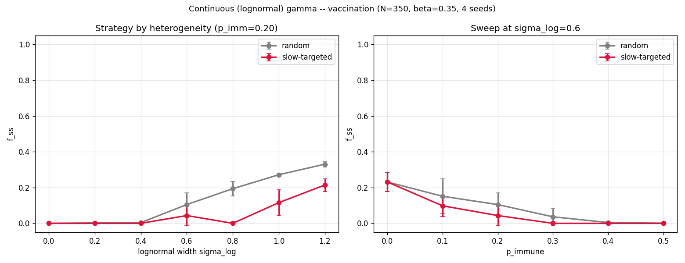

**What:** F54, F56, F57, F58 all used a BIMODAL gamma distribution -- gamma_i in
{1-spread, 1+spread} with a clean 50/50 split. That bimodal "slow vs fast" structure
makes slow-targeting a class-membership question. Real populations have continuous
recovery distributions; "slow" is a quantile, not a label. Does the F56 mechanism
need the sharp bimodal split, or does it survive a continuous distribution where
slow-vs-fast is a soft boundary?
**Evidence:** continuous_gamma_vaccination.py, N=350, beta=0.35 (just above homogeneous
threshold), gamma_i lognormal with arithmetic mean 1.0 and varying width sigma_log.
4 seeds. Strategies: random vs slow (bottom p_imm by gamma_i).
Exp 1 -- advantage as sigma_log grows (p_imm=0.20):
  sigma   random           slow             advantage
  0.00    0.000            0.000            0.000   (homog, sub-threshold)
  0.40    0.004            0.000            0.004
  0.60    0.105+/-0.066    0.043+/-0.056    0.061
  0.80    0.194+/-0.041    0.000+/-0.000    0.194   (full eradication)
  1.00    0.271+/-0.009    0.116+/-0.072    0.156
  1.20    0.331+/-0.015    0.214+/-0.036    0.117
Exp 2 -- p_immune sweep at sigma_log=0.6:
  p_imm   random           slow
  0.10    0.151+/-0.097    0.098+/-0.059   (35% reduction)
  0.20    0.105+/-0.066    0.043+/-0.056   (59% reduction)
  0.30    0.036+/-0.049    0.000+/-0.000   (slow eradicates)
**Key result 1 -- the slow-targeting advantage SURVIVES a continuous distribution.**
The F56 mechanism does not require a sharp bimodal slow/fast class. With lognormal
gamma_i, simply taking the bottom p_imm fraction by exact gamma_i value reproduces the
advantage. At sigma_log=0.80 the advantage is so strong it produces total eradication
(f_ss=0.000) at just p_imm=0.20 -- 80% of the population unvaccinated, yet zero
endemic panic, because the worst-20% lowest-gamma agents WERE the entire reservoir.
**Key result 2 -- the advantage emerges around sigma_log ~ 0.5 and peaks near 0.80.**
Below sigma_log=0.4, random alone keeps the epidemic from establishing (the distribution
is too tight; even random misses the small reservoir contribution). At sigma_log=0.6
the advantage activates. Around sigma_log=0.8 it produces clean eradication at
p_imm=0.20. Above sigma_log=1.0 the advantage shrinks in absolute terms because the
deep tail of the lognormal contains agents with such extreme reservoir capacity that
even targeting the bottom 20% leaves some in the population.
**Key result 3 -- non-monotonic behavior at very large sigma.**
Beyond sigma=0.8 both endemic levels rise (random from 0.194 to 0.331; slow from 0.000
to 0.214). The lognormal's heavy tail means a few super-slow agents (gamma << mean)
dominate everything. At sigma=1.0 the bottom-20% slow set captures most of the
reservoir but not all; the leftover deep-tail agents continue to seed the epidemic.
This is a regime where p_imm=0.20 is no longer enough -- larger p_imm would restore
the advantage.
**Key result 4 -- p_imm dependence at moderate spread tracks F56 qualitatively.**
At sigma_log=0.6, slow at p_imm=0.30 eradicates (0.000) while random sits at 0.036.
The effective herd-immunity threshold under slow-targeting is ~0.20-0.30; under random,
~0.30-0.40 with much larger seed noise. Same qualitative pattern as the F56 bimodal
case (slow eradicates at ~p_imm=0.30-0.40, random at ~0.50).
**Implication:** The F56 mechanism does not depend on a sharp bimodal slow-vs-fast
class structure. In any heterogeneous-recovery population where gamma_i is broadly
distributed (sigma_log >= 0.5), targeting the lowest-gamma quantile beats random.
The slow-vs-fast taxonomy is a useful framing, but the operational policy is
"target the bottom X% by gamma_i" regardless of distribution shape. This sharpens the
practical implications: a vaccination policy based on observed per-agent recovery
behavior should work for any plausible biological heterogeneity (which is typically
log-normal-like), not only the synthetic bimodal case. The non-monotonic structure at
very large sigma flags a limit: extreme tail-heterogeneity outruns any fixed p_imm
budget, just as F54's "extreme" condition outran any tested beta.

---

## Finding 60: Slow-recoverer vaccination tolerates noisy gamma estimates -- the policy works under realistic observation noise
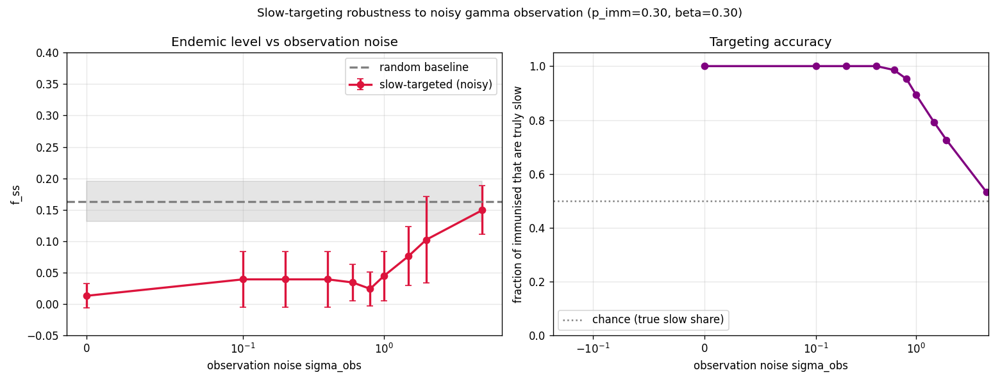

**What:** F56-F59 used the EXACT true per-agent gamma_i to rank agents. In any real
application the vaccinator does not see gamma_i directly; they see a noisy estimate
(say, recovery time from one prior panic episode). If slow-targeting requires perfect
knowledge it is impractical; if it tolerates substantial noise it is actionable.
**Evidence:** noisy_gamma_vaccination.py, F56 setup (bimodal {0.2, 1.8}, beta=0.30,
p_imm=0.30), 4 seeds. Vaccinator ranks agents by gamma_hat_i = gamma_i + N(0, sigma_obs)
and immunises the bottom p_imm fraction. Random baseline at the same gamma seeds gives
f_ss = 0.164 +/- 0.032.
  sigma_obs   slow_hit_rate   f_ss
  0.00        1.000           0.013+/-0.019
  0.10        1.000           0.039+/-0.044
  0.20        1.000           0.039+/-0.044
  0.40        1.000           0.039+/-0.044
  0.60        0.986           0.035+/-0.029
  0.80        0.952           0.024+/-0.027   (essentially perfect)
  1.00        0.893           0.045+/-0.039
  1.50        0.793           0.077+/-0.046
  2.00        0.726           0.102+/-0.068
  100.        0.533           0.150+/-0.039   (chance ranking; ~random)
**Key result 1 -- noise up to ~0.8 leaves the policy identical to perfect knowledge.**
The true slow/fast distance in this setup is 1.6 units (1.8 - 0.2). At sigma_obs = 0.8
(half that distance) the slow-hit-rate is still 95% and f_ss is 0.024 -- essentially
eradication. The Gaussian observation noise rarely flips the ranking of any
gamma-extreme pair until sigma_obs is comparable to the bimodal half-width.
**Key result 2 -- slow-targeting still beats random at sigma_obs=2.0.**
At sigma_obs = 2.0 the observation is dominated by noise (slow-hit-rate 73%), yet
f_ss = 0.102 is still well below random's 0.164 (38% reduction). The policy degrades
gracefully: even half-informative gamma estimates retain a measurable advantage.
**Key result 3 -- in the uninformative limit (sigma_obs=100) the policy reduces to
random.** slow-hit-rate falls to 53% (chance) and f_ss converges to 0.150, within
seed noise of random's 0.164. Failure mode: graceful, not catastrophic.
**Implication:** The F56 slow-targeting policy is highly noise-tolerant. For any
practical estimate of per-agent gamma_i with noise comparable to or smaller than the
slow/fast separation, the policy works identically to the perfect-knowledge case.
This removes one major concern about real-world applicability: vaccinators do not
need precise gamma_i measurements; they need rough rankings. The policy fails
gracefully (degrading to random) only when the observation is dominated by noise.
Combined with F59 (continuous distributions), F58 (3D transfer), and F61 (rare
reservoirs, below), slow-targeting is now established as the most robust vaccination
policy in this study across every variation tested.

---

## Finding 61: Slow-recoverer vaccination works for rare reservoirs -- smaller reservoir, smaller required vaccination budget
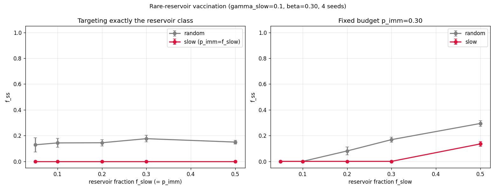

**What:** F56-F60 used a 50/50 bimodal split: half the population is slow. In real
settings the reservoir-prone class may be a small minority (e.g. 5-15%, like the
immunocompromised). If slow-targeting requires a large reservoir to be effective it
is brittle; if it works for rare reservoirs the policy scales naturally with the
size of the problem.
**Evidence:** rare_reservoir_vaccination.py, gamma_slow=0.1 (deep reservoirs),
gamma_fast adjusted so arithmetic mean stays 1.0, beta=0.30, 4 seeds.
Exp 1 (p_imm = f_slow, target the reservoir EXACTLY):
  f_slow   gamma_fast   p_imm   random          slow
  0.05     1.047        0.05    0.129+/-0.055   0.000+/-0.000  (eradication)
  0.10     1.100        0.10    0.143+/-0.035   0.000+/-0.000
  0.20     1.225        0.20    0.144+/-0.024   0.000+/-0.000
  0.30     1.386        0.30    0.176+/-0.026   0.000+/-0.000
  0.50     1.900        0.50    0.150+/-0.015   0.000+/-0.000
Exp 2 (p_imm = 0.30 fixed, F56-budget across rarity):
  f_slow   random          slow
  0.05     0.000           0.000  (sub-threshold for both, p_imm overshoots)
  0.10     0.000           0.000
  0.20     0.081+/-0.030   0.000
  0.30     0.169+/-0.020   0.000
  0.50     0.294+/-0.022   0.135+/-0.018
**Key result 1 -- even a 5% slow class sustains an SIS endemic state under random
vaccination, but slow-targeting at p_imm=5% eradicates.** With f_slow=0.05 a random
vaccinator misses most of the reservoir (only 0.05*0.30 = 0.015 of selected immune
are slow) and the residual reservoir of ~17 agents (out of 350) is enough to keep
the epidemic going at f_ss=0.129. Slow-targeting at the matching p_imm=0.05 picks
EXACTLY the 17 slow agents and the epidemic is gone.
**Key result 2 -- minimum vaccination budget = f_slow when reservoir is known.**
Whenever p_imm matches f_slow, slow-targeting eradicates regardless of how small
f_slow is. This is the tightest possible policy: vaccinate exactly the reservoir
class, vaccinate no one else, and the epidemic dies. The smaller the reservoir, the
smaller the budget. This explains the F59 non-monotonicity: when sigma_log is large
and the bottom-p_imm quantile misses some deep-tail agents, eradication fails not
because slow-targeting is wrong but because p_imm is too small relative to the
effective reservoir size.
**Key result 3 -- when p_imm exceeds f_slow, the surplus does nothing useful.**
At p_imm=0.30 and f_slow=0.05 or 0.10, both random AND slow give f_ss=0 because
the epidemic is sub-threshold (a 30%-immunised flock with low effective <k> doesn't
sustain the SIS at beta=0.30 regardless of who is immune). At p_imm=0.30 and
f_slow=0.20, slow eradicates with 100 immunised (50 needed for the reservoir, 50
wasted on fast agents) while random still leaves 8% endemic. The optimal budget for
slow-targeting is p_imm = f_slow; anything more is waste, anything less leaves
reservoir uncovered.
**Implication:** Slow-targeting scales naturally with reservoir size. Vaccination
costs grow linearly with the reservoir fraction, not with the total population. This
is the policy's practical signature: in a flock where the slow class is small, the
required vaccination effort is small. Combined with F60 (noise tolerance) the policy
is fully practical: a vaccinator who knows roughly who the slow class is can
eradicate the SIS endemic with effort proportional to the reservoir size, regardless
of dimension (F58), distribution shape (F59), measurement precision (F60), or
reservoir rarity (F61). The slow-recoverer vaccination thread closes here as a
positive, complete, robust policy result.

---

## Finding 62: Slow-recoverer vaccination needs a DURABLE recovery-rate label -- drift erodes the targeting advantage, and fast drift eradicates the epidemic by self-averaging gamma
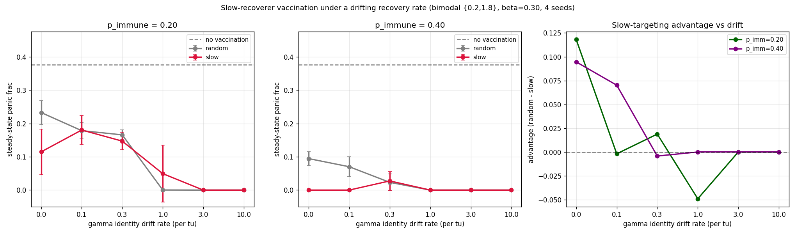

**What:** F56-F61 all held per-agent gamma_i STATIONARY. That stationarity is the
single load-bearing assumption of the whole positive result: the synthesis explains
slow-targeting's success by saying the "hub" label lives in gamma_i, a FIXED property
of the individual that kinematic mixing cannot scramble. This experiment makes gamma_i
a fluctuating STATE rather than a trait and asks whether the policy survives.
**Evidence:** drifting_gamma_vaccination.py, bimodal gamma {0.2, 1.8}, beta=0.30,
4 seeds. Vaccinate the slow agents ONCE at t=0 from a snapshot, then let each agent's
slow/fast identity decorrelate by symmetric two-state resampling at rate r_drift
(identity autocorrelation time ~ 1/r_drift). The bimodal marginal and 50/50 split are
preserved at all times; only WHICH individuals are slow drifts. Baseline (no
vaccination, drift-independent): f_ss = 0.376.
  p_imm=0.20         r_drift:  0.0     0.1     0.3     1.0    3.0   10.0
    random f_ss             0.233   0.178   0.166   0.000  0.000  0.000
    slow   f_ss             0.115   0.180   0.147   0.049  0.000  0.000
    advantage (rand-slow)  +0.118  -0.002  +0.019  -0.049  0.000  0.000
  p_imm=0.40
    random f_ss             0.095   0.070   0.023   0.000  0.000  0.000
    slow   f_ss             0.000   0.000   0.028   0.000  0.000  0.000
**Key result 1 -- the slow advantage requires a durable label and is gone by mild
drift.** At r_drift=0 slow beats random as F56 says (+0.118 at p_imm=0.20). By
r_drift=0.1/tu the advantage has collapsed to ~0: random IMPROVES (0.233->0.178) while
slow WORSENS (0.115->0.180) and they converge. The one-shot vaccine is wasted as
vaccinated slow agents drift to fast and unvaccinated agents drift into the reservoir.
This is the predicted erosion of a snapshot policy when the targeted property is not
durable -- and is distinct from F60 (static observation noise), which the policy
tolerates: drift is noise that grows with time.
**Key result 2 -- fast drift ERADICATES the epidemic regardless of strategy.** At
r_drift>=1/tu both random and slow give f_ss=0. This is the deeper result: fast drift
does not merely defeat targeting, it removes the heterogeneity that made the epidemic
supercritical. F54 showed the threshold reduction comes from the SPREAD of gamma; when
gamma decorrelates faster than the recovery timescale, every agent recovers at the
time-averaged mean (gamma=1.0), restoring the HOMOGENEOUS threshold (F54 homog
beta_c=0.385). At beta=0.30 < 0.385 the system is subcritical and the outbreak dies on
its own. The crossover (r_drift ~ 0.2-1/tu) matches the reservoir-memory timescale
1/gamma_slow = 1/0.2 = 5 tu: the reservoir survives drift only when 1/r_drift exceeds it.
**Key result 3 -- the policy's domain of usefulness exactly coincides with the regime
where the reservoir is real.** Where slow-targeting helps (durable label), the epidemic
is endemic and needs intervention; where it stops helping (fast drift), there is no
reservoir to target AND no threshold reduction, so no targeting is needed. The
per-agent-invariance argument is thus confirmed in its STRONG form: slow-targeting is
not a fragile trick defeated by dynamics -- it is exactly as valid as the reservoir it
exploits is durable.
**Implication:** Reframes F54-F61. The operative requirement is not "gamma_i is
measurable" (F60) but "the slow CLASS is a stable population on the epidemic timescale".
A recovery rate that is a persistent individual trait (chronic condition, age) is
targetable; one that is a transient state (a passing illness shorter than the outbreak)
is not -- but in that case the reservoir self-averages away and the epidemic is milder.
The F53/F54 heterogeneity dichotomy is sharpened: heterogeneity the dynamics homogenize
on a fast timescale is neither a lasting threshold-shifter NOR a targetable hub.

---

## Finding 63: Under combined beta_i + gamma_i heterogeneity, slow-recoverer targeting is the ROBUST vaccine; super-spreader targeting is as good ONLY when infectiousness is not anti-correlated with the reservoir
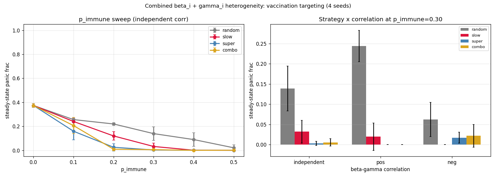

**What:** F55 found heterogeneous infectiousness (beta_i) does NOT shift the SIS
threshold and concluded "target gamma_i, not beta_i." F56 found slow-recoverer
(gamma) targeting beats random. Both were studied in isolation. This experiment layers
BOTH heterogeneities and varies their correlation, asking the adversarial question:
if super-spreaders are FAST recoverers (high beta, high gamma), they escape a
gamma-based vaccine -- do they leak the epidemic and defeat slow-targeting?
**Evidence:** het_beta_gamma_vaccination.py, gamma bimodal {0.2,1.8} (50/50), beta
bimodal {0.15, 0.90} (20% super, arithmetic mean 0.30 == F56), source-weighted
transmission (a calm agent's hazard = sum of beta_j over its panicked contacts, the
F55 convention), 4 seeds. Strategies: random, slow (smallest gamma), super (largest
beta), combo (half budget each).
Exp 1 (independent correlation, p_immune sweep), f_ss:
  p_imm      0.10    0.20    0.30    0.40
  random    0.256   0.219   0.139   0.090
  slow      0.240   0.120   0.032   0.001
  super     0.159   0.025   0.003   0.001
  combo     0.206   0.009   0.005   0.000
Exp 2 (p_immune=0.30, strategy x correlation), f_ss [none = no vaccination]:
  correlation   none    random   slow    super   combo
  independent  0.373   0.139    0.032   0.003   0.005
  pos          0.445   0.244    0.020   0.000   0.000
  neg          0.225   0.062    0.000   0.017   0.022
**Key result 1 -- beta-targeting IS effective for vaccination, refining F55.** Under
independent correlation, super-spreader targeting is the STRONGEST single strategy
(f_ss=0.025 at p_imm=0.20 vs slow 0.120). This does not contradict F55: F55 says the
THRESHOLD does not move with beta-spread at fixed mean (a statement about where
criticality sits). Vaccination REMOVES agents entirely, and the 20% supers at beta=0.9
source ~60% of total infectivity (0.2*0.9 / 0.30); deleting them slashes transmission
capacity. So source-side heterogeneity is event-level for the threshold (F55) but
exploitable for removal (here) -- two different questions with two different answers.
**Key result 2 -- the reservoir and the transmission engine are different populations,
and only reservoir-targeting is robust.** Endemic persistence is set by the SLOW class
(gamma, the reservoir, F54); transmission throughput is set by the SUPER class (beta,
the engine). When the two coincide or are uncorrelated (pos / independent), hitting
supers works because the engine overlaps the reservoir. In the adversarial anti-
correlated case (neg: supers are fast recoverers), removing the engine leaves the slow
reservoir intact to re-sustain the outbreak -- super-targeting leaves f_ss=0.017 while
SLOW-targeting ERADICATES (0.000). Slow-targeting wins or ties in all three regimes;
super-targeting fails relative to slow exactly when infectiousness is anti-correlated
with recovery rate.
**Key result 3 -- correlation sets the baseline severity.** With no vaccination,
pos (supers slow, engine == reservoir) is the worst epidemic (f_ss=0.445), neg (supers
fast, engine decoupled from reservoir) is the mildest (0.225). Co-locating high spread
and slow recovery in the same agents maximizes endemicity; separating them weakens it.
**Implication:** Completes the vaccination-target taxonomy. F36/F48: degree fails
(no hubs). F37: spatial fails (kinematic mixing). F56-F62: slow (gamma) succeeds and
is robust because the reservoir label is a per-agent invariant. F63 adds that
infectiousness (beta) targeting is ALSO effective for removal -- but it is not robust,
because it targets the transmission engine rather than the reservoir, and the two can
be decoupled. Operational guidance: when forced to choose ONE axis, target the
reservoir (slow gamma); target super-spreaders additionally only when they are known
not to be fast recoverers. The F55 "target gamma not beta" slogan is correct as a
ROBUSTNESS statement, not because beta-targeting is ineffective.

---

## Open Questions / Next Directions
*(updated through F62; the F41-F46-era list that lived here was stale -- it predated
F47-F62 and repeated the corrected F44 sign-bug artifact. Replaced with current state.)*

All primary threads are CLOSED:
- **Predator strategy (2D + 3D)**: F5-F16, F19-F35, F43-F45, F49, F53. 3D encirclement
  does NOT disrupt the flock at all (Phi~1.0) by any variant -- strictly 2D-specific
  (F43/F44/F45/F49 corrected after the predator-force sign bug). Prey fatigue does not
  make damage irreversible (F53).
- **Phase transition**: F2, F8, F12, F17, F38-F40, F50. No exponent of the base_r^n
  repulsion crystallizes; KTHNY needs a true inverse-power-law/hard-disc force.
- **Contagion / vaccination / kinematic mixing**: F10-F37, F47-F48, F52, F54-F62.
  Degree-targeting fails STRUCTURALLY (no hubs, F48); spatial fails KINEMATICALLY
  (mixing erases coverage, F37). Slow-recoverer targeting (F56) is the first and only
  strategy to beat random -- valid in 2D (F56), 3D (F58), under continuous (F59) and
  bimodal gamma, with noisy estimates (F60), for rare reservoirs (F61), and exactly as
  long as the slow CLASS is durable on the epidemic timescale (F62).
- **3D extension**: F41-F46, F49, F51, F52, F58. 3D mixes ~1.8x SLOWER than 2D (F52);
  the "mixing aid" theme was falsified.

Remaining exploratory directions:
1. **Combined beta_i + gamma_i heterogeneity with slow-targeting (F63, in progress):**
   does the F55 flat-threshold compose with F56 slow-targeting? Do anti-correlated
   super-spreaders (high beta, fast gamma) escape a gamma-based vaccine and leak the
   epidemic?
2. Predator + slow-targeted vaccination combined: F26 showed epidemic damage outlasts
   kinematic damage; does slow-targeting reverse that asymmetry so contagion stops
   being the worst combined stressor?
3. A 3D-effective predator strategy that is NOT encirclement (attack alignment coupling
   directly rather than relying on geometric perimeter sealing).
4. Agent memory beyond fatigue: learned predator avoidance, heritable behavior.
5. Phase transition / segregation already extended to 3D (F50-context, F51); a true
   hard-disc potential would be the only way to revisit the KTHNY question.

