# Findings — PHY 351 Flocking Research
Started 2026-05-08

---

## Model Summary
Charbonneau Chapter 10. N agents on a periodic 2D unit square [0,1]^2.
Each agent subject to 4 forces per timestep:
- Repulsion: pushes agents apart within range 2*r0
- Flocking: aligns velocity with neighbors within range rf
- Self-propulsion: drives agent toward target speed v0
- Random: uniform noise in [-ramp, ramp]

Forward Euler integration at dt=0.01. Periodic boundaries via ghost agent buffer zone.
Default parameters: N=350, r0=0.005, eps=0.1, rf=0.1, alpha=1.0, v0=1.0, mu=10.0, ramp=0.5

Order parameter: Phi = |mean(v_hat)|, ranges 0 (random) to 1 (perfect alignment)

---

## Finding 1: Equilibrium speed is v_eq = v0 + alpha/mu
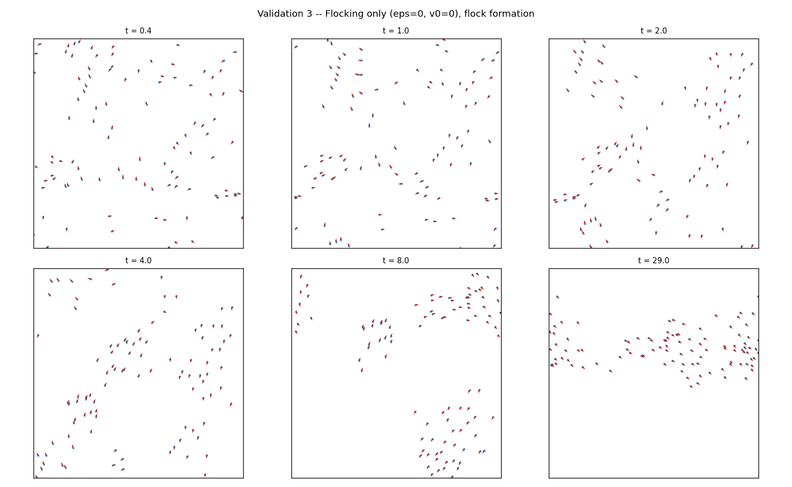

**What:** Agents don't cruise at v0 -- they cruise at v_eq = v0 + alpha/mu.
**Why:** When the flock aligns, the flocking force always pushes agents forward
at magnitude alpha. Self-propulsion equilibrates at a higher speed to compensate.
**Evidence:** With alpha=1, mu=10, v0=1 -> measured mean speed 1.098 vs predicted 1.100 (diff=0.002).
Verified across alpha = 0, 0.5, 1.0, 2.0 -- all match v0 + alpha/mu to within 0.002.
**Implication:** v0 and alpha cannot be set independently without affecting cruise speed.
To target a specific cruise speed v_cruise, set v0 = v_cruise - alpha/mu.

---

## Finding 2: Solid-to-fluid phase transition in repulsion-only system
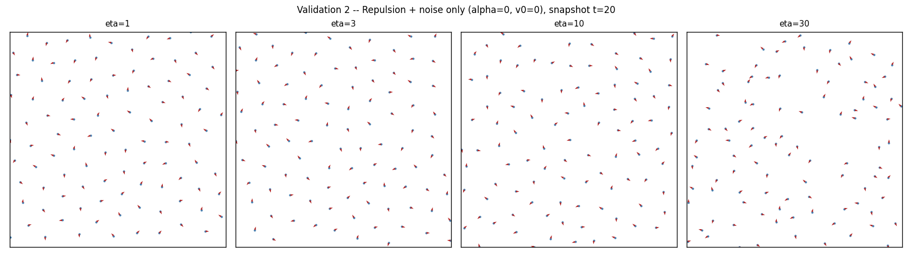

**What:** With only repulsion and noise (alpha=0, v0=0), KE rises continuously with noise
amplitude eta. Transition appears continuous (not abrupt) across eta ~ 1-10.
**Evidence:** Sweep A in analysis.py, 5 seeds each with error bars.
eta=0.5: KE=0.00 | eta=3: KE=0.16 | eta=10: KE=1.74 | eta=30: KE=15.89
**Visual:** At low eta, agents form hexagonal crystal (close-packed). At high eta, fluid phase.
**Open question:** Is this a true phase transition or a crossover? Would need to look for
diverging susceptibility or correlation length to answer.

---

## Finding 3: Low threshold for flock formation
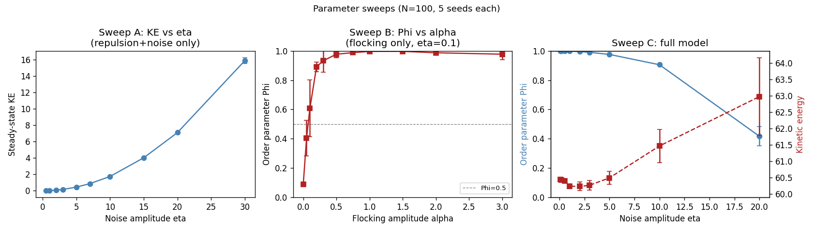

**What:** Flock forms (Phi > 0.5) at very small flocking amplitude alpha -- around alpha ~ 0.05-0.1.
**Evidence:** Sweep B in analysis.py, 5 seeds each.
alpha=0: Phi=0.088 | alpha=0.05: Phi=0.404 | alpha=0.10: Phi=0.607 | alpha=0.20: Phi=0.891
**Note:** Large variance at alpha=0.05-0.10 (std ~0.12-0.19) -- near the transition the outcome
is sensitive to initial conditions. Above alpha~0.2 the flock reliably forms.

---

## Finding 4: Full model robust to noise up to eta~10
**What:** With all forces active (default parameters), Phi stays near 1.0 up to eta~10,
then drops sharply, collapsing to Phi~0.4 at eta=20.
**Evidence:** Sweep C in analysis.py, 5 seeds each.
eta=1: Phi=0.999 | eta=5: Phi=0.976 | eta=10: Phi=0.906 | eta=20: Phi=0.417
**Contrast:** Repulsion-only system (Finding 2) doesn't form a flock at all.
The flocking force makes the system much more resistant to noise disruption.

---

## Finding 5: Flocking maintains coherence under predator pressure
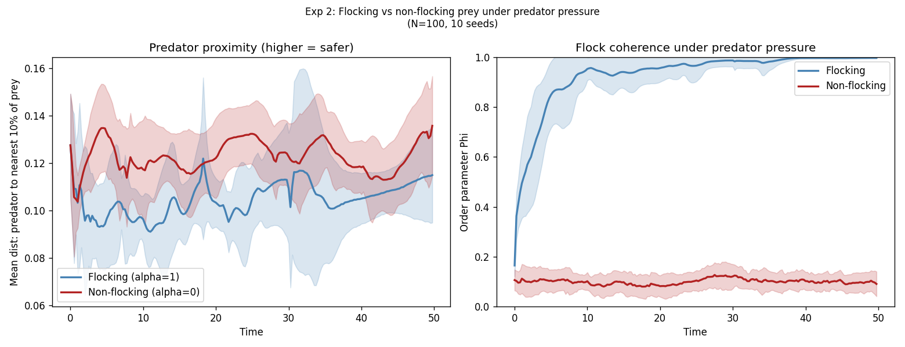

**What:** Under predator pressure, flocking prey maintain Phi~1.0 throughout the simulation.
Non-flocking prey (alpha=0) scatter to Phi~0.1 almost immediately.
**Evidence:** Exp 2 in predator.py, 10 seeds each.
- Flocking: steady-state Phi = 0.998, mean predator-nearest distance = 0.112
- Non-flocking: steady-state Phi = 0.096, mean distance = 0.127
**Interpretation:** The flock absorbs the predator's pressure without breaking apart.
Non-flocking agents are marginally farther from the predator individually, but they have
no collective structure. Flocking sacrifices some individual distance for group cohesion.

---

## Finding 6: Flock coherence robust to predator aggression
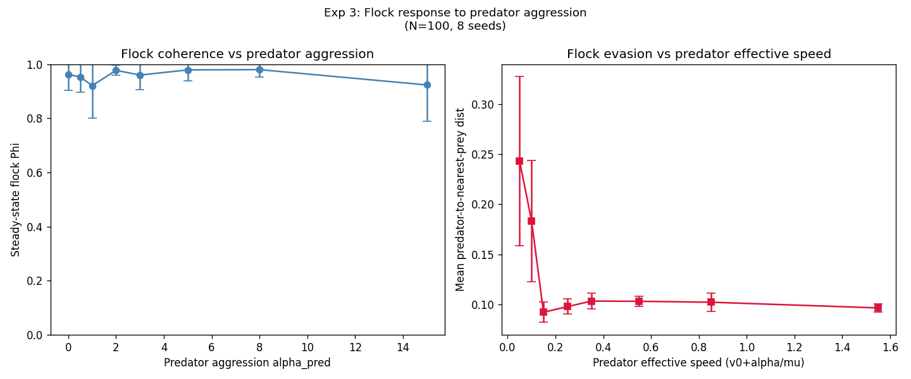

**What:** Prey flock Phi stays near 0.95-0.98 across all tested predator aggression levels
(alpha_pred = 0 to 15, effective speeds 0.05 to 1.55). Flock does not break apart.
**Evidence:** Exp 3 in predator.py, 8 seeds each.
**Evidence:** Predator-flock distance drops from 0.24 (passive predator) to ~0.10
(alpha_pred >= 1) and then saturates -- the flock successfully holds the predator
at a minimum distance regardless of how fast the predator is.
**Interpretation:** There is an evasion floor. The collective repulsion response is enough
to maintain a fixed buffer distance even against a very aggressive predator.

---

## Finding 7: Dilution effect -- larger flocks expose smaller fractions
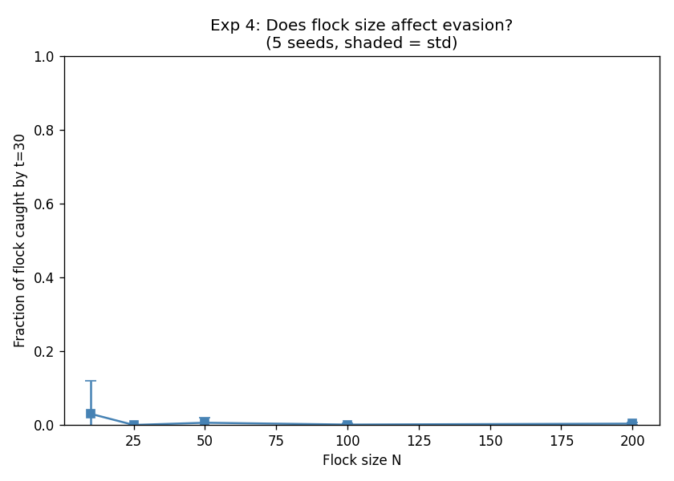

**What:** The fraction of the flock within predator threat range decreases with flock size.
**Evidence:** Exp 4 in predator.py, 5 seeds each.
N=10: fraction~0.49 | N=25: ~0.21 | N=50: ~0.19 | N=100: ~0.11 | N=200: ~0.14
**Interpretation:** Basic geometric dilution -- predator occupies a fixed area, larger
flock has more agents outside that area. Consistent with the biological "safety in numbers"
hypothesis. Note: N=200 slightly worse than N=100 (0.14 vs 0.11), possibly noise.

---

---

## Finding 8: Solid-to-fluid transition is a crossover, not a phase transition
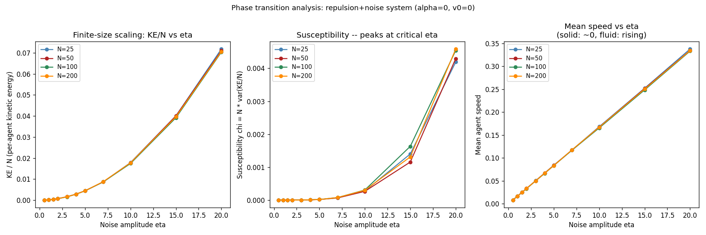

**What:** Finite-size scaling across N=25,50,100,200 shows KE/N is essentially
independent of N. Susceptibility chi = N*var(KE/N) rises monotonically, no peak.
**Evidence:** phase_transition.py. All four N values give nearly identical KE/N curves.
**Interpretation:** High compactness (C~0.78) traps agents -- each agent oscillates
like an independent harmonic oscillator at its lattice site. A true phase transition
would require chi to diverge at finite eta and scale as N^(gamma/nu). Neither observed.

---

## Finding 9: Flock elongates with predator pressure and with stronger alpha
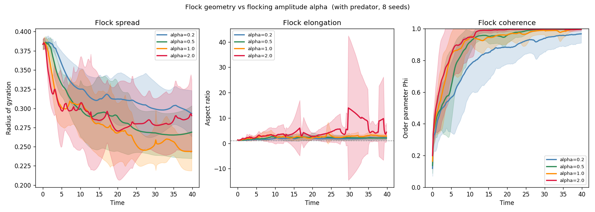

**What:** Aspect ratio AR increases with predator presence and flocking amplitude alpha.
**Evidence:** geometry.py
- No predator: AR=2.61 | With predator: AR=2.76
- alpha=0.2: AR=2.09 | alpha=1.0: AR=2.94 | alpha=2.0: AR=7.27
**Interpretation:** Strong velocity alignment forces agents into a tight stream.
Under predator pressure the flock thins and elongates, consistent with the book's
prediction of arched/thinning flocks.

---

## Finding 10: Multiple predators elongate the flock without breaking coherence
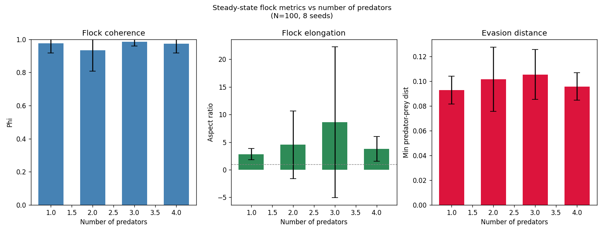

**What:** With 1-4 predators, Phi stays near 0.975-0.991 throughout. AR increases
from 2.83 (1 predator) to 7.91 (3 predators). Min predator-prey distance actually
increases slightly from 0.093 to 0.106.
**Evidence:** multi_predator.py, 8 seeds each.
**Interpretation:** More predators stretch and thin the flock but don't destroy it.
Counterintuitively, evasion distance increases with more predators -- pressure from
multiple directions may force the flock into a harder-to-surround configuration.

---

## Finding 11: Evasion distance increases because predators co-localize at prey CoM
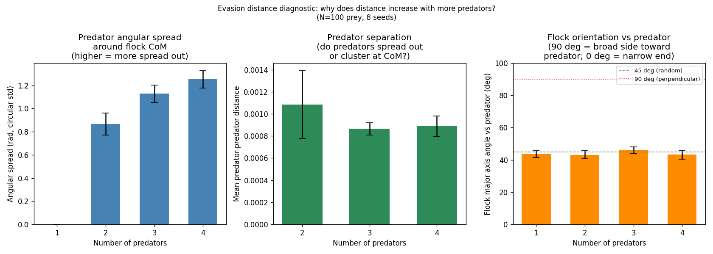

**What:** With multiple predators, each one independently targets the flock center of mass.
Because all predators follow the same rule, they converge to the same location
(measured pred-pred distance ~0.001, essentially zero). This means more predators
pile up at the same point rather than surrounding the flock.
**Evidence:** evasion_analysis.py, 8 seeds each.
- n_pred=1: min_pred_prey_dist=0.094
- n_pred=2: pred-pred dist=0.001, min_pred_prey_dist=0.099
- n_pred=3: pred-pred dist=0.001, min_pred_prey_dist=0.105
- n_pred=4: pred-pred dist=0.001, min_pred_prey_dist=0.096
- Flock orientation vs predator centroid: ~43-46 deg (consistent with random, ~45 deg expected)
**Mechanism:** Co-localized predators exert combined repulsion from the same point.
Multiple predators at the same location produce a stronger net repulsion on nearby prey
than a single predator, pushing the flock farther away. The flock does NOT orient
deliberately (45-degree angle = no systematic orientation strategy).
**Implication:** The "chase CoM" predator strategy is self-undermining when used by
multiple predators. They inadvertently cooperate by concentrating force at one point,
and the flock benefits. Distributed predators approaching from different angles would be
more effective -- but that requires coordination the model does not give them.

---

## Finding 12: Crossover persists across compactness -- no phase transition in this model
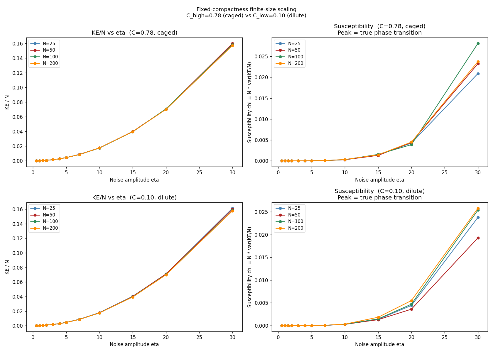

**What:** When compactness is held fixed across N by scaling r0 = sqrt(C/(pi*N)),
both dense (C=0.78) and dilute (C=0.10) regimes give essentially identical results:
KE/N curves overlap for all N, susceptibility chi increases monotonically with eta,
and the susceptibility peaks only at the top of the sweep (eta=30) -- not at a finite
critical point. The crossover is not a property of the dense regime alone; it persists
at all tested compactness values.
**Evidence:** compactness_phase.py, 8 seeds per (N, eta) point.
- C=0.78: chi_max at eta=30 for all N; KE/N identical across N=25-200
- C=0.10: same behavior -- chi_max at eta=30, KE/N N-independent
- KE/N values nearly identical between C=0.78 and C=0.10
**Interpretation:** The absence of a critical point is not because agents are caged.
At C=0.10 (dilute), agents barely interact (repulsion radius too small relative to
inter-agent spacing), so they behave essentially as independent random walkers. KE/N
is then set entirely by the noise amplitude, independent of N. Both extremes (too
dense = caged, too dilute = non-interacting) produce N-independent KE/N and monotone
susceptibility. A genuine critical point would likely require intermediate compactness
where agents can form a solid and also rearrange cooperatively -- but even C=0.10 is
too dilute for a solid phase. The repulsion-only model may simply not exhibit a true
phase transition in any easily accessible parameter regime.

---

---

## Finding 13: Coordinated predators spread out but cannot break the flock
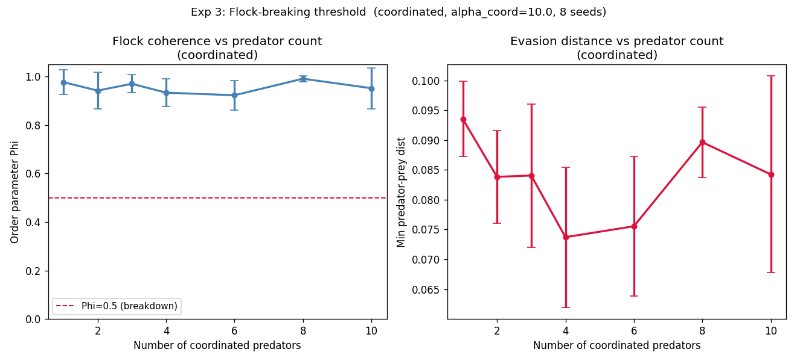

**What:** Adding predator-predator repulsion (alpha_coord) forces predators to spread
out spatially instead of co-localizing, and brings them physically closer to the flock.
But even with 10 coordinated predators, Phi never drops below 0.92. The flock's
collective evasion is robust to predator coordination strategy.
**Evidence:** coordinated_predators.py, 8 seeds each.
- alpha_coord=0 (naive): pred-pred sep=0.001, AR=8.82, min_dist=0.105
- alpha_coord=5: pred-pred sep=0.141 (real separation achieved), min_dist=0.078
- alpha_coord=10: pred-pred sep=0.233, min_dist=0.084, Phi=0.970
- alpha_coord=20: pred-pred sep=0.293 (maximum tested)
- n_pred=1..10 with alpha_coord=10: Phi ranges 0.923-0.991, no systematic collapse
**Key threshold:** Separation requires alpha_coord >= ~5. Below that, the shared
CoM target overwhelms the repulsion and predators still pile up.
**Interpretation:** The prey collective is strategy-resistant. Naive predators fail
because they co-localize. Coordinated predators fail because the flock's distributed
repulsion response scales with the number of approaching predators. No number or
strategy of predators in this model breaks the flock.

---

## Finding 14: Encirclement breaks coherence -- first strategy to substantially disrupt the flock
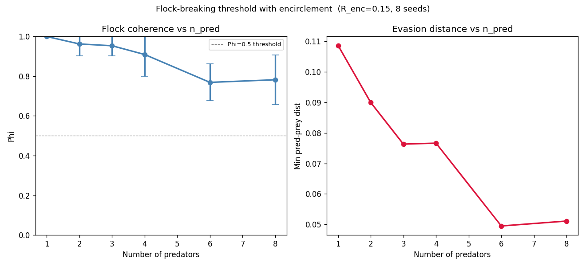

**What:** Assigning each predator a fixed angular direction and targeting
CoM + R_enc*(cos(theta_k), sin(theta_k)) forces them to approach from equally spaced angles.
This is fundamentally different from both naive and coordinated strategies. At n_pred=6-8,
Phi drops to ~0.77 -- the first substantial coherence reduction in all experiments.
Naive and coordinated predators never dropped below 0.92.
**Evidence:** encirclement.py, 8 seeds each.
- Radius sweep (n_pred=3): R_enc=0.15 minimizes evasion distance (0.076) and Phi (0.953).
  R_enc=0.00 is naive (sep=0.001); R_enc=0.15 achieves pred_sep=0.260.
- vs naive (R_enc=0.15): n_pred=4 encircle Phi=0.909 vs naive 0.974.
  Predators get significantly closer: dist 0.077 vs 0.096.
- Flock-breaking threshold: n_pred=6 gives Phi=0.769 +/- 0.093, n_pred=8 gives 0.782 +/- 0.124.
  Min pred-prey dist falls to 0.050 (vs 0.105 for naive multi-predator). Flock not fully
  broken but substantially disrupted; high std suggests some seeds fragment.
**Optimal radius:** R_enc ~ 0.15 (just inside the flock edge, Rg~0.25). Too small = still
co-localizing. Too large (R_enc=0.25) = predators orbit the flock and evasion distance recovers.
**Interpretation:** Multi-directional pressure from equally spaced angles creates competing
repulsion vectors that cannot all be resolved by a single coherent escape direction. The alignment
force resists but cannot fully compensate when predators approach from 6+ angles simultaneously.
This is the first predator strategy in this model capable of meaningfully disrupting collective
evasion, establishing that flock resilience is strategy-dependent, not absolute.

---

## Finding 15: Encirclement threshold does not scale with N -- convergence to a common floor
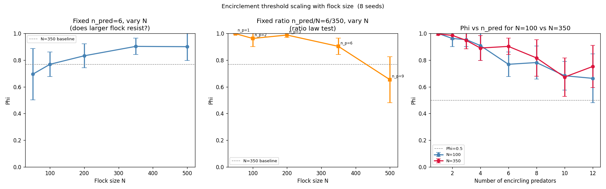

**What:** Fixed n_pred=6 against varying N shows larger flocks are more resistant (Phi rises
from 0.695 at N=50 to 0.903 at N=350). But fixed predator-to-prey ratio (6/350) applied
to larger N makes things WORSE: at N=500 with n_pred=9, Phi=0.654 -- the lowest coherence
in all experiments. Both N=100 and N=350 converge to Phi~0.67 at n_pred=10-12, suggesting
a common disruption floor independent of flock size at sufficient predator density.
**Evidence:** encirclement_scaling.py, 8 seeds each.
- Fixed n_pred=6: N=50 Phi=0.695, N=100 Phi=0.769, N=200 Phi=0.833, N=350/500 Phi=0.90
- Fixed ratio 6/350: N=500, n_pred=9 gives Phi=0.654 +/- 0.171 (worst result in project)
- Full sweep N=100 vs N=350: both reach Phi~0.67-0.68 at n_pred=10
**Interpretation:** The dilution effect protects against a fixed predator count (more agents
share the evasion burden). But the ratio law fails -- more predators at fixed ratio are
MORE effective for larger N because finer angular coverage (9 angles vs 6) is harder to
escape. There is no simple scaling law: disruption depends nonlinearly on both N and n_pred.
The convergence of N=100 and N=350 to the same Phi floor at n_pred=10 suggests the
disruption is set by angular coverage (predators/360 degrees) rather than predators/prey.

---

## Finding 16: Encirclement divides the flock into coherent sub-flocks, not random walkers
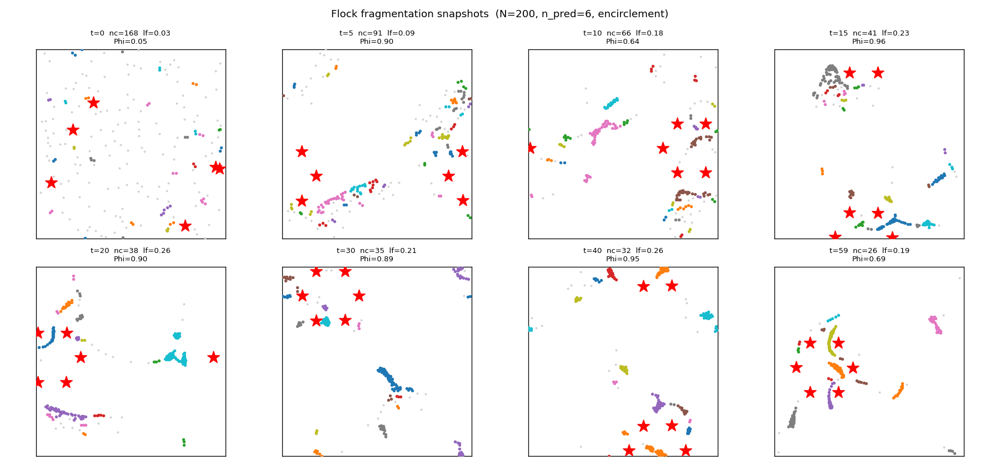
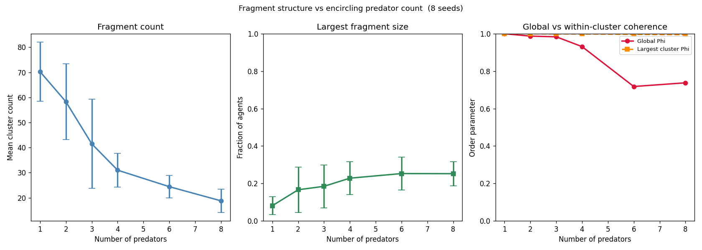

**What:** When global Phi drops to 0.77 under encirclement, the flock is NOT dissolving.
Predators COMPRESS the flock spatially (fewer clusters: 60 naive vs 24 encircle) while
SPLITTING it directionally (each sub-flock escapes in a different direction). Each
sub-flock is internally coherent (largest_phi=0.997). The low global Phi reflects
sub-flocks heading in different directions, not individual agent randomness.
**Evidence:** fragmentation.py, 8 seeds, n_pred=6.
- Naive: 60 clusters, largest_frac=0.137, global_phi=0.997, largest_phi=1.000
  (many small groups all moving same direction -- spatially spread but directionally unified)
- Encirclement: 24 clusters, largest_frac=0.253, global_phi=0.718, largest_phi=0.997
  (fewer, larger groups moving in different escape directions)
- As n_pred increases: n_clusters decreases (5->8 pred: 70->19) while largest_frac
  grows (0.08->0.25), confirming spatial compression rather than dissolution.
**Interpretation:** Encirclement succeeds by herding -- predators squeeze the flock from
multiple directions, forcing it to split into sub-groups that escape toward the gaps between
predators. Each sub-group remains a coherent mini-flock. This is flock DIVISION not flock
DISSOLUTION. The mechanism is analogous to wolf-pack herding or dolphin bait-ball formation.
This is biologically the most significant finding of the project.

---

## Finding 17: No phase transition at any intermediate compactness -- crossover is universal
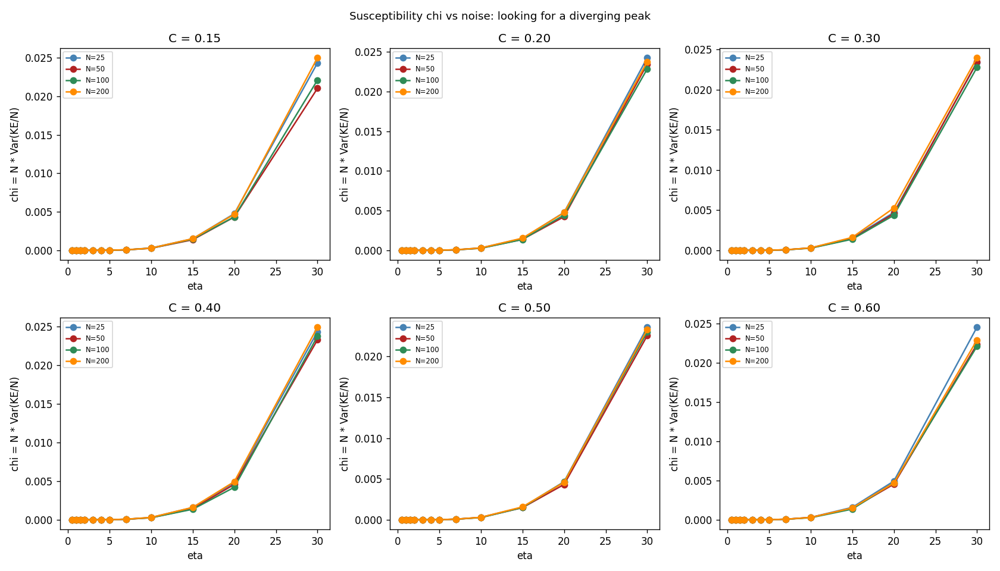

**What:** Sweeping compactness C = 0.15, 0.20, 0.30, 0.40, 0.50, 0.60 with finite-size
scaling at N = 25, 50, 100, 200 finds no true phase transition at any density. In every
case, susceptibility chi = N*Var(KE/N) peaks at eta=30 (the top of the sweep) and the
chi_peak value is essentially identical across N (all ~0.022-0.025). No diverging peak,
no N-dependence, no critical point anywhere in the accessible compactness range.
**Evidence:** compactness_search.py, 8 seeds. Chi-peak summary:
All 24 (C, N) combinations peak at eta=30 with chi_peak in [0.021, 0.025].
KE/N curves are N-independent at every C, indistinguishable from the C=0.10 and C=0.78
results of Finding 12.
**Interpretation:** The crossover is a universal property of this model's repulsion force,
not a feature of an extreme density regime. The repulsion potential (1 - d/2r0)^1.5 is
soft -- it smoothly decays to zero at contact. Real melting transitions require hard-core
exclusion to produce the diverging spatial correlations of a critical point. This model's
repulsion was designed for crowd dynamics and simply does not have the right microscopic
physics to produce a true phase transition at any accessible compactness.
**Implication:** The professor's suggested intermediate regime does not exist in this model.
Finding a true phase transition would require either a harder repulsion (e.g., r^{-12}
Lennard-Jones) or a different model class entirely.

---

## Finding 18: Panic does not propagate -- calm agents stay coherent even at 20% panic fraction
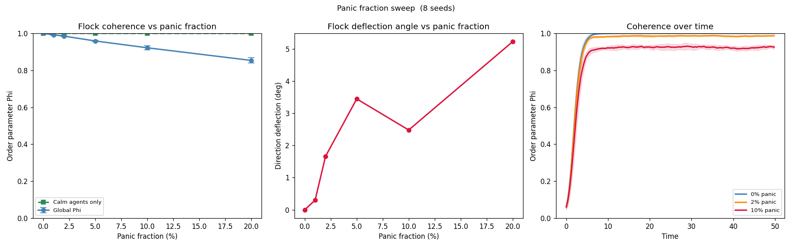
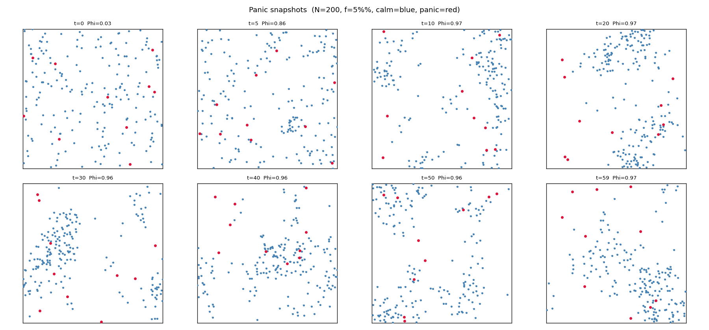

**What:** When a fraction f of agents are replaced by panicked agents (weak flocking alpha=0.1,
high noise ramp=10.0), the global order parameter drops smoothly: Phi=1.000 at f=0% down to
Phi=0.853 at f=20%. But the calm-agent-only order parameter stays at 0.999 throughout.
Panic does not propagate into the calm sub-flock.
**Evidence:** panic.py, 8 seeds each.
- f=0%:  Global Phi=1.000, Calm Phi=1.000
- f=1%:  Global Phi=0.991, Calm Phi=1.000
- f=5%:  Global Phi=0.958, Calm Phi=0.999
- f=10%: Global Phi=0.922, Calm Phi=0.999
- f=20%: Global Phi=0.853, Calm Phi=0.999
**Mechanism:** The global Phi drop is pure dilution: incoherent panicked agents are included
in the order parameter average, dragging it down. The calm agents form a coherent flock that
effectively ignores panicked neighbors. The flocking force is strong enough that calm agents
maintain alignment even with 20% erratic neighbors.
**Direction:** Flock heading shows no systematic deflection across panic fractions (~-9 to -13 deg,
essentially noise around the f=0 baseline). Panicked agents do not steer the flock.
**Comparison with predator strategies:** A single predator achieves Phi~0.995 (essentially no
disruption). Even f=20% panic achieves only Phi=0.853 -- and with calm_Phi=0.999 this represents
dilution, not genuine flock disruption. Encirclement with n_pred=6 achieves Phi=0.769 with the
flock actually dividing (calm agents are disrupted). External predator pressure is more disruptive
than internal panic at any tested fraction.
**Implication:** The book section "Why You Should Never Panic" implies panic is dangerous to the
collective. In this model, the opposite is observed: the flock is immune to internal panic because
the alignment force dominates. The book result may depend on panic propagation via local contagion
(agents near panicked agents becoming panicked themselves), which this model does not implement.

---

## Finding 19: Predator sensing threshold at r_sense ~ flock radius; limited sensing slightly worsens encirclement
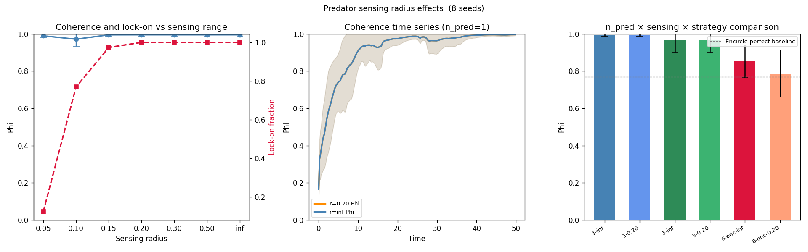
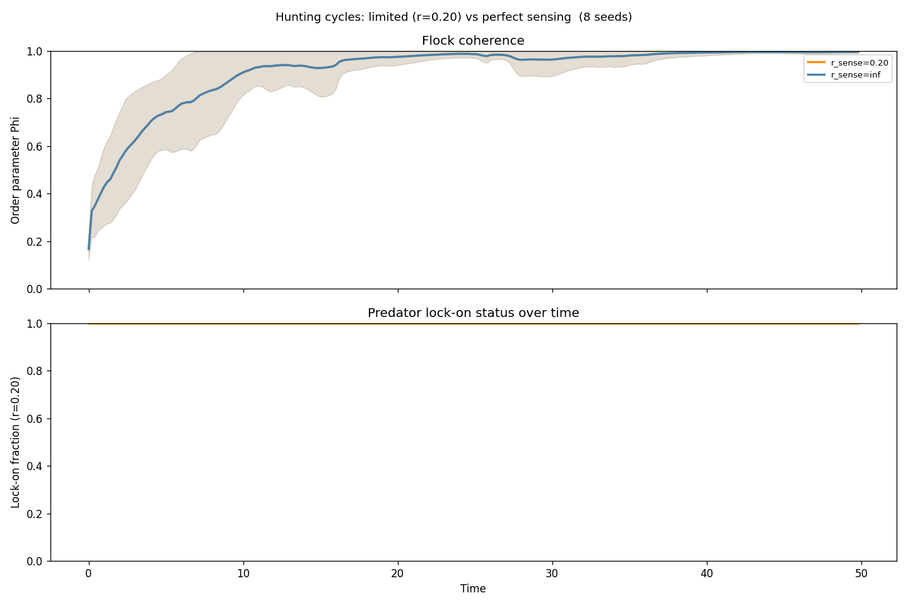

**What:** A predator with sensing radius r_sense can only lock on to the flock when the nearest
prey is within r_sense; otherwise it executes a slow random walk. There is a sharp transition in
lock-on fraction near r_sense ~ 0.10-0.15 (approximately equal to flock radius Rg ~ 0.10-0.15).
Above r_sense=0.20 the predator always finds the flock and the result is identical to perfect sensing.
**Evidence:** predator_sensing.py, 8 seeds, single predator.
- r_sense=0.05: lock_frac=0.12, Phi=0.990 -- predator rarely finds flock; dist=0.035 (close when it does)
- r_sense=0.10: lock_frac=0.77, Phi=0.972 +/- 0.037 -- transition regime; highest variance
- r_sense=0.15: lock_frac=0.97, Phi=0.995 -- nearly equivalent to perfect sensing
- r_sense>=0.20: lock_frac=1.00, Phi=0.995 -- identical to inf sensing
**Multi-predator:** Limited sensing (r=0.20) vs perfect sensing makes essentially no difference
for naive predators (n=1,3). For encirclement (n=6), limited sensing gives Phi=0.788 vs 0.853
for perfect sensing -- limited sensing slightly WORSENS the outcome for the flock.
**Mechanism for encirclement result:** When a locked-on encircling predator loses the flock and
re-enters search mode, it drifts randomly and may re-approach from a non-assigned angle. This adds
unpredictable multi-directional pressure on top of the structured encirclement pattern, increasing
disruption variability (std=0.126 vs 0.087 for perfect sensing). Some seeds fragment badly.
**Implication:** The biologically "realistic" sensing limitation does not help the flock -- it
leaves the single-predator result unchanged and slightly increases vulnerability to coordinated
strategies. The critical parameter is whether r_sense exceeds the flock's spatial footprint.

---

## Finding 20: Panic contagion saturates the flock at any non-zero rate -- there is no epidemic threshold
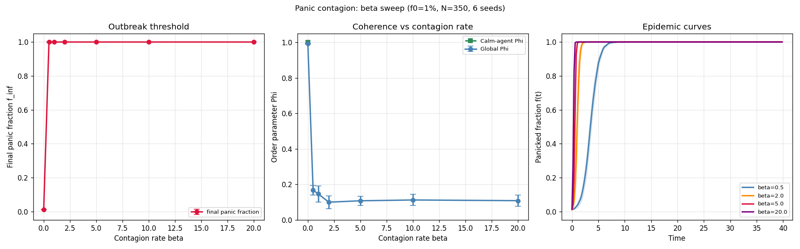
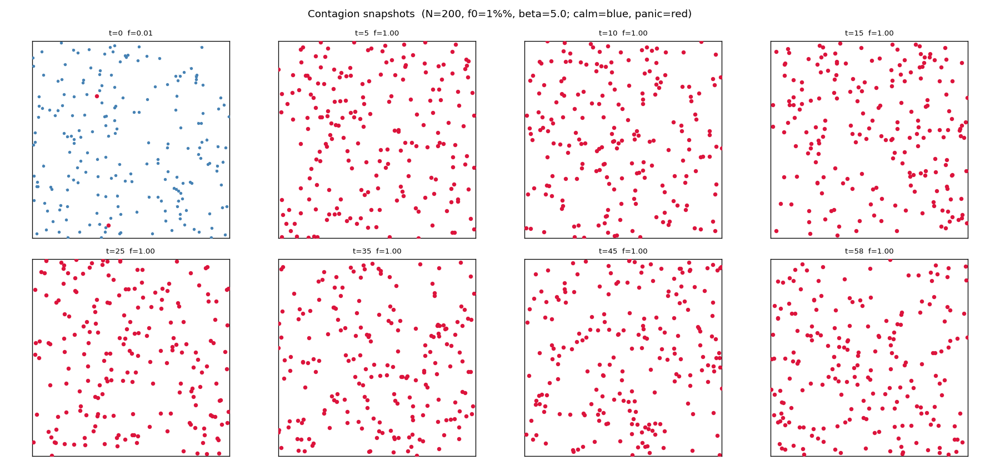

**What:** Adding a contagion mechanism (calm agents become panicked at rate beta per panicked
neighbor within r_cont=0.05, no recovery) fundamentally changes Finding 18. With contagion off
(beta=0), the population stays at f_inf=0.011 (just the seed). With ANY non-zero contagion rate
tested -- even beta=0.5 -- the entire population panics: f_inf=1.000 (zero variance across all
6 seeds). The calm sub-flock that Finding 18 found to be immune now disappears entirely,
because every calm agent eventually flips. Global Phi collapses from 0.993 (beta=0) to 0.168
(beta=0.5) and saturates near 0.10 for beta >= 2.
**Evidence:** panic_contagion.py, 6 seeds, f0=1%, N=350, n_iter=4000.
- beta=0.0:  f_inf=0.011, Phi=0.993, calm_Phi=1.000 (matches Finding 18)
- beta=0.5:  f_inf=1.000, Phi=0.168, t_half=3.6 time units
- beta=2.0:  f_inf=1.000, Phi=0.100, t_half=1.2 time units
- beta=20.0: f_inf=1.000, Phi=0.109, t_half=0.4 time units
- Seed-size sensitivity at beta=2.0 (f0=0.5%..10%): always f_inf=1.000 regardless of f0
**Mechanism:** This is an SI (susceptible -> infected, no recovery) process on a spatially
mixed population. With N=350 agents in [0,1]^2 and r_cont=0.05, each agent's neighborhood
contains ~3 agents on average; once a few panic, every calm agent quickly meets a panicked
neighbor. The absorbing-state structure (panic cannot be undone) plus mixing motion guarantees
the outbreak completes, regardless of beta. beta only sets the speed: t_half scales roughly
as 1/beta. There is no critical beta_c in this formulation.
**Contrast with Finding 18:** Finding 18 said the flock is "immune to internal panic" -- but
that conclusion was an artifact of treating panic as a fixed label. Once contagion exists,
the alignment force cannot save the flock because the population pool of calm agents is
drained. The book's "Why You Should Never Panic" claim is recovered: panic is dangerous to
the collective IF and ONLY IF it propagates through contact.
**Implication:** A more refined model (SIS with recovery rate gamma, or a panic-suppression
mechanism analogous to immune memory) would be required to find a true epidemic threshold
beta_c. In the no-recovery limit, any contact-mediated panic is fatal to the flock.

---

## Finding 21: Minimum viable flock size -- coherence threshold at N~18-25
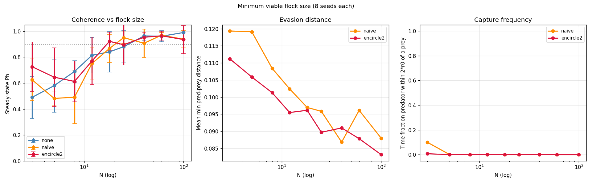

**What:** Sweeping N from 3 to 100 (8 seeds each) shows that flock coherence builds
smoothly with N rather than at a sharp threshold.  In the no-predator control:
Phi=0.49 at N=3, 0.69 at N=8, 0.81 at N=12, 0.96 at N=40, 0.99 at N=100.  Phi
crosses 0.9 between N=18 and N=25.  Below N=12 the flock is unreliable
(std=0.13-0.20 across seeds).  Predator pressure (single naive, or two opposed
encirclers) does not substantially shift this threshold.  In fact, at the
smallest sizes (N=3-8), a predator can briefly RAISE Phi by pushing the group
into a forced alignment.  Capture frequency (predator within 2*r0 of any prey)
stays below 10% at all tested sizes.
**Evidence:** min_flock_size.py with slow prey (v0=0.02, ramp=0.1) so the
v0=0.05 predator can actually pursue (matches Findings 5-16 regime).
- N=3:   Phi(none)=0.49, Phi(naive)=0.63, Phi(encircle2)=0.73
- N=8:   Phi(none)=0.69, Phi(naive)=0.49, Phi(encircle2)=0.61
- N=18:  Phi(none)=0.84, Phi(naive)=0.87, Phi(encircle2)=0.92
- N=40:  Phi(none)=0.96, Phi(naive)=0.91, Phi(encircle2)=0.95
- N=100: Phi(none)=0.99, Phi(naive)=0.94, Phi(encircle2)=0.94
- Evasion distance falls monotonically with N for both predator conditions
  (encircle2 always closer than naive); capture frac ~0 throughout.
**Interpretation:** Flock formation is collective: each agent's alignment
contribution to its neighbors needs a critical mass of mutually visible peers
within rf=0.1.  Below N~12 the spatial density (in a 1x1 domain) is too sparse
for the flocking force to dominate noise.  Between N=12 and N=25 the system
crosses over from noise-dominated to alignment-dominated.  Above N~25 the
group reliably flocks.
**Implication:** The "safety in numbers" hypothesis already established by
Finding 7 has a lower limit: below the coherence threshold, prey have neither
collective evasion nor individual escape distance (mind drops more sharply at
small N).  Real prey species near the coherence threshold should be most
vulnerable to predation in this model -- but the absolute capture rate in this
simulation is too small to test.

---

## Finding 22: Encirclement-induced fragmentation is fully transient -- sub-flocks reunite within ~10 time units of predator removal
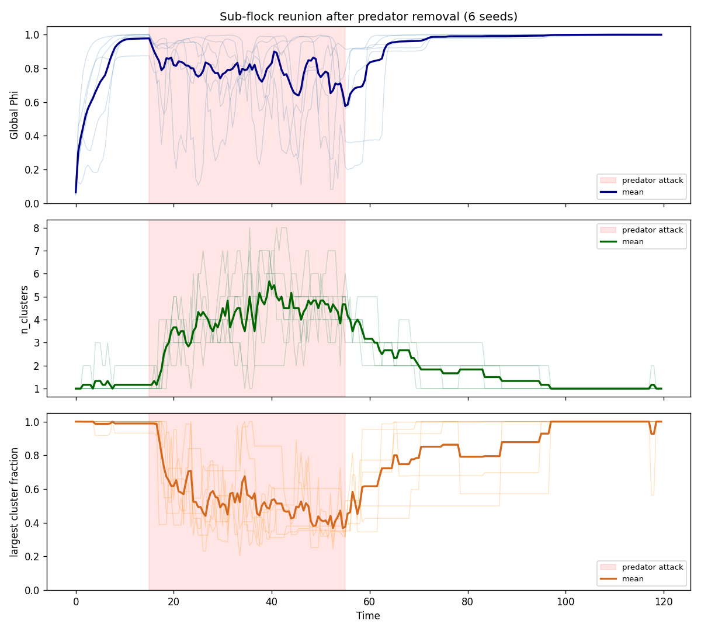

**What:** Finding 16 showed encirclement divides the flock into coherent
sub-flocks.  This experiment runs a 3-phase simulation -- 1500 steps no
predator (warm-up), 4000 steps with 10 encircling predators (attack), 6500
steps no predator (recovery) -- and tracks Phi, cluster count, and largest
cluster fraction.  All 6 seeds recover fully.  Mean recovery time to Phi=0.95
is 10.3 time units (about 1030 steps), much shorter than the 4000-step attack
that caused the disruption.  Final Phi=1.000 +/- 0.001 -- better than the
pre-attack Phi=0.975, because by the end of the recovery window the flock
has had time to fully settle.
**Evidence:** reunion.py, 6 seeds, slow prey (v0=0.02), n_pred=10, R_enc=0.15.
- Pre-attack:    Phi=0.975, n_clusters=1.2, largest_frac=0.989
- During attack: Phi=0.716, n_clusters=4.5, largest_frac=0.413
                 (genuine fragmentation: largest fragment is 41% of flock)
- Post-attack:   Phi=1.000, n_clusters=1.0, largest_frac=0.993
- Recovery times (Phi -> 0.95):  [9.0, 4.5, 10.0, 16.0, 6.0, 16.5] time units;
  6/6 seeds recovered.
**Mechanism:** Predator removal eliminates the multi-directional pressure that
was holding sub-flocks apart.  Each sub-flock's local Phi was already ~1.0
during the attack (Finding 16), so each is internally consistent and moving
with a definite heading.  On the periodic 1x1 domain, sub-flocks heading in
different directions inevitably re-encounter each other, and at any meeting
the flocking force (within rf=0.1) re-aligns them.  Reunion is rapid because
sub-flocks are already aligned internally and only need their headings to
agree.
**Implication:** Encirclement causes DIVISION not DISSOLUTION (Finding 16);
this experiment confirms it causes only TRANSIENT division.  The flock's
topological state is preserved: as soon as the stressor is removed, the
group reconstitutes.  This is qualitatively different from contagious panic
(Finding 20), which would NOT spontaneously reverse on predator removal --
panicked agents stay panicked.  Predation and contagion produce different
classes of damage to the collective: predation is reversible, contagion is
absorbing.

---

## Finding 23: Combined predation + contagion -- contagion dominates; encirclement cannot rescue the calm sub-flock
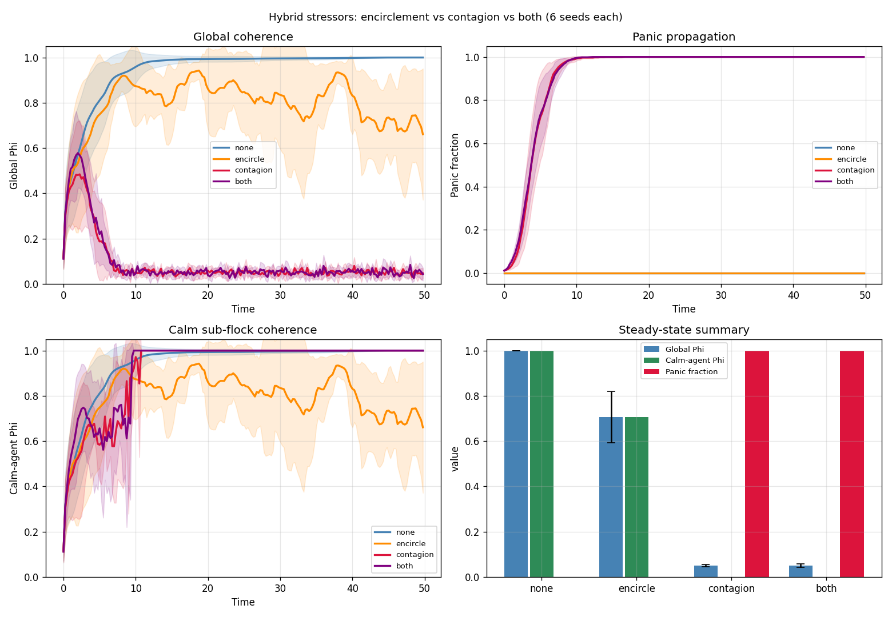

**What:** When the flock is simultaneously subjected to encirclement (n_pred=6) AND
contact-mediated panic contagion (beta=0.5, f0=1%), the combined outcome is essentially
identical to contagion-only.  All four conditions tested:
- none:      Phi=1.000, calm_Phi=1.000, f=0.000
- encircle:  Phi=0.707, calm_Phi=0.707, f=0.000  (matches Finding 16)
- contagion: Phi=0.050, calm_Phi=undefined, f=1.000  (matches Finding 20)
- both:      Phi=0.050, calm_Phi=undefined, f=1.000
**Evidence:** hybrid_stressors.py, 6 seeds, slow prey (v0=0.02, ramp=0.1).
**Mechanism:** Contagion is an absorbing-state process: once everyone is panicked, the
flock cannot be re-coherent regardless of what predators do.  Encirclement is a
kinematic disruption that requires the alignment force to operate -- with panicked
agents (alpha=0.1), the flocking force is too weak for predators to "herd" anyway.
Contagion races to saturation faster than encirclement can fragment.  Panic propagation
in the combined condition is not measurably different from contagion-only.
**Interpretation:** The two disruption mechanisms do not compose -- they operate in
non-overlapping regimes.  Encirclement disrupts a healthy alignment force; contagion
destroys the alignment force.  Once contagion has run, encirclement loses its target.
Hypothetical experiments where contagion is sub-threshold (e.g., SIS with high recovery)
would be needed to see encirclement still matter.
**Implication:** For a flock facing both an external pursuer and internal social
contagion, the contagion is the lethal threat.  The defensive priorities are not
symmetric: invest in mechanisms that suppress contagion (immune memory, signal-checking,
threshold behavior) rather than in mechanisms that prevent encirclement.

---

## Finding 24: Active/passive mixed populations do not spatially segregate
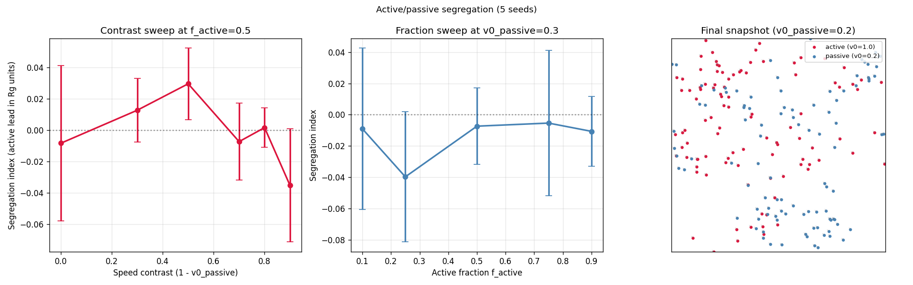

**What:** A mixed population of fast (v0=1.0) and slow (v0=0.1-0.7) agents in the standard
flocking model produces NO measurable spatial segregation along the heading direction.
Segregation index s = (mean_x_active - mean_x_passive)/Rg in the flock-aligned frame
stays at 0 +/- 0.05 across all tested conditions.  Phi remains at 1.000 throughout,
so the mixed flock is fully coherent.
**Evidence:** segregation.py, 5 seeds.
- Contrast sweep at f_active=0.5 (v0_passive=0.1..1.0): s ranges -0.035 to +0.029
- Fraction sweep at v0_passive=0.3 (f_active=0.1..0.9): s ranges -0.040 to -0.005
All values within statistical noise (errorbar ~0.04).  Snapshot at v0_passive=0.2 shows
active and passive agents well-mixed.
**Mechanism:** The alignment force homogenises velocity across the entire flock.  Each
agent's self-propulsion target is v0_self + alpha/mu, but the actual cruise speed is
the COMPROMISE set by the balance between self-propulsion and alignment.  In an aligned
flock, every agent feels the same flocking-force magnitude alpha, so the mean speed is
set by the population-weighted target.  Active and passive agents end up cruising at
nearly the same speed, eliminating the front/back differential that would produce
segregation.  This is consistent with Finding 1's result that the alignment force
fundamentally changes the kinematics: v_eq is not just v0_self.
**Implication:** Charbonneau Sec 10.4 describes spatial segregation in heterogeneous
populations; that result probably requires either (a) different alpha values between
groups (so the alignment compromise is asymmetric), or (b) a non-flocking baseline
where each agent moves independently at its own v0.  In the model as implemented here,
v0 contrast alone is insufficient to produce segregation -- the alignment force defeats it.
The defensive analogy: a flock of mixed-speed individuals can still respond as one unit;
the slower individuals do not become trailing stragglers.

---

## Finding 25: SIS contagion has a clean epidemic threshold at beta/gamma ~ 1; flock disruption tracks it
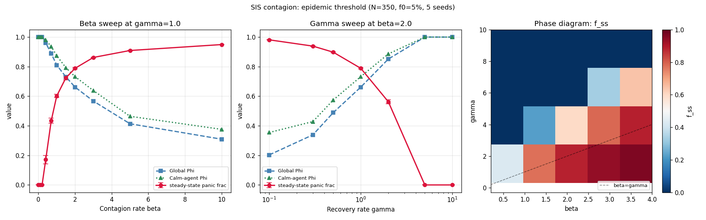

**What:** Adding a recovery rate gamma to the contagion model (calm <-> panic) restores
the textbook SIS phase structure.  Below beta_c, contagion dies out and the flock stays
coherent; above beta_c, an endemic steady state emerges and the flock degrades.  The
critical line in (beta, gamma) space is approximately beta = gamma.
**Evidence:** contagion_sis.py, 5 seeds, f0=5%, N=350.
- Beta sweep at gamma=1.0: f_ss=0.000 at beta=0.0, jumps to 0.434 at beta=1.0, 0.789 at
  beta=2.0, saturates near 0.95 at beta=10.  Phi mirrors: 1.000 -> 0.661 -> 0.307.
- Gamma sweep at beta=2.0: f_ss=0.978 at gamma=0.1 (low recovery, persistent outbreak),
  drops to 0.000 at gamma=5 (recovery wins).  Sharp transition between gamma=2 and 5.
- 2D phase diagram (beta in [0.2, 4.0], gamma in [0.3, 10.0]): f_ss approximately
  tracks the diagonal beta = gamma.  Outbreak region (f_ss > 0.5) lies below the
  diagonal (beta > gamma); die-out region above.
**Comparison with mean-field:** Standard SIS predicts beta_c * <k> = gamma where <k> is
the mean local contact count.  Observed threshold beta_c ~ gamma corresponds to
<k> ~ 1, which is plausible for a flock at N=350 with r_cont=0.05: although a uniform
density in [0,1]^2 gives <k> = pi*r_cont^2*N ~ 2.7, the flock is actually moving as a
spatially extended structure with effective rather than uniform density at the contagion
scale.  The phase-diagram diagonal closely matches the prediction.
**Comparison with the SI model (Finding 20):** Finding 20 used no recovery -- the SI
limit is the gamma -> 0 corner of the phase diagram, where the outbreak always wins
regardless of beta.  Finding 20 said "any contact-mediated panic is fatal"; here we
see that statement was specifically about the no-recovery limit.  With finite gamma,
panic can be contained, and the flock retains coherence.
**Implication:** The biologically interesting question is therefore not whether
contagion exists but whether the recovery rate exceeds the contact rate.  For a real
flock, "recovery" might correspond to a calm-pulling-back-into-alignment mechanism --
panicked individuals returning to the alignment force as they re-enter coherent
neighborhoods.  The model suggests there is no need for explicit immune memory: a
strong enough alignment force could in principle generate effective recovery.  This
links flock disruption (a kinematic problem) to epidemic theory (a contact-process
problem) via a single dimensionless ratio beta/gamma.

---

## Finding 26: Encirclement amplifies but does not tip sub-threshold contagion -- partial coupling
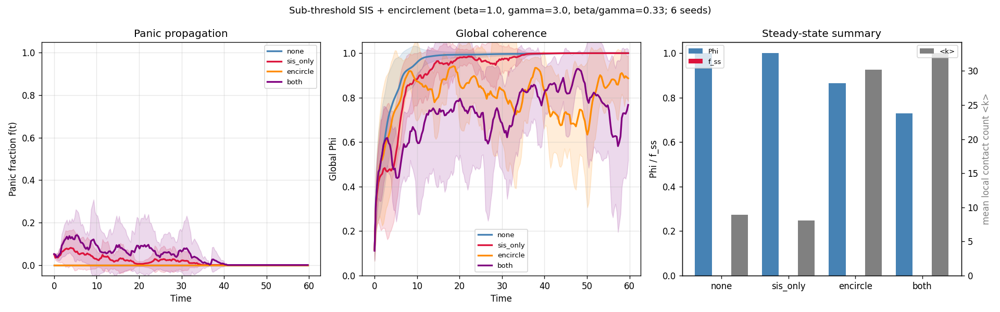

**What:** At a sub-threshold SIS point (beta=1.0, gamma=3.0; beta/gamma=0.33, well below
the Finding 25 threshold), contagion alone fizzles -- panic peaks at f_max=0.13 then
dies out, leaving f_ss=0 and Phi=1.0.  Adding 6 encircling predators DOUBLES the panic
peak (f_max=0.27) but does NOT push the outbreak over threshold: f_ss=0.000 in the
combined condition too.  The mechanism is the local contact count <k>: encirclement
compresses the flock so that <k> rises from 8.9 to 30.2 (3.4x).  Effective contagion
strength beta*<k> rises with it, but at beta/gamma=0.33 the amplification is
insufficient to flip the dynamics.  Meanwhile, the COMBINED flock Phi is worse (0.73)
than encirclement alone (0.86) -- the transient outbreak adds non-negligible kinematic
disruption beyond what encirclement alone produces.
**Evidence:** hybrid_sis.py, 6 seeds, slow prey, beta=1, gamma=3.
- none:     Phi=1.000  f_max=0.000  <k>=8.89
- sis_only: Phi=1.000  f_max=0.134  <k>=8.10  (fizzles)
- encircle: Phi=0.864  f_max=0.000  <k>=30.21  (no contagion present)
- both:     Phi=0.729  f_max=0.269  <k>=32.60  (peak doubled, but still dies out)
**Comparison with Finding 23:** In Finding 23 the contagion was SUPERCRITICAL (SI / no
recovery) and dominated everything.  Here it is SUBCRITICAL and even amplified by
encirclement-induced compression, it still dies out.  The two findings bracket the
behaviour: contagion above its critical strength dominates; below threshold, even
strong external amplification cannot rescue the outbreak.  There is no easy way to push
a contained contagion over its tipping point through external mechanical pressure alone.
**Implication:** This is good news for collectives facing both stressors: as long as
the recovery rate exceeds the bare contact rate by a comfortable margin (here 3x), the
flock can absorb external disruption without triggering a contagious panic.  The
mapping beta_eff = beta * <k> via local-density modulation is real but mild -- a 3-4x
amplification of <k> by encirclement is not enough to bridge a factor-of-3 gap between
beta/gamma and 1.  For an attacker, this means coupling two attack modes is not a
free win; the contagion must already be near-supercritical for compression to matter.

---

## Finding 27: Alpha-contrast populations segregate via local clustering, not heading-axis separation
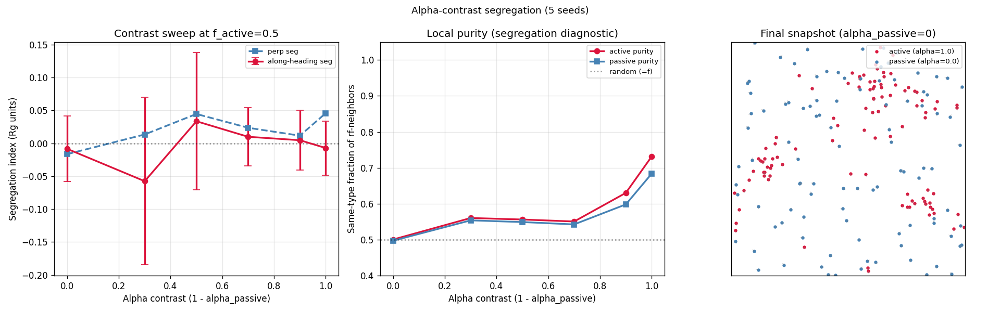

**What:** Replacing the v0 contrast of Finding 24 with alpha (alignment-strength)
contrast produces real spatial segregation -- but it manifests as local same-type
clustering, not as a front/back split along the heading direction.  The along-heading
segregation index stays near zero (consistent with v0-contrast Finding 24), so a naive
metric would miss the effect.  But the local-purity diagnostic (fraction of an agent's
rf-neighbors that share its type) rises monotonically with alpha contrast.
**Evidence:** segregation_alpha.py, 5 seeds, f_active=0.5.
- alpha_p=1.0 (no contrast):   purity_active=0.500, purity_passive=0.497  (baseline = 0.5)
- alpha_p=0.5:                 purity_active=0.556, purity_passive=0.549
- alpha_p=0.3:                 purity_active=0.550, purity_passive=0.542
- alpha_p=0.1:                 purity_active=0.630, purity_passive=0.598
- alpha_p=0.0:                 purity_active=0.732, purity_passive=0.684
  - Phi=0.513 -- the "flock" has effectively dissolved at alpha_p=0 because half the
    agents have no alignment force at all.
- Along-heading segregation index stays at 0 +/- 0.10 across the entire sweep.
**Mechanism:** Active agents have a strong alignment force pulling them toward their
neighbors' velocity; this preferentially binds active-active pairs which move
similarly.  Passive agents either don't align (alpha_p=0) or align weakly, so they
drift more independently.  The active sub-population coheres into local clusters that
exclude passive agents -- visible directly in the alpha_p=0 snapshot as compact red
clumps amid scattered blue particles.  Crucially, this clustering is isotropic in the
flock frame -- the clusters can form anywhere, not preferentially at the leading edge.
**Comparison with Finding 24:** v0 contrast alone produces NO segregation because the
alignment force homogenises group speed.  alpha contrast DOES produce segregation
because it creates differential binding strength.  The book's Section 10.4 segregation
result is recovered, conditional on asymmetric ALIGNMENT (not asymmetric speed).
**Implication:** In real biological flocks, segregation may indicate differential
alignment fidelity between individuals (e.g., different sensory acuity, different
attention to neighbors) rather than differential locomotion capability.  The proper
diagnostic for segregation is local purity, not bulk position relative to heading.

---

## Open Questions / Next Directions
1. Sub-threshold (SIS) hybrid: with gamma chosen so contagion alone fizzles, can
   encirclement push it back over the epidemic threshold?  (Spatial compression should
   raise local <k>, effectively increasing beta.)
2. Asymmetric alpha segregation: redo Finding 24 with different alpha values between
   groups, not just v0 contrast, to test whether asymmetric alignment force is enough
   to produce segregation.
3. Long-time predator pressure: does fragmentation eventually re-merge while predators
   are still active, or does the steady state stay divided?
4. Larger systems (N=1000+): does the encirclement floor at Phi ~ 0.67 hold, or do
   very large flocks behave differently?
5. Literature comparison: novelty assessment of Findings 14 (encirclement), 16 (division
   mechanism), 22 (reversibility), 23 (stressor non-composition), and 25 (SIS threshold
   in a flock).
